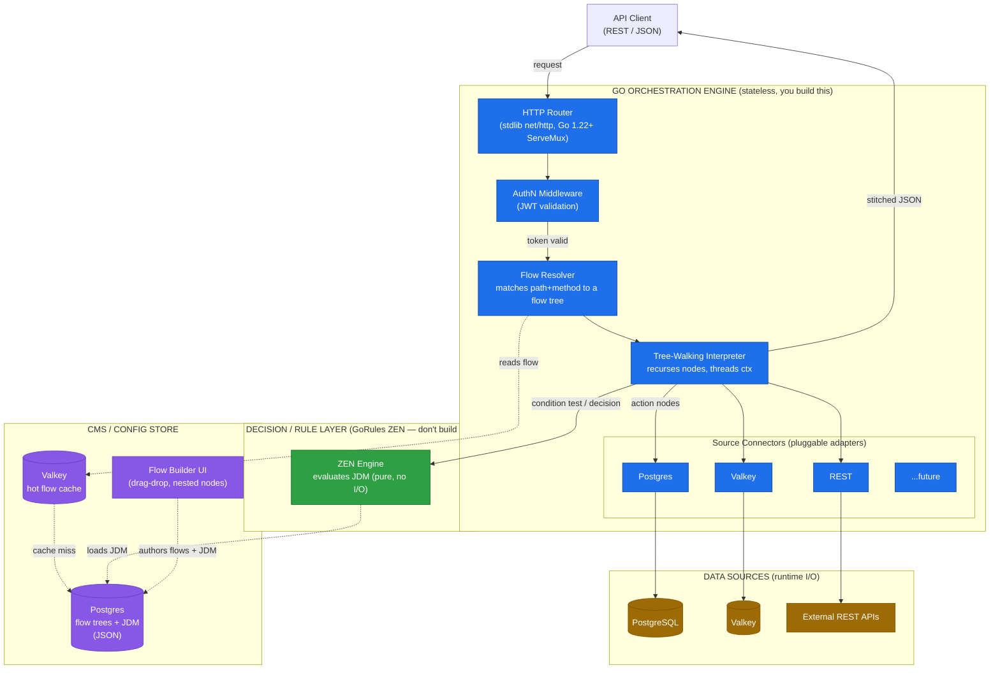
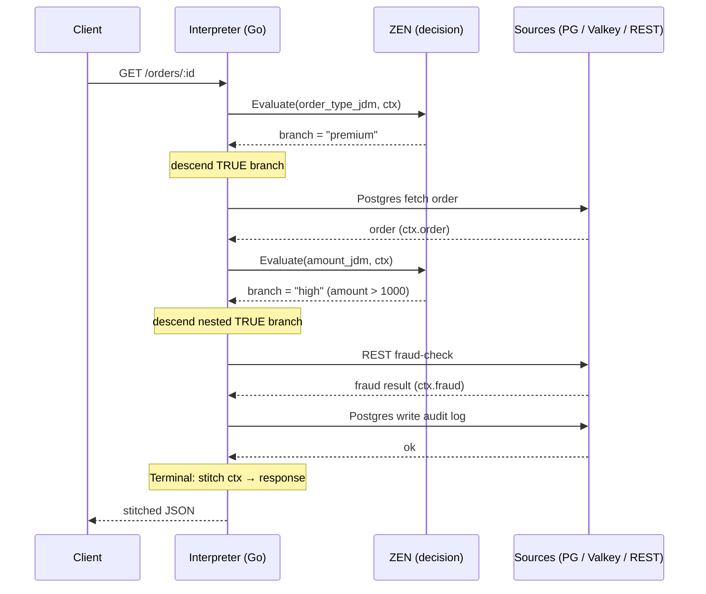
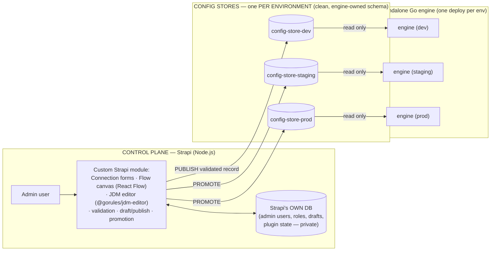

# Config-Driven API Engine — Architecture

Goal: an **API-only** service where **all logic lives in a CMS/config**. Adding a new
API = authoring a flow in the CMS, no code deploy. The engine reads/writes **multiple
sources** (Postgres, Valkey, REST, extensible), does **CRUD**, supports **nested
conditional logic**, and enforces **AuthN/AuthZ**.

## Two engines (the core split)

- **Orchestration engine (you build, in Go):** does the I/O and the control flow — HTTP
  routing, walking the flow tree, calling source connectors, writes, stitching. The "kitchen".
- **Decision / rule engine (GoRules ZEN, don't build):** pure logic evaluation over the
  context — every condition test, authz check, validation. No I/O. The "recipe".

ZEN decides **which way**; the orchestration engine **does the thing** (the I/O in the chosen
branch). This split holds at every depth of nesting.

## The config is a recursive control-flow tree (not a flat DAG)

A flow is a tree the engine walks recursively. A **control node** owns child nodes, which is
where nesting comes from — a condition's branches are themselves pipelines, nestable to any
depth.

Node taxonomy:

| Kind | Nodes | Does I/O? | Owns children? |
| --- | --- | --- | --- |
| **Trigger** | HTTP route + method entry point | — | yes (the root body) |
| **Action** | Postgres / Valkey / REST — read or write | yes (I/O) | no |
| **Control** | Condition (if/else), Switch, Sequence, Parallel, ForEach | no | **yes** |
| **Decision** | ZEN evaluate (also used as a Condition's *test*) | no (pure) | no |
| **Terminal** | Transform / Stitch (targetPath), Response | no | no |

Every node reads from and writes to the shared **context** (`ctx`), so any node — at any
depth — can use data produced by upstream nodes.

### A condition's test is always a ZEN decision

A `Condition` node holds a reference to a JDM. At runtime the engine calls
`result = zen.Evaluate(jdm_id, ctx)`, and descends into the branch the result selects. There
is **one** way to author logic — ZEN JDM — for trivial and complex checks alike. No separate
inline expression language.

### Example flow tree

```
Trigger (GET /orders/:id)
└─ Condition [ZEN: order_type_jdm]  (is ctx.input.type == "premium"?)
   ├─ TRUE:
   │   ├─ Action: Postgres  → fetch order        (ctx.order)
   │   └─ Condition [ZEN: amount_jdm]  (ctx.order.amount > 1000?)
   │      ├─ TRUE:  Action: REST    → fraud-check API   (ctx.fraud)
   │      └─ FALSE: Action: Valkey  → read risk score   (ctx.risk)
   └─ FALSE:
       └─ Action: REST → fetch from legacy ESB   (ctx.legacy)
       └─ Action: Postgres (write) → audit log    ← writes fan out freely
└─ Terminal: Response (stitch ctx → JSON)
```

Writes are just action nodes, so a single flow can **write to multiple sources** — drop
multiple write nodes wherever the branch logic requires.

## Connections — reusable, named data sources (referenced by key)

A **Connection** is a configured data source defined **once** and referenced by **key** from
any action node in any flow. This separates *how to reach a source* (connection) from *what
operation to run* (action node). Change a password once in the connection; every flow using
it is updated.

```
connections:
  main_db     → { type: postgres, host, port, user, secretRef, pool: { max: 20 } }
  cache       → { type: valkey,   host, port, db: 0 }
  legacy_esb  → { type: rest,     baseUrl, auth: {...} }
```

An action node carries only `{ connectionRef, operation }`:

```
Action(postgres) { connectionRef: "main_db",    query: "SELECT ...", params: [...] }
Action(rest)     { connectionRef: "legacy_esb",  method: GET, path: "/orders/:id" }
Action(valkey)   { connectionRef: "cache",        op: GET, key: "risk:{{id}}" }
```

### Connection Registry (engine component)

At startup and on config change, the engine reads connection definitions and instantiates
**live, pooled clients** — one `*pgxpool.Pool` per Postgres connection, one Valkey client, one
configured `*http.Client` per REST connection — each keyed. The registry owns their lifecycle,
hot-reloads on change, and hands clients to the interpreter by key. One connection is **shared**
across every node and flow that references it (no per-request dialing). Secrets are referenced
by `secretRef`, never inlined (per [[config-and-secrets]]).

### Resilience lives on the connection (per-node override allowed)

Each connection carries its own timeout, retry policy, and **circuit breaker** (per
[[retry-and-backoff]], [[distributed-systems-patterns]], [[error-classification]]). If
`legacy_esb` trips its breaker, every node using it fails fast while other connections stay
healthy — the blueprint's independent per-source breaker. An individual action node may
**override** these (e.g. a tighter timeout for one call). Retries apply only to idempotent
operations; writes retry only when safe (per [[idempotency-and-dedup]]).

```
Connection Registry (live pooled clients + per-connection breaker, keyed)
  main_db ───┐  (pgxpool, timeout, retry, breaker)
  cache ─────┤  (valkey client)
  legacy_esb ┘  (http client, breaker: trips independently)
       ▲ referenced by key
       │
Flow A: Action{ref:main_db} → Action{ref:legacy_esb}
Flow B: Action{ref:cache}   → Action{ref:main_db}
```

Connections are their own CRUD surface in the CMS (managed independently of flows); in the
eventual UI they are a connections/credentials area, and canvas nodes pick a connection from a
dropdown.

## Component diagram



## How the interpreter walks a nested flow

The engine recurses the tree. At each **Condition** it calls ZEN with the current context,
then descends into the selected branch and performs that branch's I/O. The context threads
through the whole walk, so nested branches see everything gathered above them.



Contract for every decision: `result = zen.Evaluate(jdm_id, ctx)` — JSON in, JSON out.
Orchestration owns the tree, the recursion, the context, and all I/O; ZEN stays pure.

## Request flow

1. Client hits an endpoint → router → JWT validated (AuthN).
2. Flow resolver looks up the matching flow tree (Valkey first, Postgres on miss).
3. Interpreter walks the tree: at each Condition it calls ZEN to pick a branch, descends,
   and runs that branch's action nodes (Postgres/Valkey/REST read or write), threading `ctx`.
4. AuthZ is itself a ZEN decision over `{user, roles, resource, action}`, evaluated early.
5. Terminal node stitches `ctx` via `targetPath` and returns the response.

Adding a new API = author a flow tree (+ its JDMs) in the CMS. No deploy.

## Conditional response fields (add a field only when a condition matches)

Because a Condition's branches are themselves pipelines, adding a field to the response only
when a condition matches needs **no new concept** — place a **Set/Transform** node inside the
matching branch. It writes a value into `ctx.finalResponse` at an explicit `targetPath` (via
`lodash.set`-style set, never object-merge). If the branch doesn't run, the field is absent.

```
Condition [ZEN: amount_jdm]  (ctx.order.amount > 1000?)
├─ TRUE:  Set → targetPath "flags.highValue" = true     ← field present only here
└─ FALSE: (nothing)                                      ← field absent
```

The value can be static, copied from the context, or computed by a ZEN decision:

| Field source | Example | Nodes |
| --- | --- | --- |
| Static | `"status": "premium"` | Set |
| Copied from context | `"name": ctx.user.fullName` | Set / Transform |
| Computed by a rule | `"discount": 0.15` | Decision (ZEN) → Set |

Because stitching uses explicit `targetPath` patches, fields contributed by **different
branches at different depths** coexist in one response without clobbering each other
(cumulative multi-level stitching):

- `cond1` (depth 1) → `finalResponse.meta.region`
- `cond1.cond1.2` (depth 3) → `finalResponse.order.compliance`
- `cond2` (sibling) → `finalResponse.flags.vip`

Each is included only if its branch ran. The flow-tree schema therefore has a first-class
**Set/Transform** node with a `targetPath` and a value source (static | contextPath | zenDecision).

## Control plane vs. data plane (two independent services)

The system is **two separately deployable services** that share only a config store contract.
Neither calls the other at runtime.



- **Control plane = Strapi + a custom module.** One Strapi instance orchestrates all
  environments. The module provides the content types (Connection, Flow, Jdm, Environment),
  the React custom-field editors (flow canvas + `@gorules/jdm-editor`), validation at
  write/publish, and draft/publish + promotion. Strapi's admin is React, so the visual editors
  mount as native custom fields — not raw JSON.
- **Strapi has its OWN database** for its internals (admin users, roles, drafts, plugin
  state). The engine never reads Strapi's internal tables — that schema is private to Strapi
  and version-dependent.
- **Publish writes a clean, engine-owned record** into the **config store** — a separate DB
  whose schema the engine owns (the contract between the planes).
- **Data plane = the standalone Go engine.** It only **reads** the config store (cached in
  Valkey) and executes flows. It has **no runtime dependency on Strapi** — if Strapi is down,
  the engine keeps serving from the config store + cache.

### Environments (one Strapi, per-env config stores)

Config is **isolated per environment**: dev / staging / prod each have their **own config
store DB and own Valkey**. A dev flow physically cannot reach prod — different database,
different connection definitions behind the same keys.

- The **connection key is stable** (`main_db`); it resolves to different hosts/secrets per
  environment, authored per-env in Strapi, secrets by `secretRef` only (per
  [[config-and-secrets]], [[twelve-factor-app]]).
- **Promotion** = Strapi publishes the same flow/JDM into the next environment's config store
  (draft → publish → promote). One Strapi orchestrates all three; the engine binary is
  environment-agnostic (same image, env-specific config/secrets).

### Where the "components" live across the two planes

| Component | Control plane (Strapi module) | Data plane (Go engine) |
| --- | --- | --- |
| **Connection** (dbconn / esb-with-key / valkeyconn) | defined once as a form; per-env values | Connection Registry → live pooled clients, keyed |
| **Action node** | canvas node that picks a connection by key | interpreter looks up client by key, runs op |
| **Flow tree** | React Flow canvas (custom field) | tree-walking interpreter executes it |
| **JDM / decision** | `@gorules/jdm-editor` (custom field) | embedded ZEN evaluates it |

**Sequencing (Path B):** build the Go engine + the config-store schema (the contract) first,
seed config as JSON/SQL to prove flows run, then build the Strapi module + visual editors
against the stable schema. The Strapi module is a **separate build** from the Go engine.

## Settled decisions

- **ZEN embedding**: embed `zen-go` **in-process** (not a sidecar). Accept the **CGO**
  build constraint — builds require CGO enabled and a C toolchain; cross-compilation and
  fully-static linking are affected. Build/CI must account for this.
- **Condition authoring**: all condition tests and value computations are **ZEN JDM** — one
  authoring model, no separate inline expression language.
- **Writes**: a single flow may write to **multiple sources** (write actions placed per branch).
- **Sequencing (Path B)**: build the Go interpreter + flow-tree schema + config API first;
  author flows as JSON initially; build the drag-and-drop UI against the stable schema later.

## Production readiness (grounded in engineering-standards)

This is a production target, not a prototype. The following are first-class requirements,
each tied to the standard that governs it:

- **Resilience** — per-connection timeouts, retry with backoff + jitter on idempotent ops,
  and independent circuit breakers (`sony/gobreaker` or equivalent). Per
  [[retry-and-backoff]], [[distributed-systems-patterns]], [[error-classification]],
  [[best-effort-vs-required]].
- **Observability** — structured JSON logs (`log/slog`), RED metrics (Prometheus), and
  distributed tracing (OpenTelemetry) spanning the flow walk, each node, each ZEN eval, and
  each connection call. Per [[observability-and-logging]], [[distributed-tracing]],
  [[sli-slo-sla]].
- **Health & lifecycle** — `/livez` and `/readyz` (readiness gated on registry + config
  store), graceful shutdown draining in-flight requests and closing pools. Per
  [[health-checks-liveness-readiness]], [[graceful-shutdown]].
- **Security** — JWT via JWKS (rotating keys), AuthZ as a ZEN decision over
  `{user, roles, resource, action}`, secrets by reference only, input validation at the
  trigger, and the blueprint's structural hardening (explicit `targetPath` set — never
  object-merge — to avoid prototype-pollution/IDOR classes). Per [[security-and-authz]],
  [[config-and-secrets]], [[api-gateway-and-bff]].
- **Config safety** — flows and JDMs are **validated before activation** (a bad flow row
  must not become a runtime 500); versioned with rollback; hot-reloaded via the config cache.
  Per [[versioning-and-compatibility]], [[data-and-migrations]].
- **Data & migrations** — config store schema managed by versioned migrations; write actions
  honor idempotency where required. Per [[data-and-migrations]], [[idempotency-and-dedup]].
- **Caching** — flow/connection config cached in Valkey with explicit invalidation on change.
  Per [[caching-strategy]].
- **Testing & CI** — table-driven unit tests for the interpreter + node handlers, integration
  tests against ephemeral Postgres/Valkey, contract tests for the config API, and a CI gate.
  Per [[testing-strategy]], [[ci-cd-and-delivery]].
- **Idiomatic Go** — per [[go]], [[google-go-style-guide]], [[go-code-review-comments]];
  context propagation on every I/O call, error wrapping, no global mutable state beyond the
  registry.

## v1 scope (production-ready)

Core engine, delivered to the production bar above:

1. **Flow-tree schema** — Trigger / Action / Condition / Decision / Set-Transform / Response,
   as Go structs with validation (reject invalid flows before activation).
2. **Tree-walking interpreter** — recursive, context-threaded, ZEN at conditions, `targetPath`
   stitching; full tracing/logging around the walk.
3. **Connection Registry** — pooled clients keyed by name, hot-reload, per-connection
   resilience (timeout/retry/breaker) with per-node override.
4. **Connectors** — Postgres (`pgx`), Valkey, REST — driven by the registry, read + write.
5. **ZEN integration** — embed `zen-go` (CGO), load JDM by id, `Evaluate(jdm, ctx)`.
6. **Config store (engine side)** — a clean, engine-owned Postgres schema (flows, JDMs,
   connections, environment) managed by versioned migrations; Valkey hot cache + invalidation.
   The engine **reads** this store; it is written by the control plane (Strapi) on publish.
   The engine defensively validates config on load (never 500 on a malformed flow).
   **Per-environment** stores (dev/staging/prod isolated).
7. **AuthN** (JWT/JWKS) + **AuthZ** (ZEN decision).
8. **Ops surface** — `/livez`, `/readyz`, metrics, graceful shutdown, structured logs, OTel.
9. **Tests + CI** — unit + integration + contract tests, CI pipeline.
10. **One end-to-end example flow** (the nested orders example), seeded via SQL/JSON, proving
    the engine runs without the control plane present.

Module path: `nzr-rules-engine`.

Separate build (not this scope): the **Strapi control-plane module** — content types,
React custom-field editors (`@gorules/jdm-editor` + React Flow canvas), validation,
draft/publish, and promotion. Built against the stable config-store schema after the engine.

Deferred entirely (not v1): Kafka async write path and API gateway (KrakenD) — added when
scale/need demands.
