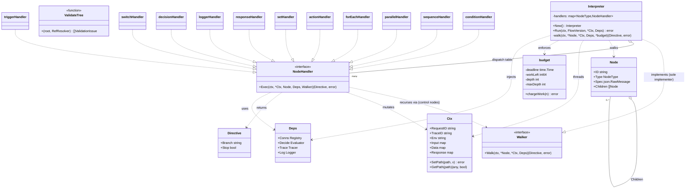

# LLD — Slice A: Flow schema + tree-walking interpreter + context accumulator

Package: `internal/flow` · Module: `nzr-rules-engine` · Go 1.22+
Status: **draft for build** · Last updated: 2026-10-02

Designs against the fixed seams in [`lld-contracts.md`](../lld-contracts.md) and realizes the
data-plane interpreter from [`hld.md`](../hld.md) (§3 node taxonomy, §4 data flow, §6a observability,
§6b flow testing, §6c versioning, §10 AC-1..AC-28). Follows the wiki `[[low-level-design]]`
(interfaces at boundaries, SOLID, class/sequence diagrams, planned error handling, tests-first)
and `[[simplicity-and-design]]` (small single-purpose handlers, explicit deps, ports & adapters,
obvious control flow, no speculative generality). Error handling crosses the seam classified per
`[[error-classification]]`.

> This is a design document — Go type definitions, pseudocode, and diagrams. Not compilable
> implementation. Code sketches omit imports and some error-wrapping boilerplate for readability.

---

## 1. Package `internal/flow` — responsibilities & structure

Slice A owns the **meaning of a flow tree** and the **engine that walks it**. It is the pure
orchestration core: it decides *what to do and in what order*, and delegates every side effect
(I/O, decisions, logging, tracing) to the interfaces in `Deps`. It imports **no infrastructure**
— only `context`, `encoding/json`, stdlib, and the shared contract packages behind interfaces
(`connect`, `decision`, `observ` via `Deps`). This keeps the business logic free of infra imports
per `[[simplicity-and-design]]` (ports & adapters).

### Responsibilities (what this package is the single home for)
- The **node Spec schemas** — the typed Go shape each `NodeType` parses `Node.Spec` into (§2).
- The **tree-walking interpreter** — recursive `Walk`, dispatch to a `NodeHandler` per type,
  `Directive`-driven branch selection, threading `*Ctx` (§3).
- The **context accumulator** — `SetPath`/`GetPath` semantics on `Ctx` (§4).
- **Version pinning** at request start (§5, AC-11) — accepts an already-resolved `FlowVersion`
  snapshot and walks only it.
- **Loop/ForEach runtime safety** — iteration + time/work budget enforcement (§6, AC-17).
- **Structural validation** of a tree — the pure checker used by publish/validate and by
  defensive load (§7, AC-15 participation).
- **Error classification at the seam** — mapping handler/engine failures to the taxonomy (§9).

### Explicit non-responsibilities (owned by other slices)
- Opening connections / performing I/O → Slice B (`connect`), reached via `Deps.Conns`.
- Evaluating JDM → Slice C (`decision`), via `Deps.Decide`.
- Resolving which `FlowVersion` is active, caching, publish/rollback → Slice D (`config`).
- Emitting spans/logs/metrics transport, Logger node sink → Slice E (`observ`), via `Deps.Trace`
  / `Deps.Log`. Slice A *decides when* to log/trace; Slice E *does* it.
- HTTP routing / request decode / response encode → Slice E/A (`httpapi`). Slice A exposes a
  callable `Interpreter.Run`, not an HTTP surface.

### File structure (proposed)
```
internal/flow/
  node.go        // re-exports contract Node/NodeType/Directive usage; node registry
  spec.go        // §2 — all *Spec structs + Parse helpers (json → typed spec)
  ctx.go         // §4 — Ctx.SetPath / Ctx.GetPath / merged-view read
  interpreter.go // §3,§5 — Interpreter, Run, Walk (recursion), budget wiring
  handlers.go    // §3 — NodeHandler impls per type (one small struct each)
  budget.go      // §6 — Budget: iteration + time/work accounting
  validate.go    // §7 — ValidateTree structural checker
  errors.go      // §9 — typed/sentinel errors + Classify
  *_test.go      // §10 — table-driven unit tests mapped to ACs
```

### SOLID mapping (per `[[low-level-design]]`)
- **SRP** — one handler struct per node type; `budget.go`, `validate.go`, `ctx.go` each own one
  concern.
- **OCP** — a new node type = a new `NodeHandler` registered in the handler map; `Walk` does not
  change (echoes HLD "new connectors, no engine change" at the node level).
- **LSP** — every handler is substitutable behind `NodeHandler`; control nodes and leaf nodes
  share the same `Exec` contract.
- **ISP** — handlers depend on the narrow `Deps` view, not on concrete slices.
- **DIP** — `flow` depends on `connect.Registry`, `decision.Evaluator`, `observ.*` abstractions
  injected via `Deps`; it never imports a driver.

---

## 2. Node Spec type definitions

`Node.Spec` is `json.RawMessage`. Each handler parses it into a typed struct exactly once per
node execution (or at validation). All specs live in `spec.go`. Parsing is strict:
`json.Decoder` with `DisallowUnknownFields` so a config carrying a field an older engine does
not understand **fails validation cleanly** rather than silently ignoring it — the forward-compat
rule from HLD §6c / R11 / AC-15.

```go
// parseSpec decodes n.Spec into T with unknown-field rejection (R11 forward-compat).
func parseSpec[T any](raw json.RawMessage) (T, error) {
    var out T
    dec := json.NewDecoder(bytes.NewReader(raw))
    dec.DisallowUnknownFields()
    if err := dec.Decode(&out); err != nil {
        return out, fmt.Errorf("%w: spec decode: %v", ErrValidation, err)
    }
    return out, nil
}
```

### Common fragments
```go
// Ref names a config object by key; version is resolved by the pinned snapshot (§5), not here.
type ConnRef struct {
    Connection string `json:"connection"` // Connection key (Slice B registry lookup)
}

// Resilience override allowed per node (HLD ADR-007 / AC-7). Nil => use connection default.
type ResilienceOverride struct {
    TimeoutMS  *int `json:"timeoutMs,omitempty"`
    Retries    *int `json:"retries,omitempty"`
    BreakerOff *bool `json:"breakerOff,omitempty"`
}
```

### 2.1 Trigger — flow entrypoint (one per tree, the root)
```go
type TriggerSpec struct {
    Method string `json:"method"`          // "GET","POST",... (must match FlowVersion.Method)
    Path   string `json:"path"`            // "/orders/{id}" (must match FlowVersion.Path)
    // Declares which parts of the request are mapped into Ctx.Input. Mapping itself is done by
    // httpapi before Run; this is the contract/validation surface.
    Input  TriggerInput `json:"input"`
}
type TriggerInput struct {
    Params  []string `json:"params,omitempty"`  // path params to lift: ["id"]
    Query   []string `json:"query,omitempty"`
    Headers []string `json:"headers,omitempty"`
    Body    bool     `json:"body,omitempty"`     // bind JSON body under Input["body"]
}
```

### 2.2 Action — a single I/O operation via a connection (leaf)
```go
type ActionSpec struct {
    ConnRef
    Operation  connect.Operation   `json:"operation"`            // Kind + Payload (seam type)
    SaveAs     string              `json:"saveAs"`               // ctx.Data key for the result
    Resilience *ResilienceOverride `json:"resilience,omitempty"` // AC-7
    OnError    OnError             `json:"onError,omitempty"`    // "fail"(default)|"continue"
}
type OnError string // "fail" | "continue"  — continue classifies+records but keeps walking (R3)
```

### 2.3 Condition — binary branch via a ZEN decision (control node, owns children)
```go
type ConditionSpec struct {
    JDMID  string `json:"jdmId"`  // Slice C evaluates this over a ctx snapshot
    // Which ctx paths feed the decision input (never pass whole ctx — explicit + auditable).
    Input  []string `json:"input"`
    // Branch keys map to child node IDs. ZEN output field "branch" selects one; else TrueKey if
    // output "result" is truthy. Exactly these two keys are valid for a Condition.
    TrueKey  string `json:"trueKey"`  // child ID run when decision is true/branch==trueKey
    FalseKey string `json:"falseKey"` // child ID run otherwise (optional => linear fallthrough)
}
```

### 2.4 Switch — N-way branch via a ZEN decision (control node)
```go
type SwitchSpec struct {
    JDMID   string            `json:"jdmId"`
    Input   []string          `json:"input"`
    Cases   map[string]string `json:"cases"`   // decision "branch" value -> child node ID
    Default string            `json:"default"` // child ID when no case matches (optional)
}
```

### 2.5 Sequence — run children in order (control node)
```go
type SequenceSpec struct {
    // No branch selection; children run top-to-bottom, each threading the same *Ctx.
    // StopOnError defaults true (first failure aborts the sequence).
    StopOnError *bool `json:"stopOnError,omitempty"`
}
```

### 2.6 Parallel — run children concurrently, merge (control node)
```go
type ParallelSpec struct {
    MaxConcurrency int  `json:"maxConcurrency,omitempty"` // 0 => len(children); bounded by budget
    FailFast       bool `json:"failFast,omitempty"`       // cancel siblings on first error
    // Children must write to DISJOINT ctx paths (validated §7) so the merge is clobber-free.
}
```

### 2.7 ForEach — iterate a collection, run the child subtree per item (control node)
```go
type ForEachSpec struct {
    Over      string `json:"over"`               // dotted path to an array in the merged view
    As        string `json:"as"`                 // item alias: Input["<as>"] inside the body
    IndexAs   string `json:"indexAs,omitempty"`  // optional index alias
    MaxItems  int    `json:"maxItems"`           // hard cap (AC-17); validated > 0 at publish
    Parallel  bool   `json:"parallel,omitempty"` // sequential by default
    // Children = the loop body (a single subtree, run once per item).
}
```

### 2.8 Decision — compute values via ZEN, no branching (leaf)
```go
type DecisionSpec struct {
    JDMID  string   `json:"jdmId"`
    Input  []string `json:"input"`
    SaveAs string   `json:"saveAs"` // decision output map stored under ctx.Data[SaveAs]
}
```

### 2.9 Set — mount a value/response field at a dotted path (leaf, HLD §4 step 5)
```go
type SetSpec struct {
    // Exactly one of Value / From is set.
    TargetPath string `json:"targetPath"`      // lodash.set path into ctx.Response (§4)
    Value      any    `json:"value,omitempty"` // literal
    From       string `json:"from,omitempty"`  // dotted path read from merged view
    OmitEmpty  bool   `json:"omitEmpty,omitempty"` // skip mount if resolved value is nil/empty
}
```

### 2.10 Logger — optional debug point (leaf, HLD §3 Logger node)
```go
type LoggerSpec struct {
    Label      string   `json:"label"`
    Level      string   `json:"level"`      // "debug"|"info"|"warn"|"error"
    Capture    []string `json:"capture"`    // ctx paths to log (secret paths redacted by observ)
    SampleRate *float64 `json:"sampleRate,omitempty"` // 0..1; nil => 1.0
    // Never changes the response; a flow runs identically with every Logger node removed.
}
```

### 2.11 Filter — filter collection via ZEN predicate (leaf, post-v1)
```go
type FilterSpec struct {
    Over     string   `json:"over"`      // path to source array in ctx
    JDMID    string   `json:"jdmId"`     // predicate JDM — returns truthy to include item
    Input    []string `json:"input"`     // fields from each item to project to ZEN
    SaveAs   string   `json:"saveAs"`    // result destination key in ctx.Data
    MaxItems int      `json:"maxItems"`  // budget guard (AC-17) — rejects if source exceeds
}
```

The filter handler iterates the source array, evaluates the ZEN predicate for each item,
and collects items where the predicate returns truthy into the result array.

### 2.12 Find — find first matching item via ZEN predicate (leaf, post-v1)
```go
type FindSpec struct {
    Over     string   `json:"over"`      // path to source array
    JDMID    string   `json:"jdmId"`     // predicate JDM
    Input    []string `json:"input"`     // fields to project
    SaveAs   string   `json:"saveAs"`    // result: single item or null
    MaxItems int      `json:"maxItems"`  // budget guard
}
```

Find stops at the first matching item (short-circuit), saving it to `SaveAs`. If no item
matches, `SaveAs` is set to null.

### 2.13 Map — transform each item via ZEN (leaf, post-v1)
```go
type MapSpec struct {
    Over     string   `json:"over"`
    JDMID    string   `json:"jdmId"`     // transform JDM — output replaces item
    Input    []string `json:"input"`
    SaveAs   string   `json:"saveAs"`
    MaxItems int      `json:"maxItems"`
}
```

Map evaluates the JDM for each item and collects the outputs into a new array.

### 2.14 Reduce — aggregate collection via ZEN (leaf, post-v1)
```go
type ReduceSpec struct {
    Over       string `json:"over"`
    JDMID      string `json:"jdmId"`       // reducer JDM — receives {acc, item}, returns new acc
    Input      []string `json:"input"`
    SaveAs     string `json:"saveAs"`
    MaxItems   int    `json:"maxItems"`
    InitialAcc any    `json:"initialAcc"` // starting accumulator value
}
```

Reduce folds the array into a single value by applying the reducer JDM to each item with
the current accumulator.

### 2.15 Response — finalize and stop (leaf, exactly-one-path per flow)
```go
type ResponseSpec struct {
    Status int    `json:"status"`           // HTTP status to return (default 200)
    // Body source: "response" (default) returns ctx.Response as-is; "path" returns a subtree.
    BodyFrom string `json:"bodyFrom,omitempty"` // "" => ctx.Response; else a dotted path
}
```

### Spec ↔ type registry
```go
// specTypes drives DisallowUnknownFields validation at publish and dispatch at runtime.
var specTypes = map[NodeType]func(json.RawMessage) error{
    "trigger":  func(r json.RawMessage) error { _, e := parseSpec[TriggerSpec](r);  return e },
    "action":   func(r json.RawMessage) error { _, e := parseSpec[ActionSpec](r);   return e },
    "condition":func(r json.RawMessage) error { _, e := parseSpec[ConditionSpec](r);return e },
    "switch":   func(r json.RawMessage) error { _, e := parseSpec[SwitchSpec](r);   return e },
    "sequence": func(r json.RawMessage) error { _, e := parseSpec[SequenceSpec](r); return e },
    "parallel": func(r json.RawMessage) error { _, e := parseSpec[ParallelSpec](r); return e },
    "forEach":  func(r json.RawMessage) error { _, e := parseSpec[ForEachSpec](r);  return e },
    "decision": func(r json.RawMessage) error { _, e := parseSpec[DecisionSpec](r); return e },
    "set":      func(r json.RawMessage) error { _, e := parseSpec[SetSpec](r);      return e },
    "logger":   func(r json.RawMessage) error { _, e := parseSpec[LoggerSpec](r);   return e },
    "response": func(r json.RawMessage) error { _, e := parseSpec[ResponseSpec](r); return e },
    "filter":   func(r json.RawMessage) error { _, e := parseSpec[FilterSpec](r);   return e },
    "find":     func(r json.RawMessage) error { _, e := parseSpec[FindSpec](r);     return e },
    "map":      func(r json.RawMessage) error { _, e := parseSpec[MapSpec](r);      return e },
    "reduce":   func(r json.RawMessage) error { _, e := parseSpec[ReduceSpec](r);   return e },
}
```

---

## 3. The interpreter — recursive tree walk

### Shape
`Interpreter` holds the handler registry and nothing request-specific (stateless, so it is safe
to share across goroutines — HLD §7 stateless instances). Per-request state lives in `Ctx` and a
`walkState` carried on the stack / `context.Context`.

```go
type Interpreter struct {
    handlers map[NodeType]NodeHandler // dispatch table (OCP: extend by adding entries)
}

func New() *Interpreter {
    return &Interpreter{handlers: map[NodeType]NodeHandler{
        "trigger": triggerHandler{}, "action": actionHandler{}, "condition": conditionHandler{},
        "switch": switchHandler{}, "sequence": sequenceHandler{}, "parallel": parallelHandler{},
        "forEach": forEachHandler{}, "decision": decisionHandler{}, "set": setHandler{},
        "logger": loggerHandler{}, "response": responseHandler{},
    }}
}
```

### Entry point — `Run` pins the version and seeds the walk (ties to §5)
```go
// Run walks exactly the provided FlowVersion snapshot to completion. The caller (httpapi) has
// already resolved+pinned the version (AC-11) and built the initial Ctx from the request.
func (ip *Interpreter) Run(ctx context.Context, fv config.FlowVersion, c *Ctx, dep Deps) error {
    b := newBudget(ctx) // §6 — reads deadline from ctx; sets work/iteration caps
    ctx, span := dep.Trace.StartSpan(ctx, "flow.run",
        map[string]any{"flow_id": fv.FlowID, "flow_version": fv.Version})
    defer span.End(nil)

    _, err := ip.walk(ctx, &fv.Tree, c, dep, b) // walk the root (a Trigger)
    return classify(err)                         // §9 — ensure error is classified at the seam
}
```

### `Walk` — the recursion (pseudocode)

The walk returns the `Directive` from the node so a control-node parent can act on branch
selection. Control nodes call `walk` on the children they choose; leaf nodes return a directive
and no recursion.

```
func walk(ctx, node, c, dep, budget) -> (Directive, error):
    # 1. runtime cancellation + depth/time/work budget (§6)
    if ctx.Err() != nil: return {}, Timeout(ctx.Err())
    if budget.Depth() > MaxDepth: return {}, Validation("max depth exceeded")
    budget.enterNode()                       # increments depth
    defer budget.leaveNode()
    if err := budget.chargeWork(1); err != nil: return {}, err   # work budget (AC-17)

    # 2. per-node trace span (§6a observability — every node gets one)
    ctx, span = dep.Trace.StartSpan(ctx, "node."+node.Type,
        {node_id: node.ID, node_type: node.Type})
    defer span.End(err)

    # 3. dispatch to the handler for this type.
    #    'ip' (the Interpreter) is passed as the Walker; control handlers call w.Walk(child),
    #    which re-enters this same walk() — one recursion point, no import cycle (review #2).
    handler = handlers[node.Type]
    if handler == nil: return {}, Validation("unknown node type " + node.Type)
    directive, err = handler.Exec(ctx, c, *node, dep, ip)  # ip satisfies Walker; may walk children
    if err != nil: return directive, classify(err)
    span.Set("branch_taken", directive.Branch)          # queryable per HLD §3
    return directive, nil
```

### How control nodes drive recursion (inside the handlers)

Control handlers own `node.Children` and recurse by calling the **`Walker`** seam passed into
`Exec` (contract, `lld-contracts.md`). This is the clean inversion of the earlier `childWalker`
func-pointer workaround (review item #2, resolved 2026-10-02): handlers depend only on the
`Walker` interface, the `Interpreter` is its sole implementer, so there is **no**
handler→interpreter import cycle and **no** injected function pointer.

```go
// contract:
type Walker interface { Walk(ctx context.Context, child *Node, c *Ctx, dep Deps) (Directive, error) }

// NodeHandler now receives the Walker:
//   Exec(ctx, c, n, dep, w Walker) (Directive, error)
// Control handlers call w.Walk(child); leaf handlers ignore w.
```

The budget (§6) is not threaded through the handler signature; it rides on the request
`context.Context` (set in `Run`), so `Walker.Walk` reads it from `ctx` — keeping the seam narrow.

- **Trigger** — single child (the body); maps `TriggerSpec.Input`, then `walk(child)`.
- **Sequence** — `for each child: d, err := walk(child); if d.Stop { return d }`; stop/abort on
  error per `StopOnError`.
- **Condition** — call `dep.Decide.Evaluate(jdmID, pick(c, Input))`; choose `TrueKey`/`FalseKey`;
  `walk` only the chosen child; set `directive.Branch` to the taken key (AC-2 observability).
- **Switch** — evaluate; look up `Cases[branch]` else `Default`; `walk` that one child.
- **Parallel** — fan out `walk(child)` on a bounded errgroup (`MaxConcurrency`), each child gets a
  **cloned writable view**; merge disjoint `Response` paths back under a single lock (the only
  concurrent-write point per the `Ctx` contract). `FailFast` cancels siblings.
- **ForEach** — resolve `Over` array; `for i, item := range items`: enforce `MaxItems` + budget
  (§6); bind `As`/`IndexAs` into a child-scoped Input overlay; `walk(bodySubtree)` once per item.
- **Decision/Action/Set/Logger** — leaves; no recursion.
- **Response** — leaf; returns `Directive{Stop: true}` so every ancestor sequence unwinds.

### Directive handling rule
A non-empty `Directive.Branch` is **informational** to the trace; branch *selection* is performed
inside the control handler (it already knows which child it walked). `Directive.Stop == true`
propagates upward: any `Sequence`/`Trigger` seeing `Stop` returns immediately without running
later siblings. This is how `Response` short-circuits the whole walk (AC-1).

---

## 4. Context accumulator — `SetPath` / `GetPath`

`Ctx` (contract-owned) has three maps: `Input` (read-only after Trigger), `Data` (per-node
outputs via `SaveAs`), and `Response` (the stitched output, written **only** via `SetPath`).

### `GetPath` — read from the merged view
Resolution order is `Response` → `Data` → `Input` (most-derived wins), so a `Set`/`From` can refer
to anything already produced. Dotted segments descend `map[string]any`; numeric segments index
`[]any`.

```
func GetPath(path) -> (any, bool):
    for _, root in [Response, Data, Input]:            # precedence
        if v, ok := dig(root, split(path, ".")); ok: return v, true
    return nil, false

func dig(node, segs) -> (any, bool):
    cur = node
    for seg in segs:
        switch n := cur.(type):
            map[string]any: cur, ok = n[seg]; if !ok return nil,false
            []any:          i = atoi(seg); if i<0 || i>=len(n) return nil,false; cur = n[i]
            default:        return nil, false          # path descends into a scalar
    return cur, true
```

### `SetPath` — lodash.set semantics into `Response`
Rules (the four the task calls out, all enforced here):
1. **Dotted paths** — `"a.b.c"` and numeric indices `"items.0.id"`.
2. **Create-intermediate** — missing maps/slices along the path are created (object for a string
   segment, slice grown for a numeric segment).
3. **No sibling clobber** — writing `a.b` must not replace an existing `a` map; it descends into
   it. Only the **leaf** segment is assigned. Writing a sibling key `a.c` later leaves `a.b`
   intact (this is what makes HLD conditional-response-fields work — AC-3).
4. **Type-conflict is a Validation error** — if an intermediate segment exists but is a scalar
   (or a map where a slice is needed), `SetPath` returns `ErrValidation` rather than silently
   overwriting. Clobbering is never implicit.

```
func SetPath(targetPath, v) -> error:
    segs = split(targetPath, ".")
    if len(segs) == 0: return Validation("empty targetPath")
    if Response == nil: Response = {}
    cur = Response
    for i, seg in segs[:len(segs)-1]:
        next = segs[i+1]
        if isIndex(seg):                       # cur must be / become a slice (handled by parent)
            cur = ensureSliceElem(cur, atoi(seg), childIsIndex(next))
        else:
            child, ok = curMap[seg]
            if !ok:
                child = emptyContainerFor(next)   # {} or []  (create-intermediate, rule 2)
                curMap[seg] = child
            else if !isContainer(child):
                return Validation("path conflict at " + seg) # rule 4, no clobber
            cur = child
    leaf = segs[last]
    assignLeaf(cur, leaf, v)                    # only the leaf is written (rule 3)
    return nil
```

### Multi-depth / sibling coexistence (AC-3)
Because only the **leaf** is assigned and intermediates are descended-into (never replaced),
independent `Set` nodes from different branches/depths accumulate side by side:

```
Set("order.id", 42)            => {"order":{"id":42}}
Set("order.total", 99)         => {"order":{"id":42,"total":99}}       # sibling, no clobber
Set("flags.expedited", true)   => {"order":{...},"flags":{"expedited":true}}  # new subtree
# a branch that did NOT run never calls its Set => its field is simply absent (AC-3)
```

### Parallel write safety
`Ctx` is "not safe for concurrent writes except within a Parallel node's merge step." The
`parallelHandler` gives each child a scratch `Response` map, walks children concurrently, then
merges each scratch into the shared `Response` under one mutex, applying each child's writes as
`SetPath` calls. Validation (§7) guarantees sibling-disjoint paths so the merge order is
irrelevant and clobber-free.

---

## 5. Version pinning (AC-11)

**The interpreter never resolves a version itself.** `httpapi` calls `config.Store.ActiveFlow`
once at request start, receives an immutable `config.FlowVersion`, and passes that *value* into
`Interpreter.Run`. Three properties give AC-11:

- **Snapshot by value.** `Run` receives `fv config.FlowVersion` **by value** and walks `&fv.Tree`.
  Nothing in `flow` reads the active-version pointer again during the walk; a concurrent
  `SetActive` (publish/rollback) changes what *future* requests resolve, never this one.
- **Immutable versions.** HLD §6c guarantees a version is never mutated in place, so holding the
  snapshot is sufficient — there is no shared mutable tree to tear.
- **Span attribution.** `flow_version` is set on the root span and every node span, so the trace
  proves which version served the request (AC-11 observability + §6a).

```go
// httpapi (Slice E/A), shown for the seam only — NOT part of internal/flow:
fv, err := store.ActiveFlow(ctx, env, method, path) // resolve + pin ONCE
c   := flow.NewCtx(reqID, traceID, env, input)
err  = interp.Run(ctx, fv, c, deps)                 // walks only this snapshot
```

Mid-flight publish test (AC-11): start `Run` on `v1`, call `SetActive(flow, v2)` concurrently,
assert the response equals the `v1` expected output. Covered in §10.

---

## 6. Loop/ForEach safety (AC-17)

Two independent guards, enforced **at runtime** (hard stop) and **at publish** (static check §7).

### Runtime: `budget`
A per-request `budget` is created in `Run` from the request `context.Context` and shared down the
walk (passed, not global).

```go
type budget struct {
    deadline  time.Time // from ctx; the per-request time budget
    workLeft  int64     // total "work units" (nodes executed + iterations) remaining
    depth     int       // current recursion depth
    maxDepth  int
}

const (
    DefaultMaxDepth   = 64
    DefaultWorkBudget = 100_000 // nodes+iterations per request
)

func (b *budget) chargeWork(n int64) error {
    b.workLeft -= n
    if b.workLeft < 0 { return fmt.Errorf("%w: request work budget exhausted", ErrValidation) }
    return nil
}
func (b *budget) enterNode() { b.depth++ }
func (b *budget) leaveNode() { b.depth-- }
```

### ForEach enforcement (the critical loop)
```
func forEach.Exec(ctx, c, node, dep):
    spec = parseSpec[ForEachSpec](node.Spec)
    items = resolveArray(c.GetPath(spec.Over))        # Validation if not an array
    n = len(items)
    if n > spec.MaxItems:                              # per-node cap (AC-17)
        return Validation("forEach over %d exceeds maxItems %d", n, spec.MaxItems)
    for i, item in items:
        if ctx.Err() != nil: return Timeout(ctx.Err()) # time budget / cancellation (AC-17)
        if err := budget.chargeWork(1); err != nil: return err  # global work budget
        childCtx = bindItem(c, spec.As, spec.IndexAs, item, i)
        walk(bodySubtree, childCtx, dep, budget)        # recurse the loop body
    return {}, nil
```

- **Max-iteration**: both the per-node `MaxItems` and the request-wide work budget bound total
  iterations, so nested loops cannot multiply unbounded.
- **Time/work budget**: the request `context.Context` deadline (set by httpapi) plus `workLeft`.
  Either tripping terminates with a **clear classified error** (`Timeout` or `Validation`), never
  a hang (AC-17).
- **Publish-time**: §7 rejects a `forEach` with `MaxItems <= 0` and bounds static tree depth so a
  pathological tree is caught before it is ever served.

---

## 7. Structural validation of a flow tree

`ValidateTree` is a **pure function** (no I/O) used in three places: publish/validate
(`POST /admin/flows/validate`, Slice D), defensive validation on load (AC-15, engine never 500s
on bad config), and as the first phase of dry-run. It returns a list of classified `Validation`
errors (collect-all, not fail-fast, so an author sees every problem at once).

```go
type ValidationIssue struct { NodeID, Code, Message string }
func ValidateTree(root Node, refs RefResolver) []ValidationIssue
```

A tree is **valid** iff all of:

1. **Root is a Trigger**, and there is exactly one Trigger (it is the root).
2. **Known node types** — every `Type` is in the registry; every `Spec` parses with
   `DisallowUnknownFields` (R11 forward-compat; unknown field/type ⇒ clean reject, AC-15).
3. **Resolvable refs** — every `ConnRef.Connection` exists in the environment's connection set;
   every `jdmId` resolves to a published JDM (via injected `RefResolver`, so the checker stays
   pure/testable). Dangling ref ⇒ issue.
4. **Control nodes have children; leaves do not.** `condition`/`switch`/`sequence`/`parallel`/
   `forEach`/`trigger` must have ≥1 child; `action`/`decision`/`set`/`logger`/`response` must
   have none. Condition's `TrueKey`/`FalseKey` and Switch's `cases`/`default` must reference
   actual child IDs.
5. **Bounded depth** — static max depth ≤ `DefaultMaxDepth`; rejects abusive nesting at publish
   (HLD §8 "deep/abusive nesting") so the recursion guard (§6) is a backstop, not the gate.
6. **Exactly-one-response path** — on **every** reachable path from the root through branch
   choices, there is exactly one `Response` node, and it is terminal (no nodes after it on that
   path). No path may reach a leaf without a `Response`; no path may contain two. This is what
   makes a flow *complete* (HLD §6b) and guarantees AC-1 always returns a body.
7. **ForEach bounds present** — `MaxItems > 0`; `Over`/`As` non-empty (AC-17 publish-side).
8. **Parallel disjoint writes** — the set of `Set.TargetPath` prefixes under sibling children of
   a `Parallel` must be pairwise non-overlapping (makes §4 merge clobber-free). Overlap ⇒ issue.
9. **Unique node IDs** across the tree (branch keys and traces reference IDs).
10. **Set targets well-formed** — `targetPath` non-empty and parseable; exactly one of
    `value`/`from` set.

`RefResolver` is injected so the checker needs no DB:
```go
type RefResolver interface {
    HasConnection(key string) bool
    HasJDM(id string) bool
}
```

---

## 8. Diagrams

### 8.1 Class diagram — `internal/flow`



### 8.2 Sequence diagram — walking a nested conditional flow

Flow: `Trigger → Sequence[ Action(load order) → Condition(amount>1000) { true: Set(flags.expedited) ; false: — } → Set(order.id) → Response ]`.

```mermaid
sequenceDiagram
    autonumber
    participant API as httpapi
    participant IP as Interpreter
    participant H as Handlers
    participant C as Ctx
    participant D as Deps(Decide/Conns/Trace)

    API->>IP: Run(ctx, FlowVersion v7, Ctx, Deps)
    IP->>D: Trace.StartSpan("flow.run", {flow_version:7})
    IP->>H: walk(Trigger)
    H->>C: map Input (params/body)
    H->>IP: walk(Sequence)

    IP->>H: walk(Action load order)
    H->>D: Conns.Client("ordersPG").Execute(query)
    D-->>H: rows
    H->>C: Data["order"] = rows

    IP->>H: walk(Condition amount>1000)
    H->>D: Decide.Evaluate("jdm.amount", pick(ctx,[order.total]))
    D-->>H: {branch:"true"}
    Note over H: directive.Branch="true" (trace: branch_taken)
    H->>IP: walk(Set flags.expedited)  %% only the TRUE child
    IP->>H: setHandler.Exec
    H->>C: SetPath("flags.expedited", true)

    IP->>H: walk(Set order.id)
    H->>C: SetPath("order.id", 42)  %% sibling, no clobber

    IP->>H: walk(Response)
    H-->>IP: Directive{Stop:true}
    Note over IP: Stop propagates; Sequence/Trigger unwind
    IP-->>API: nil err; Ctx.Response = {order:{id:42}, flags:{expedited:true}}
```

---

## 9. Error handling across the seam

All errors leaving `internal/flow` are classified per `[[error-classification]]` into the five
seam categories named in `lld-contracts.md`: **Timeout, NotFound, Validation, Upstream,
Internal**. Classification uses **typed sentinels + `errors.Is`/`%w`**, never string matching
(wiki rule), and every error is wrapped with node context as it unwinds.

```go
var (
    ErrTimeout    = errors.New("timeout")     // ctx deadline/cancel, time budget (AC-17)
    ErrNotFound   = errors.New("not found")   // unmatched route/ref at runtime (AC-1 404 path)
    ErrValidation = errors.New("validation")  // bad spec, bad tree, budget/iteration cap, SetPath conflict
    ErrUpstream   = errors.New("upstream")    // a downstream source failed (from connect, AC-6)
    ErrInternal   = errors.New("internal")    // engine bug / unexpected state
)

// classify maps/propagates to the seam taxonomy. connect/decision already return classified
// errors; flow preserves them (errors.Is) and only wraps with node context.
func classify(err error) error {
    switch {
    case err == nil:                       return nil
    case errors.Is(err, context.DeadlineExceeded),
         errors.Is(err, context.Canceled): return fmt.Errorf("%w: %v", ErrTimeout, err)
    case errors.Is(err, ErrTimeout),
         errors.Is(err, ErrNotFound),
         errors.Is(err, ErrValidation),
         errors.Is(err, ErrUpstream),
         errors.Is(err, ErrInternal):      return err  // already classified (e.g. from connect)
    default:                               return fmt.Errorf("%w: %v", ErrInternal, err)
    }
}
```

Mapping rules:
- **ctx deadline / cancel / time budget** → `Timeout` (fail fast, do not retry here — HLD §8).
- **unknown node type, spec decode, tree-validation, iteration/work cap, SetPath type conflict,
  array-expected-but-not** → `Validation` (poison/permanent; never retried; AC-15 keeps it a
  classified error, never a 500).
- **connector errors** (from `Deps.Conns`, Slice B) arrive already classified `Upstream`/
  `Timeout`; `flow` preserves them and adds node context. `Action.OnError == "continue"`
  **records+classifies** the error and keeps walking (R3 best-effort), vs `fail` which aborts.
- **ZEN eval errors** (from `Deps.Decide`, Slice C) → preserved; a malformed JDM result that
  names no valid branch → `Validation`.
- **anything unexpected** → `Internal` (engine bug), surfaced with the node id for debugging.

Every classified error is logged via `Deps.Log` with `node_id`, `node_type`, `flow_version`,
`trace_id` (structured, no bare strings — wiki rule + HLD §6a searchable fields) before it crosses
the seam, and recorded on the node span (`span.End(err)`).

---

## 10. Unit test plan (table-driven)

Tests live in `internal/flow/*_test.go`, table-driven per `[[simplicity-and-design]]` default.
`Deps` is satisfied by in-package fakes (`fakeEvaluator`, `fakeRegistry`, `noopTracer`,
`captureLogger`) so the interpreter is tested with **no real I/O** (mirrors HLD §6b fixtures).
Each table row is a named case: `{name, tree, input, mocks, want{response, branchPath, errKind}}`.

| AC | What it proves | Representative table cases |
|----|----------------|----------------------------|
| **AC-1** | Configured route resolves and returns a stitched response; the walk always ends at exactly one `Response`. | `happy_path_returns_body`; `response_stops_walk` (nodes after Response never run); `missing_response_rejected` (caught by `ValidateTree`, surfaced as `Validation`). |
| **AC-2** | Nested conditional takes the correct branch at each depth; branch path is observable. | `nested_true_true`, `nested_true_false`, `nested_false` with a 2-deep Condition tree; assert `captureLogger`/span `branch_taken` sequence equals expected path; `switch_default` when no case matches. |
| **AC-3** | `Set` adds a field only when its branch runs; multi-depth/sibling writes coexist without clobber. | `set_only_on_taken_branch` (field absent when branch skipped); `sibling_set_no_clobber` (`order.id` + `order.total` both present); `deep_then_shallow` (`a.b.c` then `a.d`); `type_conflict_is_validation` (scalar then descend ⇒ `ErrValidation`). |
| **AC-11** | Request pins to the version resolved at start; mid-flight republish does not change the result. | `pinned_version_walked` (Run given v1 snapshot ⇒ v1 output); `concurrent_setactive_no_effect` (goroutine flips active→v2 during Run; assert v1 result and `flow_version=1` on spans). |
| **AC-17** | ForEach/loop exceeding max-iteration or time/work budget terminates with a clear error, not a hang. | `foreach_over_maxitems` ⇒ `ErrValidation`; `work_budget_exhausted` (nested loops) ⇒ `ErrValidation`; `ctx_deadline_mid_loop` ⇒ `ErrTimeout`; `terminates_within_bound` (asserts the call returns, bounded by a test deadline — no hang). |

Supporting (not in the required mapping but part of the slice's coverage):
- `SetPath`/`GetPath` unit tables (dotted, numeric index, create-intermediate, precedence
  Response>Data>Input).
- `ValidateTree` tables (each §7 rule has a passing and a failing row).
- `classify` table (each error kind maps to the right seam category).
- `parallel_disjoint_merge` (concurrent children merge clobber-free) and the negative
  `parallel_overlap_rejected` at validation.

Test doubles are defined once in `flow_testing_test.go` and reused across tables (DRY).

---

## 11. Sub-package `internal/flow/saga` (R3 mitigation)

The saga sub-package implements an orchestration-style saga/compensation coordinator for
cross-source write orchestration, mitigating HLD R3 (multi-source writes not atomic).

### 11.1 Responsibilities

- **State machine** — tracks saga lifecycle through states: Started → Executing → Committed OR Compensating → Compensated/Failed.
- **Step recording** — registers completed writes with optional compensation specs.
- **Compensation execution** — runs compensations in reverse order on failure.

### 11.2 Core types

```go
// Context is the saga coordinator, threaded through a write-heavy flow.
type Context struct {
    State  State            // current saga state
    Steps  []Step           // recorded completed writes
    mu     sync.Mutex       // protects state transitions
}

type State string
const (
    StateStarted      State = "started"
    StateExecuting    State = "executing"
    StateCommitted    State = "committed"
    StateCompensating State = "compensating"
    StateCompensated  State = "compensated"
    StateFailed       State = "failed"
)

// Step represents a completed write with its compensation.
type Step struct {
    NodeID       string         // the action node that performed the write
    ConnKey      string         // connection used
    Operation    string         // operation kind (e.g., "exec", "http")
    Result       any            // write result (for compensation context)
    Compensation *Compensation  // how to undo this write (nil = not compensable)
}

// Compensation describes how to undo a write.
type Compensation struct {
    ConnKey   string         // connection for compensation call
    Operation string         // compensation operation kind
    Payload   map[string]any // compensation parameters
}
```

### 11.3 State transitions

```go
// Start initializes a new saga context.
func NewContext() *Context

// Record registers a completed write. Called by actionHandler after successful writes.
func (c *Context) Record(step Step) error

// Commit marks the saga successful. No further writes allowed.
func (c *Context) Commit() error

// Compensate runs compensations in reverse order. Called when a required write fails.
func (c *Context) Compensate(ctx context.Context, executor CompensationExecutor) error

type CompensationExecutor interface {
    Execute(ctx context.Context, connKey string, op string, payload map[string]any) error
}
```

### 11.4 Usage in flow execution

The saga context is optionally attached to the flow context for write-heavy flows:

```go
// In actionHandler, for writes in a saga-enabled flow:
if sagaCtx := saga.FromContext(ctx); sagaCtx != nil {
    result, err := client.Execute(ctx, op)
    if err != nil {
        if op.Required {
            // Required write failed — trigger compensation
            sagaCtx.Compensate(ctx, executor)
            return err
        }
        // Best-effort write failed — record and continue
        return nil
    }
    // Success — record for potential compensation
    sagaCtx.Record(saga.Step{
        NodeID:       node.ID,
        ConnKey:      spec.Connection,
        Operation:    op.Kind,
        Result:       result,
        Compensation: spec.Compensation, // from ActionSpec
    })
}
```

### 11.5 File structure

```
internal/flow/saga/
  saga.go       // Context, State, Step, Compensation, state machine
  saga_test.go  // table-driven tests for state transitions and compensation
```

### 11.6 Acceptance criteria

| AC | Description |
|----|-------------|
| AC-31 | Saga coordinator runs compensations in reverse order on failure |
| | - Writes record steps with compensation specs |
| | - On required-write failure, compensations run in reverse |
| | - Compensation failures are logged but don't block other compensations |
| | - Saga state is queryable for debugging/tracing |

---

## Seam changes requested

None. Slice A designs cleanly against the fixed contracts in `lld-contracts.md`:

- `Ctx`, `Node`, `NodeType`, `NodeHandler`, `Directive`, `Deps` are used as defined.
- `Interpreter.Run` consumes `config.FlowVersion` **by value** (the snapshot for AC-11) using the
  existing `FlowVersion` fields — no new field required.
- `connect.Operation`, `connect.Registry`, `decision.Evaluator`, `observ.Tracer`/`Logger` are
  consumed as-is via `Deps`.
- The error taxonomy (`Timeout`/`NotFound`/`Validation`/`Upstream`/`Internal`) is honored; the
  sentinel errors in §9 are **package-internal** to `flow` and do not alter the seam.

> Note for the stitch step: `RefResolver` (§7) and `budget` (§6) are **internal to
> `internal/flow`** — not shared contracts — so they need no entry in `lld-contracts.md`. If
> Slice D prefers to call `ValidateTree` directly, it already depends on `flow` for `Node`; no new
> seam is introduced.
>
> **Stitch amendment (2026-10-02, review #2):** the earlier internal `childWalker` func pointer is
> replaced by the shared `Walker` interface in `lld-contracts.md`, and `NodeHandler.Exec` now takes
> `(ctx, c, n, dep, w Walker)`. This is a contract change (applied) that removes the
> handler→interpreter import cycle. Dry-run write-suppression: `actionHandler` MUST honor
> `observ.IsDryRun(ctx)` — skip the write and record `wrote:"suppressed"` (AC-14).
