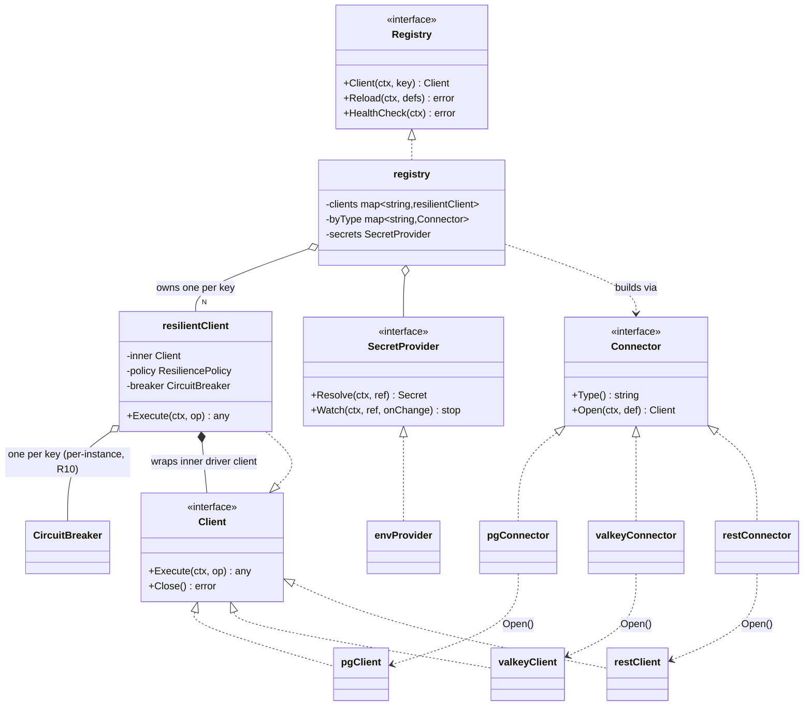

# LLD — Slice B: Connection Registry + Connectors + Resilience

Package scope: `internal/connect` and `internal/connect/drivers`.
Status: **draft for build (v1)** · Module `nzr-rules-engine` · Go 1.22+

This slice designs the data plane's I/O layer: a **Connection Registry** that owns live pooled
clients keyed by connection key, a **Connector** abstraction realized per source type
(postgres / valkey / rest+http), and the **per-connection resilience** envelope (timeout +
retry + circuit breaker) with per-node override.

It is written against the fixed seams in [`lld-contracts.md`](../lld-contracts.md)
(`connect.Registry`, `Client`, `Connector`, `Operation`, `ConnectionDef`, `ResiliencePolicy`)
and the approved [`hld.md`](../hld.md) (ADR-007 reusable typed connections referenced by key;
R3 non-atomic cross-source writes; R4 idempotency; R10 per-instance breakers; R12 secret
resolution; §10 acceptance criteria).

Follows the LLD process in `[[low-level-design]]` (interfaces at module boundaries, DIP,
SRP, high cohesion / low coupling). Resilience design follows `[[retry-and-backoff]]`,
`[[distributed-systems-patterns]]`, `[[error-classification]]`, `[[best-effort-vs-required]]`,
`[[idempotency-and-dedup]]`, and `[[config-and-secrets]]`, cited inline where a choice is driven
by them.

---

## 1. `internal/connect` responsibilities & the Registry implementation

### 1.1 Responsibilities (SRP boundary)

`internal/connect` is the **only** place that holds live, pooled source handles and the only
place that applies the resilience envelope. Its responsibilities, and nothing more:

- Build and own one live pooled client per connection key (the pool/connection lifecycle).
- Resolve a connection key → `Client` for action nodes (`Registry.Client`).
- Apply the resilience envelope (timeout → breaker → retry) around every `Client.Execute`.
- Resolve `SecretRef` → secret value at open and on rotation, via a pluggable `SecretProvider`.
- Hot-reload connection definitions without a process restart (`Registry.Reload`).
- Report health for `/readyz` (`Registry.HealthCheck`).
- Classify every driver error into the shared taxonomy before it crosses the seam (§8).

Explicitly **not** here (owned by other slices, consumed via the `Deps` seam): flow walking,
node sequencing, ZEN evaluation, config-store reads, tracing/metrics emission (Slice E provides
`Tracer`/`Logger`; this slice *calls* them).

### 1.2 Package shape

```
internal/connect/
  registry.go       Registry impl (keyed client table, Reload, HealthCheck)
  client.go         resilientClient: wraps a driver client with the resilience envelope
  resilience.go     timeout + retry-with-jitter + gobreaker wiring; policy merge (node override)
  secret.go         SecretProvider interface + envProvider (v1)
  errors.go         ConnError + classification helpers (the seam taxonomy)
  drivers/
    postgres.go     pgx/pgxpool connector + client
    valkey.go       valkey connector + client
    rest.go         net/http connector + client (shared by rest + http types)
    registry.go     type -> Connector factory table (compile-time registration)
```

### 1.3 Registry implementation

The registry is a concurrency-safe table of built clients, keyed by connection key. It is built
once at startup from `config.Store.Connections(env)` and mutated only by `Reload`.

```go
// internal/connect/registry.go
type registry struct {
    mu       sync.RWMutex
    clients  map[string]*resilientClient // key -> live client (one per key — AC-5)
    byType   map[string]Connector        // "postgres"/"valkey"/"rest"/"http" -> Connector
    secrets  SecretProvider
    tracer   observ.Tracer
    log      observ.Logger
}

func New(connectors []Connector, secrets SecretProvider, t observ.Tracer, l observ.Logger) *registry
```

**Build & own live pooled clients (AC-5).** For each `ConnectionDef`, the registry looks up the
`Connector` by `def.Type`, resolves `def.SecretRef`, calls `Connector.Open(ctx, def)` which
returns a driver-backed `Client` holding **one pool** (pgxpool / valkey client / `http.Client`),
then wraps it in a `resilientClient` carrying the merged `ResiliencePolicy` and a dedicated
`*gobreaker.CircuitBreaker`. The wrapped client is stored under `def.Key`. The pool is created
exactly once per key; `Registry.Client` returns the same `*resilientClient` to every caller,
so all nodes and flows share the one pool (AC-5).

```go
func (r *registry) Client(ctx context.Context, key string) (Client, error) {
    r.mu.RLock(); c, ok := r.clients[key]; r.mu.RUnlock()
    if !ok {
        return nil, &ConnError{Class: Validation, Key: key, msg: "unknown connection key"}
    }
    return c, nil // same instance for every caller — the shared pool (AC-5)
}
```

**Hot-reload (`Reload`).** Reload takes the new desired set of `ConnectionDef`s and reconciles
against the live table under the write lock, computing a three-way diff:

- **Added** key → open a new client, insert.
- **Removed** key → drain and `Close()` after swap (deferred close, so in-flight ops finish).
- **Changed** key (settings/resilience/secretRef differ by content hash) → open a *new* client,
  atomically swap it in, then close the old one. New requests get the new pool; in-flight
  requests on the old pool complete before it closes.
- **Unchanged** key → leave the existing client (and its warm pool + breaker state) untouched.

A per-def content hash (over `Settings`, `Resilience`, `SecretRef`, `Type`) decides changed vs
unchanged, so an unrelated edit elsewhere never churns a healthy pool. Reload is **all-or-nothing
per key**: if opening a replacement fails, that key keeps its old client and `Reload` returns a
classified error naming the failed keys; other keys still reconcile. This matches the HLD's
"engine never 500s on bad config" posture (defensive — a bad connection edit degrades one source,
not the registry).

```go
func (r *registry) Reload(ctx context.Context, defs []ConnectionDef) error
```

Note on precedence vs config versioning (HLD §6c): a **connection version bump** (host/port/pool/
resilience change) arrives as a new `ConnectionDef` and flows through `Reload`. A **secret
rotation** does *not* bump the version and does *not* go through `Reload` — it is handled by the
`SecretProvider` refresh path (§5), so rotating a credential never churns the version table.

**HealthCheck for `/readyz`.** `HealthCheck` fans out a cheap liveness probe to every live client
(`SELECT 1` for postgres, `PING` for valkey, a configured health path or TCP dial for rest) under
a short bounded context, in parallel. It returns the first classified failure (or an aggregate),
so `/readyz` is not-ready until every required connection is reachable and flips to ready once
they are (AC-23). Health probing reuses the pool; it does not open side connections.

```go
func (r *registry) HealthCheck(ctx context.Context) error
```

---

## 2. The `Connector` interface realized per type

One `Connector` per source type, satisfying the fixed seam. Adding a new type (mysql, mongo, …)
is a new file in `drivers/` registered in `drivers/registry.go` — **no change** to the Registry,
the interpreter, or the flow schema (AC-8, ADR-007).

```go
type Connector interface {
    Type() string
    Open(ctx context.Context, def ConnectionDef) (Client, error)
}
```

Each driver `Client` implements `Execute(ctx, Operation) (any, error)` + `Close() error`. The
driver client is the **inner** client (raw I/O); the `resilientClient` from §4 is the **outer**
wrapper that the registry stores and hands out. `Operation.Kind` selects the branch inside
`Execute`; an unsupported `Kind` for a type is a `Validation` error (never a panic).

### 2.1 postgres — `pgx` / `pgxpool`

- **Open**: build `pgxpool.Config` from `Settings` (`host`, `port`, `database`, `user`, pool
  bounds `pool.maxConns`/`pool.minConns`/`pool.maxConnLifetime`), inject the resolved password
  from the `SecretProvider`, `pgxpool.NewWithConfig`. The pool is the shared resource (AC-5).
- **Operation payloads** (`Operation.Payload`):

  | `Kind`  | Payload keys | Returns | Idempotent? |
  |---------|--------------|---------|-------------|
  | `query` | `sql string`, `params []any` | `[]map[string]any` (rows) | yes (read) |
  | `exec`  | `sql string`, `params []any`, optional `idempotencyKey string` | `{rowsAffected int64}` | **only if** the SQL is an UPSERT / keyed write (§6) |

  Parameters are always passed positionally to pgx (`$1,$2,…`) — **never** string-interpolated —
  so the config author cannot create a SQL-injection seam. `query`/`exec` is chosen by the action
  node per its config; a `SELECT` under `exec` or a mutating statement under `query` is a
  `Validation` error at execute time.

### 2.2 valkey

- **Open**: construct a valkey client from `Settings` (`addr`/`addrs`, `db`, `pool.size`,
  `tls`), password from the `SecretProvider`.
- **Operation payloads**:

  | `Kind` | Payload keys | Returns | Idempotent? |
  |--------|--------------|---------|-------------|
  | `get`  | `key string` | value (string/bytes) or `NotFound` | yes |
  | `set`  | `key string`, `value any`, optional `ttl duration`, optional `nx bool` | `{ok bool}` | yes (`SET` is naturally idempotent — `[[idempotency-and-dedup]]`) |
  | `del`  | `key string` (or `keys []string`) | `{deleted int64}` | yes |

  `get` on a missing key maps to the `NotFound` class (§8), not an error-less empty — the action
  node decides whether absence is acceptable.

### 2.3 rest / http (shared by `rest` + `http`)

Both the `rest` and `http` connection types bind to the **same** connector (`restConnector`,
`Type()` returns the registered alias). The HLD treats them as one adapter; the type string only
affects which alias registered it. The transport is the **standard library `net/http`** — not chi
or any third-party router/client — per the user's explicit direction and HLD §5 (stdlib-only
HTTP).

- **Open**: build one shared `*http.Client` with a tuned `http.Transport`
  (`MaxIdleConnsPerHost`, `IdleConnTimeout`, keep-alives). `Settings` carry `baseURL`, default
  `headers`, and transport tunables. The `http.Client`'s own `Timeout` is left unset; the
  per-request timeout is applied via `context` by the resilience envelope (§4) so it composes
  with retry/breaker.
- **Operation payload** (`Kind: "http"`):

  | Payload key | Meaning |
  |-------------|---------|
  | `method`    | `GET`/`POST`/`PUT`/`PATCH`/`DELETE` |
  | `path`      | appended to `baseURL` (or absolute URL) |
  | `headers`   | `map[string]string`, merged over connection defaults |
  | `query`     | `map[string]string` → query string |
  | `body`      | `any` → JSON-encoded for write methods |

  Returns `{status int, headers map, body any}`. The connector maps `4xx`/`5xx` to error classes
  (§8). **Idempotency by method**: `GET`/`PUT`/`DELETE` are treated as idempotent and retryable;
  `POST`/`PATCH` are **not** retried unless the operation carries an explicit `idempotencyKey`
  (§6, `[[idempotency-and-dedup]]`).

---

## 3. Connection reuse (AC-5)

A connection is defined once (keyed, typed) and every node that references the key gets the
**same** `*resilientClient`, which wraps **one** pool. This is enforced structurally:

- The registry stores at most one entry per key (`map[string]*resilientClient`).
- `Open` is called exactly once per key per lifetime of that client (at build, and again only on
  a *changed* `Reload`).
- `Client(key)` is a map read; it never opens a connection on the hot path.
- Pool sizing lives on the connection (`Settings.pool.*`), so capacity is bounded and shared, not
  per-node — this is the bottleneck mitigation named in HLD §7.

**Verification (AC-5):** a test opens N action nodes referencing one key, calls `Client(key)` N
times, and asserts pointer-identity of the returned clients and a pool open-count of exactly 1
(the driver `Open` is counted via a test connector).

---

## 4. Resilience (AC-6, AC-7) — per-connection, per-instance

Every `Client.Execute` goes through a fixed envelope, applied by the `resilientClient` wrapper.
The envelope follows the resilience-pattern family in `[[retry-and-backoff]]`: **fail fast with a
timeout, protect the downstream with a breaker, and retry only transient, idempotent work with
capped jittered backoff.**

### 4.1 Composition order (outer → inner)

```
Execute(op):
  policy ← merge(connectionPolicy, op.Override)        // per-node override wins (AC-7)
  ctx    ← context.WithTimeout(ctx, policy.Timeout)    // (1) bound every wait
  return breaker.Execute(func() {                      // (2) circuit breaker (sony/gobreaker)
    return retry(policy, func() {                      // (3) retry only if op is idempotent
      return driverClient.Execute(ctx, op)             //     innermost raw I/O
    })
  })
```

Why this order: the **timeout is outermost** so the *whole* budget (including retries) is bounded
— a request can't exceed its deadline by retrying. The **breaker wraps the retry** so a tripped
breaker short-circuits before any attempt and so repeated retry failures count toward tripping it.
Retry is **innermost** and is a no-op for non-idempotent ops (§4.4).

### 4.2 Timeout

`policy.Timeout` is applied via `context.WithTimeout`. There is no separate driver-level timeout
(see rest `http.Client.Timeout` left unset in §2.3) so a single deadline governs the operation and
propagates cancellation to pgx/valkey/http. A timed-out op is classified `Timeout` (§8) and counts
as a breaker failure. Default is aggressive, not 60s (`[[retry-and-backoff]]`: "a 60s default is
almost always too high").

### 4.3 Circuit breaker (`sony/gobreaker`) — PER-INSTANCE (HLD R10)

Each connection key owns **one** `*gobreaker.CircuitBreaker`. Settings derive from the policy
(`breaker.failureThreshold`, `breaker.consecutiveFailures` / failure-ratio, `breaker.openTimeout`
for the half-open cooldown). When the breaker is open, `Execute` returns an `Upstream`-classified
`ErrBreakerOpen` immediately — fail fast — and **other connections' breakers are unaffected**,
isolating one slow/down source (AC-6, `[[distributed-systems-patterns]]` fault isolation /
bulkhead intent).

> **Honest limitation (HLD R10 — documented v1 constraint).** Breaker state lives **in the
> process**, per engine instance. With K engine replicas there are K independent breakers for the
> same source: a source failing for everyone trips each replica's breaker separately (each must
> observe its own failures), and the "open" view is per-replica, not global. v1 **accepts** this.
> A globally-shared breaker (state in Valkey) is explicitly out of scope because it adds hot-path
> latency and a shared-state dependency to every call. This is surfaced, not hidden — AC-28
> requires it be documented in the limits doc, and the breaker-state metric (Slice E) is a
> per-instance gauge, labeled as such.

Breaker trips are **not** retried inside the same call (the breaker is above retry). The breaker's
own half-open probe is the recovery mechanism.

### 4.4 Retry with backoff + jitter — idempotent ops only

Retry policy comes from `policy.Retry` (`maxAttempts`, `baseBackoff`, `maxBackoff`). Backoff is
**exponential with jitter and a hard cap**, and the sleep is **cancellable** (respects the
operation deadline / shutdown), per `[[retry-and-backoff]]`.

Retry runs **only** when the operation is idempotent (§6). Idempotency is decided by:
1. **Op kind / HTTP method** — reads (`query`,`get`), and `set`/`del`/`PUT`/`DELETE` are
   idempotent; `exec` writes and `POST`/`PATCH` are not — *unless*
2. the op carries an explicit **`idempotencyKey`**, which makes a write safe to replay (§6).

Only `[[error-classification|transient]]` errors are retried — `Timeout` and `Upstream` (5xx /
connection reset) are transient; `Validation`, `NotFound`, and `4xx` (except 429) are **not**
retried (retrying a validation error loops forever — `[[error-classification]]`). A `429` with
`Retry-After` is honored as the backoff hint. When retry attempts cross the configured threshold,
the client logs at alert level (`[[retry-and-backoff]]`: convert a silent retry storm into a
signal).

### 4.5 Policy merge & per-node override precedence (AC-7)

`ResiliencePolicy` has two layers: the **connection default** (`ConnectionDef.Resilience`) and an
optional **per-node override** carried on the operation. Precedence is **field-level, node wins**:

```go
func mergePolicy(base ResiliencePolicy, override *ResiliencePolicy) ResiliencePolicy
// for each field: override value if set (non-zero / explicitly present), else base.
```

A node that sets only `Timeout` inherits the connection's retry and breaker settings; a node that
sets nothing uses the connection default verbatim. The merge happens **per Execute** on the hot
path, cheaply (value struct, no allocation). The **breaker instance is NOT overridable per node** —
there is one breaker per connection key regardless of node overrides, because breaker state is a
property of the *downstream*, not the call site; a per-node override can tune timeout/retry but
cannot create a second breaker for the same source. This keeps AC-6 isolation coherent.

**Verification (AC-7):** a test sets a connection default timeout of 5s and a node override of
50ms against a deliberately slow stub, asserts the op fails at ~50ms (override won), and a second
node with no override fails at ~5s (default held).

> To express override cleanly at the seam, the operation needs to carry an optional override. See
> **Seam changes requested** (§10) — `Operation` currently has no override field.

---

## 5. Secret resolution (AC-20, R12)

Secrets resolve through a **pluggable `SecretProvider`**, injected into the registry. v1 ships an
**env-backed** provider; the interface leaves room for Vault/SSM later with no registry change
(DIP — `[[low-level-design]]`; `[[config-and-secrets]]`).

```go
// internal/connect/secret.go
type SecretProvider interface {
    // Resolve returns the current secret value for a ref (e.g. "env:PG_ORDERS_PW"
    // or "vault:secret/data/orders#password"). Never logged, never persisted.
    Resolve(ctx context.Context, ref string) (Secret, error)
    // Watch (optional) notifies on rotation so the registry can refresh without a version bump.
    Watch(ctx context.Context, ref string, onChange func()) (stop func(), err error)
}

type Secret struct { v []byte } // String()/MarshalJSON redact to "***" — never leaks the value
func (s Secret) Reveal() []byte { return s.v } // only the driver Open reads the raw bytes
```

Rules enforced by this slice (`[[config-and-secrets]]`, AC-20):

- `ConnectionDef.SecretRef` stores **only the ref**, never a value — matching the HLD rule
  "connections are versioned, secrets are not."
- The resolved value lives only in the `Secret` wrapper and the open driver pool; it is **never**
  written to the `Ctx`, config rows, logs, traces, or error messages. `Secret.String()` and its
  JSON marshaller redact. Error wrapping (§8) carries the connection key, never the secret.
- **Rotation without a version bump (R12).** When the provider signals a rotation (via `Watch`,
  or a bounded TTL re-resolve for env/poll providers), the registry **re-resolves and rebuilds
  just that key's client** (open-new-swap-close, same mechanism as a changed `Reload`), *without*
  advancing the connection's config version. This is deliberately a *different* path from
  `Reload`: `Reload` handles config-shape changes; secret refresh handles credential rotation.
- The env provider (v1) resolves `env:NAME` from the process environment, loaded/validated at
  startup (`[[config-and-secrets]]`: typed, fail-fast). A missing required secret is a fatal
  startup error, not a lazy runtime surprise.

**Verification (AC-20):** a test scans emitted logs/traces and the stored `ConnectionDef` for the
known secret value and asserts it never appears; a `Secret` marshalled to JSON yields `"***"`.

---

## 6. Write semantics across sources (HLD R3) & idempotency (R4)

This slice provides **single-source** execution with resilience; it does **not** provide
cross-source atomicity. The HLD is explicit (R3, ADR-008): **writes are not atomic across
sources** in v1. A flow that writes Postgres then calls a REST endpoint can leave the DB write
committed when the REST write fails. This slice's job is to make that boundary **honest and
classified**, not to hide it.

### 6.1 best-effort vs required (`[[best-effort-vs-required]]`)

Each write operation is classified by the action node as **required** or **best-effort**, and the
classification rides on the operation. This slice honors it:

- **required** write fails → the error propagates (classified, §8); the interpreter aborts the
  unit of work. (The orchestration-level decision to abort is Slice A's; this slice returns the
  classified failure that triggers it.)
- **best-effort** write fails → classified and returned with a `BestEffort` marker so the caller
  logs-and-continues rather than aborting. The classification is explicit at the call site so a
  later reader doesn't "fix" a deliberate best-effort into a hard failure.

AC-27 (negative acceptance): a two-write flow whose second write fails leaves the first committed,
and the failure surfaces as a classified error — documented behavior, not a silent inconsistency.

### 6.2 Idempotent-only retry & the idempotency-key mechanism (R4, `[[idempotency-and-dedup]]`)

Retry (§4.4) only ever replays **idempotent** writes. Two mechanisms make a write safe to replay:

1. **Naturally idempotent writes** — valkey `set`/`del`, HTTP `PUT`/`DELETE`, and postgres
   `exec` whose SQL is an **UPSERT** (`INSERT ... ON CONFLICT ... DO UPDATE`) keyed on a stable
   business key. These are retried freely (`[[idempotency-and-dedup]]`: prefer UPSERT/SET over
   blind INSERT/append).
2. **Idempotency key for non-idempotent writes** — a blind `INSERT`, a `POST`, or any side effect
   is retried **only** if the operation carries an `idempotencyKey` (a sortable unique key, e.g.
   ULID, derived from request + target by Slice A). The mechanism:
   - For HTTP: send the key as an `Idempotency-Key` header; a cooperating downstream dedups.
   - For a guarded local side effect: acquire an atomic dedup lock in valkey
     (`SET key NX` with TTL) keyed on the unit of work; **first writer wins, others skip**. The
     lock is **released if the guarded write fails** so a legitimate retry can re-attempt, and
     carries a TTL so a crash can't leave a permanent tombstone (`[[idempotency-and-dedup]]`).
   - Without an idempotency key, a non-idempotent write is executed **at most once** (never
     auto-retried), surfacing the transient error to the caller instead of risking a duplicate.

The dedup-store failure posture is **documented explicitly** per `[[idempotency-and-dedup]]`:
v1 is **pessimistic** (a dedup-lock error blocks the guarded write rather than risking a
duplicate), because the engine's writes may include money-adjacent operations and a rare silent
duplicate is worse than a surfaced error.

> R4 scope: v1 builds the idempotency-key path for **required** writes that opt in; broader
> coverage is next-phase (HLD §9). This slice provides the mechanism; whether a given flow uses
> it is config.

### 6.3 Dedup guard implementation (`dedup.go`, R4 implemented)

The `dedupGuard` implements the first-writer-wins semantics for non-idempotent writes, backed
by a `DedupStore` interface (satisfied by Valkey in production):

```go
// DedupStore is the atomic lock primitive behind the idempotency-key mechanism.
// The implementation uses Valkey SET NX with TTL.
type DedupStore interface {
    // Acquire attempts to acquire a dedup lock for the given key.
    // Returns true if acquired (first writer), false if already held (duplicate).
    Acquire(ctx context.Context, key string, ttl time.Duration) (acquired bool, err error)
    // Release releases a previously acquired lock.
    // Called when the guarded write fails, allowing legitimate retries.
    Release(ctx context.Context, key string) error
}

// dedupGuard wraps DedupStore with the guard logic.
type dedupGuard struct {
    store DedupStore
    ttl   time.Duration // default 30s — bounded so crash can't permanently suppress
}

// guard wraps a write operation with dedup protection.
// Lock key format: nzr:dedup:{connKey}:{opKind}:{idempotencyKey}
func (g *dedupGuard) guard(
    ctx context.Context,
    connKey string,
    op Operation,
    write func() (any, error),
) (any, error) {
    if op.IdempotencyKey == "" {
        return write() // no key → no dedup, at-most-once semantics
    }
    
    lockKey := fmt.Sprintf("nzr:dedup:%s:%s:%s", connKey, op.Kind, op.IdempotencyKey)
    acquired, err := g.store.Acquire(ctx, lockKey, g.ttl)
    if err != nil {
        // Dedup store failure → pessimistic: block the write
        return nil, fmt.Errorf("dedup lock failed: %w", err)
    }
    if !acquired {
        // Duplicate request → skip (first writer wins)
        return nil, ErrDuplicate
    }
    
    result, err := write()
    if err != nil {
        // Write failed → release lock so retry can re-attempt
        g.store.Release(ctx, lockKey)
        return nil, err
    }
    // Success — lock remains until TTL expires
    return result, nil
}
```

**Key properties:**
- **First-writer-wins**: the first request with a given idempotency key acquires the lock and
  performs the write; subsequent requests with the same key are skipped.
- **TTL-bounded**: locks expire after TTL (default 30s) so a crashed process cannot permanently
  suppress legitimate writes.
- **Release on failure**: if the guarded write fails, the lock is released immediately so a
  legitimate retry can re-attempt.
- **Pessimistic on dedup failure**: if the dedup store itself fails, the write is blocked rather
  than risking a duplicate (money-adjacent operations).

---

## 7. Diagrams

### 7.1 Class diagram (structure)



### 7.2 Sequence diagram (action node resolves a client by key, executes with breaker + timeout)

```mermaid
sequenceDiagram
    autonumber
    participant AN as Action node (Slice A)
    participant R as Registry
    participant RC as resilientClient
    participant CB as gobreaker (per key)
    participant D as driver Client (pg/valkey/http)
    participant S as Source

    AN->>R: Client(ctx, "pg_orders")
    R-->>AN: resilientClient (shared, AC-5)
    AN->>RC: Execute(ctx, op{Kind, Payload, Override?})
    RC->>RC: policy = merge(connDefault, op.Override)  %% node wins (AC-7)
    RC->>RC: ctx = WithTimeout(ctx, policy.Timeout)
    RC->>CB: Execute(fn)
    alt breaker OPEN
        CB-->>RC: ErrBreakerOpen  %% fail fast
        RC-->>AN: Upstream error (not retried)
    else breaker CLOSED/HALF-OPEN
        loop retry (idempotent ops only, capped+jitter)
            CB->>D: fn() -> Execute(ctx, op)
            D->>S: query / get-set / http
            alt success
                S-->>D: result
                D-->>CB: result
                CB-->>RC: result (success -> breaker counts ok)
            else transient error (Timeout/Upstream)
                S-->>D: error
                D-->>CB: classified error
                CB->>CB: record failure
                RC->>RC: backoff+jitter (cancellable) ; retry if attempts left & idempotent
            end
        end
        RC-->>AN: result or classified error
    end
```

---

## 8. Error classification across the seam

Every error leaving this slice is a typed `ConnError` carrying a class from the shared taxonomy
(`[[error-classification]]`, lld-contracts seam rule). Callers classify with `errors.Is`/`As`,
never by string match. Wrap-with-context preserves the cause; the connection key is always
attached, secret values never are.

```go
// internal/connect/errors.go
type ErrClass int
const ( Timeout ErrClass = iota; NotFound; Validation; Upstream; Internal )

type ConnError struct {
    Class ErrClass
    Key   string   // connection key (safe to log)
    Op    string   // op kind (safe)
    cause error    // wrapped (%w); never contains secrets
}
func (e *ConnError) Error() string
func (e *ConnError) Unwrap() error
```

Mapping rules (driver → class → retry posture):

| Class | Source signal (examples) | Retryable? | Who acts |
|-------|--------------------------|------------|----------|
| **Timeout** | ctx deadline exceeded, pool-acquire timeout, slow HTTP | **yes** (transient) | retry (if idempotent) → breaker counts |
| **NotFound** | valkey `get` miss, pg `no rows` where a row is required, HTTP 404 | no | caller decides if absence is acceptable |
| **Validation** | unknown key, unsupported `Kind` for type, bad SQL shape, HTTP 400/422 | no (loops forever if retried) | surface to author/caller |
| **Upstream** | pg connection reset, valkey down, HTTP 5xx / 429, `ErrBreakerOpen` | **yes** except 4xx; 429 honors Retry-After | retry (if idempotent) + breaker |
| **Internal** | encode/decode bug, impossible state in this slice | no | log + propagate; fix the engine |

- `Timeout` and `Upstream` are the only **transient** classes → the only ones §4.4 retries.
- `Validation`/`NotFound` are **poison** → never retried (`[[error-classification]]`).
- `ErrBreakerOpen` is surfaced as `Upstream` but is **not** retried in-call (the breaker owns
  recovery).

---

## 9. Test plan (maps to AC-5, AC-6, AC-7, AC-8, AC-20)

Unit tests use a fake `Connector`/`Client` (counting opens, injecting faults) so the registry and
resilience logic are testable with **no real I/O**. Integration tests run against **ephemeral**
Postgres and Valkey (containers, torn down per run; CGO-aware CI per HLD §9/AC-25). Table-driven
where the input varies.

| AC | Level | Test |
|----|-------|------|
| **AC-5** (reuse: one pool per key) | unit | N `Client(key)` calls return the same instance (pointer identity); fake connector asserts `Open` called exactly once per key; `Reload` with an unchanged key does not re-open. |
| **AC-5** | integration | A flow with two nodes on one pg key shares the pgxpool; assert pool stat `TotalConns`/acquire-count reflects one pool, not two. |
| **AC-6** (breaker opens, fail fast, others healthy) | unit (**fault injection**) | A fake client returns N consecutive `Upstream` errors; assert breaker trips after threshold, subsequent calls return `ErrBreakerOpen` **without** invoking the inner client, and after `openTimeout` a half-open probe is allowed. A **second** connection's breaker stays closed and serving (isolation). |
| **AC-6** | integration | Point a rest connection at a stub that 503s / hangs; assert the connection's breaker opens and a parallel healthy pg connection is unaffected. |
| **AC-7** (per-node override precedence) | unit | Connection default timeout 5s + node override 50ms vs a slow stub → op fails ~50ms (override won); a no-override node → fails ~5s (default held). Field-level merge: node overriding only `Timeout` keeps default retry/breaker. |
| **AC-8** (new type via `Connector`, no engine change) | compile + unit | A test `fooConnector` implementing `Connector` registers in `drivers/registry.go` and is served by the **unchanged** registry; assert `Client("foo_key").Execute` works with no interpreter/schema edit. (Design-review + compile-time interface satisfaction.) |
| **AC-20** (secrets never leak) | unit | Resolve a known secret; scan all emitted log/trace fields and the serialized `ConnectionDef` → value never present; `Secret` JSON == `"***"`; error from a failed open names the key, not the password. |
| Retry correctness (supports AC-6) | unit | Transient error retried with capped jittered backoff up to `maxAttempts`; `Validation` **not** retried; `POST` without idempotency key **not** retried; `PUT` retried; backoff sleep cancels on ctx cancel. |
| Reload reconciliation | unit | Added/removed/changed/unchanged diff: changed key swaps client (old closed after in-flight), unchanged key keeps warm pool + breaker state; a failing replacement keeps the old client and returns a classified error naming the key. |
| Secret rotation (R12) | unit | `Watch` fires → the key's client is rebuilt (new pool) and the connection **version is unchanged**; in-flight op on old pool completes. |
| HealthCheck / readiness (supports AC-23) | integration | `HealthCheck` fails while a required source is down, passes once reachable; probe reuses the pool (no side connections). |
| Write semantics (AC-27, R3) | integration | Two-write flow (pg then rest); fault the rest write → pg write stays committed, failure surfaces as a classified `Upstream`/`BestEffort` error (not a hidden inconsistency). |
| Idempotency key (R4) | unit + integration | Guarded `POST`/INSERT replays once under retry with an idempotency key (dedup lock `SET NX`); lock released on failure so a legitimate retry re-attempts; no key → at-most-once. |

---

## 10. Seam changes requested

Changes to [`lld-contracts.md`](../lld-contracts.md) this slice needs. Flagged for the stitch step
because they affect other slices (Slice A constructs `Operation`; Slice D supplies
`ConnectionDef`).

1. **`Operation` needs an optional per-node resilience override (AC-7).** The fixed `Operation`
   carries `Kind` + `Payload` but no way to express the per-node override the HLD/ADR-007 and AC-7
   require. Requested addition:
   ```go
   type Operation struct {
       Kind     string
       Payload  map[string]any
       Override *ResiliencePolicy // optional per-node override; nil = use connection default (AC-7)
       Idempotent bool            // op-level idempotency hint (write replay safety, R4)
       IdempotencyKey string      // optional; enables safe retry of a non-idempotent write (R4)
   }
   ```
   Rationale: without `Override`, there is no seam to carry the node-level timeout/retry; without
   `Idempotent`/`IdempotencyKey`, the retry layer cannot know a write is safe to replay (§4.4, §6).
   Slice A (action nodes) populates these from node config.

2. **`ResiliencePolicy` field shape must be nameable for field-level merge (AC-7).** The contract
   names `ResiliencePolicy` but does not fix its fields. This slice assumes (and requests the
   contract fix to):
   ```go
   type ResiliencePolicy struct {
       Timeout time.Duration
       Retry   struct { MaxAttempts int; BaseBackoff, MaxBackoff time.Duration }
       Breaker struct { FailureThreshold uint32; FailureRatio float64; OpenTimeout time.Duration }
   }
   ```
   Pointer-or-zero semantics per field so `mergePolicy` can tell "unset" from "set to zero".

3. **`SecretProvider` interface should live in the shared contract.** This slice defines
   `SecretProvider` (§5) because no slice owns it yet, but Slice D (config) also resolves refs at
   publish/validate time. Requested: promote the `SecretProvider` interface (and `Secret` wrapper
   with redaction) into `lld-contracts.md` so both slices depend on one abstraction (DIP), with
   `internal/connect` owning the env implementation for v1.

4. **A `BestEffort`/required marker on write results (R3).** For §6.1, the caller must distinguish
   a failed **best-effort** write (log-and-continue) from a failed **required** write (abort). This
   can be an op-level flag (on `Operation`, mirroring item 1) rather than a new error type —
   requested as `Operation.Required bool` so the classification is explicit at the call site per
   `[[best-effort-vs-required]]`.

If the stitch step prefers to keep `Operation` minimal, an acceptable alternative is a sibling
`ExecuteWith(ctx, op, Options)` method on `Client` carrying override/idempotency/required —
flagged here so the decision is made once, not per slice.
