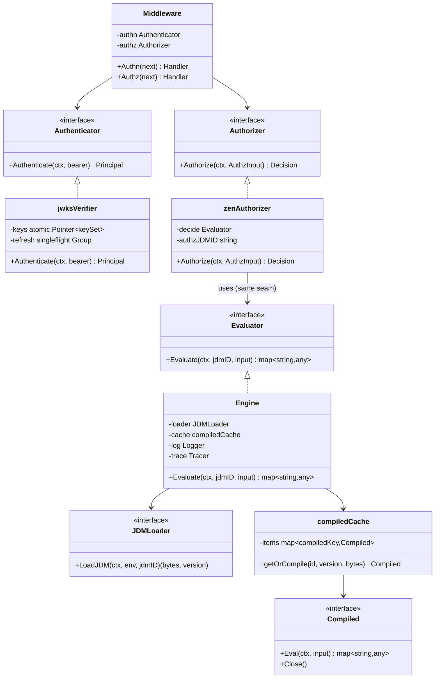

# LLD — Slice C: ZEN integration (`internal/decision`) + AuthN/AuthZ (`internal/auth`)

Status: **draft for build** · Scope: Slice C only · Go 1.22+ · Module `nzr-rules-engine`

This slice designs two internal packages against the fixed seams in
`docs/lld-contracts.md` and the approved `docs/hld.md`:

- `internal/decision` — embed GoRules **ZEN** (zen-go, Rust+CGO) as the pure decision engine
  (HLD ADR-001, ADR-003), implementing the fixed `decision.Evaluator` seam.
- `internal/auth` — **AuthN** (JWT validation via JWKS) and **AuthZ** (authorization expressed
  as a ZEN decision), both over stdlib `net/http` (HLD §3, §5).

Follows the wiki: interfaces at module boundaries, DIP, high cohesion / low coupling per
`[[low-level-design]]`; deny-by-default, authenticate-then-authorize, secrets-out-of-logs per
`[[security-and-authz]]`; typed+validated-at-startup config and `secretRef`-only secrets per
`[[config-and-secrets]]`; the `Timeout`/`NotFound`/`Validation`/`Upstream`/`Internal`
taxonomy per `[[error-classification]]`.

Acceptance criteria owned by this slice: **AC-4** (deterministic ZEN eval), **AC-18** (JWT/JWKS,
rotation without restart), **AC-19** (ZEN AuthZ allow/deny), **AC-20** (no secrets in logs). It
also underpins the Phase-0 gate **AC-S1** (CGO build) and **AC-S2** (ZEN condition correctness).

---

## 1. `internal/decision` — ZEN integration

### 1.1 Responsibility & boundary

`decision` is the **only** package that links against zen-go and the only place CGO is required
in this slice. It exposes exactly one seam — `decision.Evaluator` from `lld-contracts.md`:

```go
type Evaluator interface {
    Evaluate(ctx context.Context, jdmID string, input map[string]any) (map[string]any, error)
}
```

Per HLD §4/ADR-001 the contract is **JSON in, JSON out, no I/O inside ZEN**. The engine owns all
I/O and sequencing; ZEN only decides. `decision` therefore does *not* reach the network or the
Postgres store directly — it receives a loader port and a cache (DIP, `[[low-level-design]]`).

### 1.2 Package shape (DIP ports)

```
internal/decision/
  evaluator.go      // Engine: implements decision.Evaluator
  loader.go         // JDMLoader port (satisfied by config.Store adapter)
  cache.go          // compiledCache: (id,version) -> *zen.Decision
  zen_cgo.go        // //go:build cgo  — real zen-go binding wrapper
  zen_stub.go       // //go:build !cgo — build-time guard (see §2)
  errors.go         // classification mapping to the shared taxonomy
```

The concrete type is `decision.Engine`. It depends on two injected ports, never on their
concrete owners:

```go
// JDMLoader resolves the active JDM bytes + version for an id in the request's env.
// Satisfied by a thin adapter over config.Store.GetJDM (Slice D) — decision never
// imports config directly, keeping the dependency arrow pointing at the abstraction.
type JDMLoader interface {
    LoadJDM(ctx context.Context, env, jdmID string) (jdm []byte, version int, err error)
}

// Compiled is our OWN adapter interface wrapping a zen-go compiled decision. It stays as the
// internal abstraction; the real binding is wrapped behind it (see "zen-go v2 mapping" below).
type Compiled interface {
    Eval(ctx context.Context, input map[string]any) (map[string]any, error)
    Close()
}

// >>> zen-go v2 mapping (Phase 0 spike, 2026-10-02 — module github.com/gorules/zen-go/v2 @ v2.1.2)
// The real binding differs from the pre-spike assumptions; the differences are absorbed INSIDE
// this adapter so the public decision.Evaluator seam is unchanged:
//   - compile:  zen.Engine.CreateDecision([]byte) zen.Decision   (keyed by (id,version) in cache)
//   - evaluate: Decision.Evaluate(input any) (*EvaluationResponse, error)  — NO ctx arg
//               -> our Compiled.Eval honors ctx AROUND the call (check ctx.Err() before/after;
//                  optional hard-timeout goroutine). No in-eval cancellation (document in §8).
//   - result:   resp.Result is json.RawMessage -> Unmarshal to map[string]any at this seam.
//   - dispose:  zen.Decision.Dispose()  (our Compiled.Close() calls Dispose); Engine.Dispose() on
//               graceful shutdown (wired by cmd/engine).
//   - ctor:     zen.NewEngine(EngineConfig{}) returns NO error (deferred); surface init failure on
//               first CreateDecision/Evaluate.
//   - import:   the "/v2" path; cgo wrapper lives in zen_cgo.go (//go:build cgo).
// <<< end zen-go v2 mapping

type Engine struct {
    loader JDMLoader
    cache  *compiledCache     // keyed by (jdmID, version)
    log    observ.Logger      // structured; never logs input values at info (§6)
    trace  observ.Tracer
    envOf  func(context.Context) string // env pulled from request ctx (per-env isolation)
}
```

`envOf` reflects HLD ADR-006 per-environment isolation: the JDM id is resolved **within the
request's environment**, so a dev JDM can never be evaluated against prod. The seam
`Evaluate(ctx, jdmID, input)` keeps env out of the public signature (env rides on `context.Context`),
so the fixed contract is unchanged.

### 1.3 Loading a JDM by id (resolve path)

```
Evaluate(ctx, jdmID, input)
  env := envOf(ctx)
  (bytes, version) := loader.LoadJDM(ctx, env, jdmID)   // config.Store.GetJDM via adapter
  compiled := cache.getOrCompile(jdmID, version, bytes) // compile once, reuse
  out := compiled.Eval(ctx, input)
  return out
```

- The config `Store` (Slice D) already serves JDM bytes from Valkey → config store on miss, with
  pub/sub invalidation on publish (HLD §6c, R5). `decision` never caches the *bytes*; Slice D
  owns that. `decision` caches the **compiled graph** (next section).
- `version` comes back from `GetJDM` and is the cache key component. Because config is immutable
  per version (HLD §6c), a given `(id,version)` compiles to a byte-identical graph — this is what
  makes the compiled cache safe.

### 1.4 Caching COMPILED JDMs, keyed by `(id, version)`

ZEN compilation (parse JDM → build the decision graph) is the expensive step; evaluation is
microsecond-scale (HLD §7). We cache the compiled graph, not the raw bytes.

```go
type compiledKey struct { ID string; Version int }

type compiledCache struct {
    mu    sync.RWMutex
    items map[compiledKey]Compiled
}
```

- **Key = `(jdmID, version)`.** Immutable versions (HLD §6c) mean an entry never goes stale
  within its key — a new publish creates a *new version*, hence a *new key*, so there is no
  update-in-place and no read-your-write race on a live entry.
- **getOrCompile**: double-checked locking — `RLock` fast path; on miss, `Lock`, re-check,
  `compile(bytes)`, store. One compile per `(id,version)` even under concurrent first use.
- **Invalidation on publish**: publish advances the active-version pointer to a *new* version
  (HLD §6c). The next `Evaluate` resolves the new `version` from `GetJDM` and misses the cache,
  compiling the new graph lazily. Old entries for superseded versions are evicted by a small
  **bounded LRU** (keep the N most-recent `(id,version)` graphs) so in-flight requests pinned to
  an older version (HLD R1/AC-11) still find their graph. We do **not** need to subscribe to the
  Valkey invalidation channel here — version-keying makes invalidation implicit. (If memory
  pressure from many versions ever matters, a pub/sub-driven proactive evict is a later
  optimization, not v1.)
- **Lifecycle**: `Compiled.Close()` frees the Rust-side graph; the LRU calls it on eviction and
  the Engine calls it for all entries on graceful shutdown (ties to AC-24, owned by Slice E but
  honored here).

### 1.5 The `Evaluate` contract — snapshot in, decision map out

- **Input is a snapshot.** Callers (Slice A nodes, AuthZ) build a plain `map[string]any`
  projection of the relevant `Ctx` subset and pass it by value semantics. ZEN must not see
  pointers into live `Ctx` and must not mutate the caller's map. The Engine treats `input` as
  read-only and relies on zen-go returning a freshly-allocated result map.
- **Output is a decision map.** `Evaluate` returns the JDM's output object as `map[string]any`
  (JSON object). It carries no engine types, so the seam stays slice-agnostic.
- **Determinism (AC-4).** Given a fixed `input` and a fixed `(id,version)`, the output is
  identical across calls, instances, and time. We guarantee this by: (a) version-keyed compiled
  graphs (same graph for same key); (b) forbidding any node that reads wall-clock/random/I/O in
  v1 JDMs — enforced by publish-time validation (Slice D) and asserted by this slice's unit
  tests; (c) passing an immutable input snapshot. A `context` deadline may *abort* an eval
  (→ `Timeout`) but never changes a produced result.

---

## 2. CGO build implications (code level) — ties to ADR-003 / R9

zen-go wraps the Rust `zen-engine` through cgo; embedding it in-process is HLD **ADR-003**, and
**R9** flags the CGO tax (loses static-binary/cross-compile ease, harder crash debugging).

- **Build tags isolate the dependency.** `zen_cgo.go` carries `//go:build cgo` and holds the only
  `import "github.com/gorules/zen-go/v2"` (note the `/v2`, confirmed by the spike) and the only
  `import "C"` indirection (indirect — via the binding). `zen_stub.go`
  carries `//go:build !cgo` and provides the same package API but every constructor returns a
  `Validation`-classified error ("engine built without CGO; ZEN unavailable"). Result: a non-CGO
  build still *compiles* (useful for pure-Go lint/vet lanes and for other slices' unit tests that
  mock `Evaluator`), but refuses to run decisions — it never silently no-ops.
- **CGO must be on for the real binary.** `cmd/engine` is built with `CGO_ENABLED=1` and a C
  toolchain present. The Rust/zen-go static lib links at build time. CI runs the CGO lane in the
  **target image** (AC-S1, AC-25) — proving the build in the real image is the R9 de-risk.
- **cgo flags.** zen-go supplies the needed `#cgo` `CFLAGS`/`LDFLAGS` in its own package; our
  wrapper adds none beyond what the binding requires. We pin the zen-go version
  (`[[security-and-authz]]`: pin & vet deps) and record the required C toolchain in CI.
- **Linking/portability constraints (document, per R9).** Fully-static linking and
  cross-compilation are constrained; the target image must carry the matching libc / runtime.
  This is a documented v1 constraint, with the sidecar remaining the fallback if the build pain
  outweighs the latency win.
- **Blast radius.** Only `internal/decision` is CGO-coupled. `internal/auth` is pure Go even
  though AuthZ *uses* ZEN — it calls through the `Evaluator` seam, so it carries no cgo import.

---

## 3. How Slice A condition / decision nodes call `Evaluator`

Slice A's `Condition`/`Switch`/`Decision` handlers receive `Deps` (which carries
`Decide decision.Evaluator`) and the request `Ctx`. The seam between A and C is **input
projection → Evaluate → map the result**:

### 3.1 Input projection (Ctx subset → `map[string]any`)

The node spec names the context paths it needs (so we never serialize the whole `Ctx` — same
PII/secret discipline as the Logger node, HLD §3). The handler builds a snapshot:

```
input := {}
for each path p in node.Spec.inputs:
    v, ok := c.GetPath(p)         // merged Input+Data+Response view (Slice A)
    if ok { input[alias(p)] = v }
decision := dep.Decide.Evaluate(ctx, node.Spec.jdmID, input)
```

The snapshot is a value copy; ZEN never holds a reference into `Ctx` (keeps the Parallel-node
concurrency rule in `lld-contracts.md` intact).

### 3.2 Result → `Directive.Branch` (Condition/Switch) or `Set` value (Decision)

- **Condition / Switch** → the handler reads the branch selector from the decision map (e.g.
  `decision["branch"]` or a boolean `decision["result"]` mapped to `"true"`/`"false"`) and
  returns `Directive{Branch: selected}`. `""` means linear. The interpreter descends that child.
  The selected key is also what gets logged as `branch_taken` (HLD §3 searchable fields, AC-2).
- **Decision (computed value)** → the handler takes the decision map (or a named field of it) and
  mounts it into the response via `c.SetPath(node.Spec.targetPath, value)` — i.e. a Decision node
  produces a `Set`-style write of a ZEN-computed value (HLD §4 step 5). Field appears only if the
  branch ran (AC-3).

This keeps the A/C seam one-directional: A projects and interprets; C stays pure.

---

## 4. `internal/auth` — AuthN (JWT via JWKS)

Authenticate-then-authorize, deny-by-default, don't-trust-input per `[[security-and-authz]]`.
AuthN runs **first** in the middleware chain, before routing to a flow (HLD §4 step 1).

### 4.1 Shape over stdlib `net/http`

No third-party router (HLD §5). The authenticator is a standard middleware
(`func(http.Handler) http.Handler`):

```go
// Authenticator validates a bearer token and returns the caller principal.
type Authenticator interface {
    Authenticate(ctx context.Context, bearer string) (Principal, error)
}

type Principal struct {
    Subject string            // "sub"
    Roles   []string          // from a configured claim (e.g. "roles"/"groups")
    Claims  map[string]any    // remaining claims, for AuthZ input
}

// Middleware: extracts Authorization: Bearer <jwt>, validates, injects Principal
// into the request context; 401 on any failure (deny by default).
func (m *Middleware) Authn(next http.Handler) http.Handler
```

- Extract the `Authorization: Bearer` header; missing/malformed → **401** (no detail leaked to
  the client; detail goes to logs only — `[[security-and-authz]]`).
- On success, store `Principal` in the request `context.Context` for downstream AuthZ and the
  interpreter. On failure, write 401 and **do not** call `next` (deny-by-default).

### 4.2 JWT validation + JWKS with rotation (AC-18)

```go
type jwksVerifier struct {
    issuer   string
    audience string
    jwksURL  string                 // from config (not a secret, but configurable per env)
    keys     atomic.Pointer[keySet] // cached, swapped atomically on refresh
    client   *http.Client           // its own timeout; honors ctx
    refresh  singleflight.Group     // collapse concurrent refreshes
    clock    func() time.Time       // injectable for deterministic tests
}
```

Validation steps (each failure → `Validation`-classified → 401 at the middleware):

1. Parse the JWS header; read `kid`.
2. Look up `kid` in the cached `keySet`. **On miss, refresh once** (`singleflight` collapses the
   stampede), then retry the lookup. Unknown `kid` after refresh → reject.
3. Verify the signature with the resolved public key; verify `exp`/`nbf` against `clock()` (small
   leeway), and verify `iss == issuer` and `aud contains audience`.
4. Build `Principal` from `sub` + configured roles claim.

**Key rotation without restart (AC-18):** the cached `keySet` has a bounded TTL *and* a
`kid`-miss triggers an immediate refresh, so a freshly-rotated signing key is picked up on first
use of a token signed by it — no restart. The swap is `atomic.Pointer`, so readers never block on
a refresh and never see a half-updated set. We also cap refresh frequency (min interval) so a
flood of unknown-`kid` tokens can't turn into a JWKS-endpoint DoS.

`clock` injection makes the token-validity matrix (expired/not-yet-valid) deterministic in tests
(§9), supporting AC-18.

---

## 5. `internal/auth` — AuthZ as a ZEN decision (AC-19)

AuthZ is **policy expressed as a ZEN decision**, not hand-rolled role checks (HLD §4 step 4,
ADR-001). It reuses the exact same `decision.Evaluator` seam as condition nodes — one authoring
model for all pure logic.

### 5.1 Interface & lifecycle position

```go
// Authorizer decides allow/deny for a principal performing an action on a resource.
type Authorizer interface {
    Authorize(ctx context.Context, in AuthzInput) (Decision, error)
}

type AuthzInput struct {
    User     string            // principal.Subject
    Roles    []string
    Resource string            // route/resource identifier (e.g. "orders")
    Action   string            // HTTP method mapped to verb (read/write/...)
    Attrs    map[string]any    // extra claims / request attributes for ABAC rules
}

type Decision struct { Allow bool; Reason string } // Reason for logs/audit, not for the client
```

AuthZ runs **early**, right after AuthN and route resolution, before any flow I/O (HLD §4). It is
implemented by projecting `{user, roles, resource, action}` (+ attrs) into a `map[string]any` and
calling `Evaluate(ctx, authzJDMID, input)`:

```
in  := { user, roles, resource, action, attrs... }
out := decide.Evaluate(ctx, cfg.AuthzJDMID, in)   // same ZEN seam as Slice A
allow := out["allow"] == true                      // deny by default if field absent/false
```

### 5.2 Allow / deny mapping (AC-19)

- `allow == true` → request proceeds to the interpreter.
- Anything else (`allow` false, missing, or non-bool) → **deny → 403**, deny-by-default per
  `[[security-and-authz]]`. The client gets a generic 403; `Decision.Reason` and the policy id
  are logged as a security-relevant event (authz failure) for audit (`[[security-and-authz]]`).
- An *error* from `Evaluate` (not a deny) is a seam error, classified per §8 — a `Timeout`
  surfaces as 503-ish upstream handling, an `Internal` as 500; it is **never** silently treated
  as allow.

The AuthZ JDM is itself a versioned, published JDM (HLD §6c), so authorization policy changes
without redeploy and is testable with fixtures like any other decision.

---

## 6. Secret handling (AC-20)

Per `[[config-and-secrets]]` (typed, validated-at-startup, fail-fast; secrets never in code,
logs, args, or VCS) and HLD §6c (secrets are not versioned; only `secretRef` is stored).

- **What is config vs secret here.** `issuer`, `audience`, and `jwksURL` are non-secret config
  (per-env, in the typed config struct). The JWKS endpoint publishes **public** keys, so no
  private signing key ever lives in this engine — the engine *verifies*, it does not *sign*. If a
  deployment ever needs a symmetric secret (HS256) or a client credential to fetch JWKS, that is
  referenced by **`secretRef`** and resolved by the Slice-D/registry secret backend (env for v1,
  pluggable to Vault/SSM, R12), never inlined.
- **Startup validation.** `auth` config is validated at startup (required `issuer`, `audience`,
  a reachable-looking `jwksURL`); invalid → log + non-zero exit (fail fast,
  `[[config-and-secrets]]`).
- **No secrets in logs/traces/decisions (AC-20).** The authenticator logs only non-sensitive
  identifiers: `sub`, `kid`, issuer, outcome. It **never** logs the raw bearer token, the full
  claim set, or any `secretRef` value. The ZEN input snapshot for AuthZ excludes bearer/token
  material. Decision output logged for audit carries `allow`/`reason`/policy-id only. A unit test
  scans emitted log/trace fields to assert no token/secret substrings appear (AC-20 verification).
- **Redaction at the seam.** Any `fields map[string]any` handed to `observ.Logger` from this
  slice passes a small redactor that drops known-sensitive keys (`authorization`, `token`,
  `password`, anything matching the secret-path convention) before `Emit`.

---

## 7. Diagrams

### 7.1 Class diagram



### 7.2 Sequence diagram — request → AuthN → AuthZ (ZEN) → interpreter condition → Evaluator

```mermaid
sequenceDiagram
    autonumber
    participant C as Client
    participant MW as auth.Middleware (net/http)
    participant AN as jwksVerifier (AuthN)
    participant JK as JWKS endpoint
    participant AZ as zenAuthorizer (AuthZ)
    participant EV as decision.Engine (ZEN)
    participant IN as flow.Interpreter (Slice A)

    C->>MW: HTTP request (Authorization: Bearer <jwt>)
    MW->>AN: Authenticate(ctx, bearer)
    alt kid not in cached keyset
        AN->>JK: GET JWKS (singleflight)
        JK-->>AN: public keys (rotated set)
        AN->>AN: atomic swap keyset
    end
    AN-->>MW: Principal{sub,roles,claims}  (or Validation err)
    alt AuthN fails
        MW-->>C: 401 (generic; detail logged)
    else AuthN ok
        MW->>AZ: Authorize(ctx, {user,roles,resource,action})
        AZ->>EV: Evaluate(ctx, authzJDMID, input)
        EV->>EV: resolve (id,version) + getOrCompile + Eval
        EV-->>AZ: {allow: bool, reason}
        alt deny / allow absent
            AZ-->>MW: Decision{Allow:false}
            MW-->>C: 403 (deny-by-default; audit log)
        else allow
            AZ-->>MW: Decision{Allow:true}
            MW->>IN: next handler (flow walk)
            IN->>EV: Evaluate(ctx, condJdmID, ctxSubset)  %% condition node
            EV-->>IN: {branch: "..."}
            IN->>IN: descend Directive.Branch
            IN-->>C: stitched response
        end
    end
```

---

## 8. Error classification across the seam

Per `[[error-classification]]` and the `lld-contracts.md` taxonomy
(`Timeout`/`NotFound`/`Validation`/`Upstream`/`Internal`), classified with typed/sentinel
errors (never string matching), wrapped with context as they cross the seam.

| Origin | Condition | Class | Caller behavior |
| --- | --- | --- | --- |
| `decision` | `jdmID` not found via loader | `NotFound` | Condition node → config/validation error (never a runtime 500 for bad config, HLD AC-15); AuthZ → treat as deny + alert |
| `decision` | JDM fails to compile (malformed graph) | `Validation` | Rejected at load/eval; config-level fault, not retried |
| `decision` | `ctx` deadline/cancel during eval | `Timeout` | Fail fast; propagate; request → 503-class |
| `decision` | zen-go/CGO internal panic recovered | `Internal` | 500-class; logged with ids; graph not cached |
| `decision` | engine built without CGO (stub) | `Validation` | Startup/first-use failure, explicit message (§2) |
| `auth` (AuthN) | missing/malformed bearer, bad sig, expired, wrong iss/aud, unknown kid after refresh | `Validation` | **401**, generic to client, detail in logs |
| `auth` (AuthN) | JWKS fetch timeout / unreachable | `Timeout`/`Upstream` | Reject (fail closed) **401/503**; cached keyset used if still valid; never fail-open |
| `auth` (AuthZ) | policy returns deny / `allow` absent | *not an error* → `Decision{Allow:false}` | **403**, audit log |
| `auth` (AuthZ) | `Evaluate` returns error | propagate class from `decision` | Never treated as allow (deny-by-default) |

Rules honored: fail **closed** on both AuthN and AuthZ (deny-by-default, `[[security-and-authz]]`);
bad config surfaces as `Validation`/`NotFound`, never a 500 (HLD AC-15); every classified error
logged with structured ids (`trace_id`, `request_id`, `jdm_id`, `kid`), never bare strings.

---

## 9. Unit test plan (AC-4, AC-18, AC-19)

Table-driven per the project default; mock the seams (`JDMLoader`, `Evaluator`, JWKS source,
`clock`) so tests need no network and no CGO where possible (the stub lane covers non-CGO; a
CGO-tagged lane exercises the real zen-go — AC-S2/AC-25).

### 9.1 `decision` — determinism & compiled cache (AC-4)
- **Table-driven decision cases**: `cases := []{name, jdmID, input, wantOutput}`; load a small
  fixed JDM, assert `Evaluate` returns `wantOutput` exactly. (AC-4, AC-S2.)
- **Determinism**: evaluate the same `(id,version,input)` N times and across two `Engine`
  instances; assert byte-identical output.
- **Compiled cache**: assert `getOrCompile` compiles once for repeated `(id,version)` (compile
  counter via a fake compiler) and compiles **again** for a new version (simulated publish),
  proving version-keyed invalidation.
- **No-nondeterminism guard**: a JDM referencing a forbidden now/random node fails publish-time
  validation (asserted via the validator contract) — documents the AC-4 determinism boundary.
- **Error mapping**: loader-miss → `NotFound`; malformed JDM → `Validation`; cancelled ctx →
  `Timeout` (table of classification cases, §8).

### 9.2 `auth` AuthN — token-validity matrix (AC-18)
Table over `{name, token mutation, keyset state, now, wantStatus}`:

| case | token | keyset | now | want |
| --- | --- | --- | --- | --- |
| valid | signed by current key | has kid | within exp | 200 (Principal) |
| expired | valid sig | has kid | after exp | 401 |
| not-yet-valid | valid sig, nbf future | has kid | before nbf | 401 |
| bad signature | tampered | has kid | ok | 401 |
| wrong issuer | valid sig | has kid | ok | 401 |
| wrong audience | valid sig | has kid | ok | 401 |
| unknown kid, refresh fixes | signed by rotated key | miss→refresh adds | ok | 200 (**rotation without restart**) |
| unknown kid, still missing | random kid | miss, refresh no help | ok | 401 |
| missing/garbled header | — | — | — | 401 |
| JWKS endpoint down | valid-looking | fetch errors | ok | 401/503, fail-closed |

Rotation case asserts a single `singleflight` fetch and an atomic keyset swap (no restart).
`clock` injected for the exp/nbf cases → deterministic.

### 9.3 `auth` AuthZ — ZEN allow/deny (AC-19)
Table-driven over a stubbed `Evaluator` and over a real tiny AuthZ JDM:

| case | roles | resource | action | policy out | want |
| --- | --- | --- | --- | --- | --- |
| admin writes | [admin] | orders | write | {allow:true} | proceed |
| viewer writes | [viewer] | orders | write | {allow:false} | 403 |
| viewer reads | [viewer] | orders | read | {allow:true} | proceed |
| allow field absent | [x] | orders | read | {} | 403 (deny-by-default) |
| evaluator error | [x] | orders | read | err(Timeout) | 503, not allow |

Assert deny-by-default on absent/non-bool `allow`, and that an `Evaluate` error never maps to
allow. Assert an authz-failure audit log entry is emitted (security event) **without** token/
secret values (ties to AC-20).

### 9.4 Secret-safety (AC-20)
- Capture all `Logger.Emit` fields across an AuthN+AuthZ run; assert no field value contains the
  raw bearer token, a private key, or a `secretRef` value — only `sub`/`kid`/`issuer`/`allow`/
  `reason`/ids appear.

---

## Seam changes requested

These touch `docs/lld-contracts.md` and need the stitch step to reconcile; the fixed
`decision.Evaluator` signature is **unchanged**.

1. **New interfaces in `internal/auth` (additive, Slice-C-owned).** Add `auth.Authenticator`,
   `auth.Authorizer`, `auth.Principal`, `auth.AuthzInput`, and `auth.Decision` to the contracts
   file so Slice E (httpapi middleware chain) and Slice A (principal in `Ctx`/context) can depend
   on them. No existing signature changes.
2. **`decision.JDMLoader` port.** Add the small `JDMLoader` interface (satisfied by a
   `config.Store` adapter over `GetJDM`) so `decision` depends on an abstraction, not on
   `config` directly (DIP). Alternative if the stitch prefers fewer types: inject
   `config.Store` directly — but that couples `decision` to Slice D's full interface, which this
   slice recommends against.
3. **`Compiled` handle + `Close()` lifecycle.** Internal to `decision`; listed only because the
   graceful-shutdown owner (Slice E) must call an engine-level `Close()`/shutdown hook to free
   Rust-side graphs. Request: add an optional `io.Closer`-style shutdown contract for `Evaluator`
   implementations, or let `cmd/engine` wire the concrete `Engine.Close()` directly (preferred —
   keeps the seam minimal).
4. **Env on context.** `decision` resolves the JDM within the request environment by reading env
   from `context.Context` (per-env isolation, ADR-006). This assumes the request env is already
   placed on the context by the httpapi/middleware layer (Slice E). Flagging so Slice E guarantees
   that context key — no change to the `Evaluate` signature.

No other seam changes requested.
