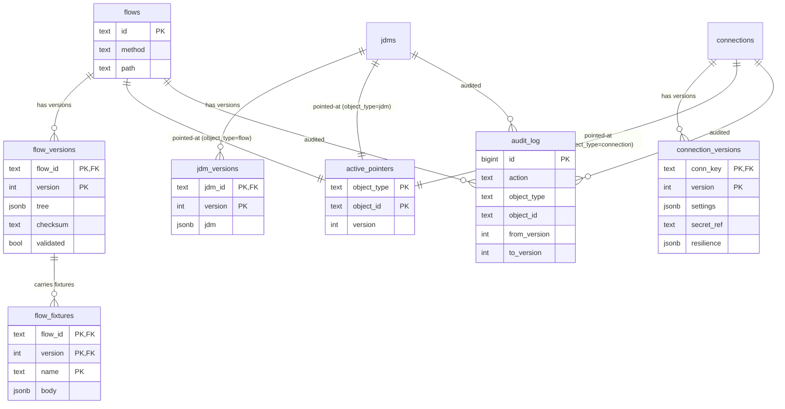

# LLD — Slice D: Config store + versioning + cache invalidation + admin validate/dry-run

Package: `internal/config` (+ `migrations/`). Go 1.22+. Module `nzr-rules-engine`.

Scope: the **engine-owned config store** (one Postgres per environment), the **versioning model**
(immutable versions + per-env active pointer + rollback + promotion + audit), the **Valkey cache**
with pub/sub invalidation, and the control-plane–facing **admin endpoints** (`/admin/flows/validate`,
`/admin/flows/dry-run`).

This slice implements the `config.Store` and `config.Cache` seams fixed in
[`docs/lld-contracts.md`](../lld-contracts.md) and the HLD decisions in
[`docs/hld.md`](../hld.md) §6b (test-before-save), §6c (versioning), ADR-005/006 (engine-owned,
per-env store), §8 (defensive load), R5 (cache invalidation across instances).

Grounded in the engineering-standards wiki: designed to interfaces at the module boundary with
DIP per `[[low-level-design]]`; immutable numbered versions + contract-test discipline per
`[[versioning-and-compatibility]]`; versioned/ordered migrations, parameterized queries, bounded
pools, indexes-for-every-query-path per `[[data-and-migrations]]`; TTL + explicit invalidation +
defined cache-down behavior + namespaced/versioned keys per `[[caching-strategy]]`; `secretRef`
only, never a secret value, validate-at-load per `[[config-and-secrets]]`; the
`Timeout/NotFound/Validation/Upstream/Internal` taxonomy per `[[error-classification]]`.

---

## 1. Postgres schema (engine-owned config store, one per env)

Design notes grounding each choice:

- Each environment has its **own physical database** (ADR-006), so rows do **not** carry an
  `env` column — the database *is* the environment. The `Store` interface still takes `env` as
  its first discriminator; the store maps `env → *pgxpool.Pool` (one pool per env it serves; the
  engine process serves exactly one env, Strapi's writer can target several). Keeping `env` on the
  seam means a future single-DB-multi-env layout is a store-internal change, not a contract change.
- **Immutable version rows** (`*_versions`): never `UPDATE`d or `DELETE`d after insert
  (`[[versioning-and-compatibility]]`, §6c). The parent row (`flows`, `jdms`, `connections`) is a
  stable identity + metadata; the body lives on the version row.
- **Activation is a pointer**, not a flag on the version — `active_pointers` has one row per
  `(object_type, object_id)` and is the only mutable "what runs now" state. Publish/rollback is a
  single-row update inside a transaction that also writes an `audit_log` row.
- **Secrets are never stored** — a connection version holds `secret_ref` only
  (`[[config-and-secrets]]`, §6c, AC-20).
- Indexes are added for **every query path and no more** (`[[data-and-migrations]]`); the hot
  path is the resolve lookup, called up on every cache miss.

```sql
-- 0001_init.up.sql  (DDL sketch; types abbreviated)

-- ---- object identities (stable; metadata only, no body) ----
CREATE TABLE flows (
    id          text PRIMARY KEY,              -- stable flow id, e.g. "orders"
    method      text NOT NULL,                 -- "GET"
    path        text NOT NULL,                 -- "/orders/{id}" (Go 1.22 ServeMux pattern)
    created_at  timestamptz NOT NULL DEFAULT now(),
    created_by  text NOT NULL,
    UNIQUE (method, path)                       -- one flow owns a route
);

CREATE TABLE jdms (
    id          text PRIMARY KEY,              -- stable JDM id referenced by decision nodes
    created_at  timestamptz NOT NULL DEFAULT now(),
    created_by  text NOT NULL
);

CREATE TABLE connections (
    key         text PRIMARY KEY,              -- stable connection key referenced by action nodes
    type        text NOT NULL,                 -- "postgres" | "valkey" | "rest"
    created_at  timestamptz NOT NULL DEFAULT now(),
    created_by  text NOT NULL
);

-- ---- immutable versions (append-only; never UPDATE/DELETE) ----
CREATE TABLE flow_versions (
    flow_id     text NOT NULL REFERENCES flows(id),
    version     int  NOT NULL,                  -- monotonic per flow, starts at 1
    tree        jsonb NOT NULL,                 -- the Node tree (Slice A schema)
    checksum    text NOT NULL,                  -- sha256 of canonical(tree) — contract test anchor
    validated   boolean NOT NULL DEFAULT false, -- true only after validate+fixtures passed (AC-13)
    created_at  timestamptz NOT NULL DEFAULT now(),
    created_by  text NOT NULL,
    note        text,                           -- author's "why"
    PRIMARY KEY (flow_id, version)
);

CREATE TABLE jdm_versions (
    jdm_id      text NOT NULL REFERENCES jdms(id),
    version     int  NOT NULL,
    jdm         jsonb NOT NULL,                 -- GoRules JDM graph
    checksum    text NOT NULL,
    created_at  timestamptz NOT NULL DEFAULT now(),
    created_by  text NOT NULL,
    note        text,
    PRIMARY KEY (jdm_id, version)
);

CREATE TABLE connection_versions (
    conn_key    text NOT NULL REFERENCES connections(key),
    version     int  NOT NULL,
    settings    jsonb NOT NULL,                 -- host/port/baseURL/pool...  (NO secret value)
    secret_ref  text,                           -- opaque pointer resolved by Slice B registry
    resilience  jsonb NOT NULL,                 -- timeout/retry/breaker policy
    checksum    text NOT NULL,
    created_at  timestamptz NOT NULL DEFAULT now(),
    created_by  text NOT NULL,
    note        text,
    PRIMARY KEY (conn_key, version)
);

-- ---- fixtures travel WITH a specific flow version (§6c, AC-12) ----
CREATE TABLE flow_fixtures (
    flow_id     text NOT NULL,
    version     int  NOT NULL,
    name        text NOT NULL,
    body        jsonb NOT NULL,                 -- {input, mocks, expect:{output?,branchPath?,errors?}}
    PRIMARY KEY (flow_id, version, name),
    FOREIGN KEY (flow_id, version) REFERENCES flow_versions(flow_id, version)
);

-- ---- the only mutable "what runs now" state: pointer per object ----
CREATE TABLE active_pointers (
    object_type text NOT NULL,                  -- "flow" | "jdm" | "connection"
    object_id   text NOT NULL,                  -- flow_id | jdm_id | conn_key
    version     int  NOT NULL,                  -- currently active version
    updated_at  timestamptz NOT NULL DEFAULT now(),
    updated_by  text NOT NULL,
    PRIMARY KEY (object_type, object_id)
);

-- ---- append-only audit of every publish/rollback/promote (§6c, AC-9..AC-12) ----
CREATE TABLE audit_log (
    id          bigserial PRIMARY KEY,
    at          timestamptz NOT NULL DEFAULT now(),
    actor       text NOT NULL,
    action      text NOT NULL,                  -- "create_version"|"publish"|"rollback"|"promote"
    object_type text NOT NULL,
    object_id   text NOT NULL,
    from_version int,                           -- pointer before (null for create)
    to_version   int,                           -- pointer after / version created
    reason      text
);

-- ---- indexes for the hot resolve path and the admin reads ----
-- Hot path: (method, path) -> flow identity, then pointer lookup, then version body.
CREATE INDEX idx_flows_route         ON flows (method, path);              -- route match
CREATE INDEX idx_active_ptr_lookup   ON active_pointers (object_type, object_id); -- (PK already covers; explicit for intent)
CREATE INDEX idx_audit_object        ON audit_log (object_type, object_id, at DESC);
CREATE INDEX idx_connver_key_ver     ON connection_versions (conn_key, version DESC);
-- version body PKs already serve point lookups (flow_id,version)/(jdm_id,version).
```

The hot resolve path `(env, method, path) -> active FlowVersion` is: `env` picks the pool, then
one indexed read of `flows` by `(method, path)` to get `flow_id`, one PK read of `active_pointers`
for the active `version`, one PK read of `flow_versions` for the tree, and (lazily) the fixtures.
This is served from Valkey on the common path (§4); the DB is touched only on cache miss.

---

## 2. Versioning model (AC-9, AC-10, AC-12; §6c)

The version is the **unit of test, promotion, and rollback** (`[[versioning-and-compatibility]]`).

- **Edit → new immutable version (AC-9).** An edit never mutates an existing `*_versions` row.
  `PutFlowVersion` inserts a new row with `version = max(version)+1` for that `flow_id`, computed
  inside the insert transaction with the parent row locked (`SELECT ... FOR UPDATE` on `flows`) so
  two concurrent authors can't collide on a version number. Prior versions stay byte-for-byte
  retrievable. The row lands with `validated = false`.
- **Validate gates publish (AC-13, §6b).** `validated` flips to `true` only when
  `/admin/flows/validate` has passed structural checks **and** all fixtures (§5). `SetActive`
  **refuses** to point at an un-validated flow version — publish is blocked on a failed test.
- **Publish = advance the pointer (AC-10).** `SetActive(env, flowID, v)` updates the single
  `active_pointers` row to `v`, in a transaction that also appends an `audit_log` row
  (`action='publish'`, `from_version`, `to_version`) and fires cache invalidation (§4) *after*
  commit. No rebuild, no redeploy.
- **Rollback = move the pointer back (AC-10).** Identical mechanism with a smaller/earlier `v`;
  `action='rollback'`. Because the old version row was never deleted, rollback is just a pointer
  move and is instant.
- **Request pinning hand-off (AC-11, R1).** The store resolves the active version *number* at
  request start and returns a `FlowVersion` carrying that number; Slice A pins to it for the whole
  walk. Slice D's contribution: `ActiveFlow` returns a complete, immutable snapshot (tree +
  version), and a later pointer move never touches that snapshot. The pin itself lives in Slice A.
- **Promotion carries a specific version + fixtures (AC-12).** `PromoteVersion(srcEnv, dstEnv,
  objectType, objectID, version)` (store-internal, driven by Strapi) copies that exact
  `*_versions` row **and its `flow_fixtures`** into the destination env's DB under the same
  version number, then writes an `audit_log` row in the destination (`action='promote'`,
  `to_version`). It does **not** auto-advance the destination pointer — promotion stages the
  version; a separate publish activates it, so environments can deliberately hold different active
  versions. ("The thing you tested is the thing you promote.")
- **Connections versioned, secrets not (§6c, AC-20).** A `connection_versions` row captures
  settings/resilience and a `secret_ref`. Rotating a secret is **not** a version bump — the Slice B
  registry re-resolves `secret_ref` without a new row. This is why secret material has no column
  anywhere in the schema.
- **Audit trail is the source of truth (§6c).** Every create/publish/rollback/promote appends one
  `audit_log` row inside the same transaction as the state change, so "who did what, when, why" is
  never lost even if the pointer later moves again.

---

## 3. Store implementation (`config.Store`) + migrations

The store is a thin adapter over `pgxpool`, honoring the fixed seam. All queries are
**parameterized** (`[[data-and-migrations]]`); pools are **bounded and configurable**
(`[[config-and-secrets]]` fail-fast on bad pool config).

```go
package config

type PgStore struct {
    pools map[string]*pgxpool.Pool // env -> pool (engine serves one; Strapi writer may hold many)
    cache Cache                    // §4; nil-safe (store works cache-down)
}

// ActiveFlow — hot resolve path (cache-aside; §4). (env,method,path) -> pinned FlowVersion.
func (s *PgStore) ActiveFlow(ctx context.Context, env, method, path string) (FlowVersion, error) {
    // 1. cache.Get(key("flow", env, method, path)); on hit, decode + return.
    // 2. miss: pool := s.pools[env]
    //    SELECT f.id FROM flows f WHERE f.method=$1 AND f.path=$2         -> flowID (NotFound->404)
    //    SELECT version FROM active_pointers WHERE object_type='flow' AND object_id=$flowID
    //    SELECT tree, version FROM flow_versions WHERE flow_id=$flowID AND version=$version
    //    SELECT name, body FROM flow_fixtures WHERE flow_id=$flowID AND version=$version
    // 3. defensive decode of tree -> Node (AC-15): decode failure => Validation error, NOT 500.
    // 4. cache.Set(key, encoded, ttl); return FlowVersion.
}

func (s *PgStore) GetJDM(ctx context.Context, env, id string) (jdm []byte, version int, err error) {
    // cache-aside over key("jdm", env, id): active_pointers(jdm,id) -> jdm_versions.jdm bytes.
}

func (s *PgStore) Connections(ctx context.Context, env string) ([]ConnectionDef, error) {
    // for each active connection pointer: join connection_versions -> ConnectionDef
    // (Key,Type,Settings,SecretRef,Resilience). NEVER reads a secret value.
}

// PutFlowVersion — append-only insert of a new version (AC-9). Returns the new number.
func (s *PgStore) PutFlowVersion(ctx context.Context, env string, f FlowVersion) (version int, err error) {
    // tx: SELECT ... FOR UPDATE on flows(id); version = max(flow_versions.version)+1;
    //     INSERT flow_versions(validated=false) + INSERT flow_fixtures(f.Fixtures)
    //     + INSERT audit_log(action='create_version', to_version=version); commit.
}

// SetActive — publish OR rollback: pointer move + audit (AC-10). Refuses un-validated versions.
func (s *PgStore) SetActive(ctx context.Context, env, flowID string, version int) error {
    // tx: assert flow_versions(flowID,version).validated = true  (else Validation: publish blocked)
    //     from := current active_pointers.version
    //     UPSERT active_pointers(flow,flowID) = version
    //     INSERT audit_log(action = version<from ? 'rollback':'publish', from, to=version)
    //     commit; THEN cache.Invalidate(pattern for this flow)  -- after commit only.
}
```

Store-internal helpers not on the seam (driven by admin/Strapi): `MarkValidated(flowID, version)`
(flips `validated` after fixtures pass), `PromoteVersion(...)` (§2), `AuditTrail(objectType,
objectID)` (reads `audit_log`).

### Migrations (golang-migrate style, `migrations/`)

Versioned, ordered, one concern each, expand/contract-safe (`[[data-and-migrations]]`). Applied at
deploy, gated, with a down for each up.

```
migrations/
  0001_init.up.sql / 0001_init.down.sql           -- all tables + indexes above
  0002_add_flow_version_note.up.sql / .down.sql   -- example additive change (expand-only)
```

Rule for every future change: **additive/expand first** (new nullable column or new table),
backfill batched + idempotent, contract (drop old) only in a later migration — never rename/drop
in the same release that stops using a column. Contract tests (R11, AC-15) pin the schema shape the
engine reads so a Strapi-side change that drifts the contract fails CI on both sides.

---

## 4. Cache (`config.Cache`) — Valkey keys, pub/sub invalidation, defensive load (AC-16, R5)

Per `[[caching-strategy]]`: every entry has a **bounded TTL**, keys are **namespaced + versioned**,
and cache-down behavior is **defined** (degrade to the store, never fail). Per R5 we **never rely on
TTL alone** — explicit invalidation over Valkey pub/sub is the primary mechanism, TTL is only the
backstop.

### Key scheme (namespaced + versioned so a schema change can't serve a stale shape)

```
cfg:v1:flow:{env}:{method}:{path}     -> encoded FlowVersion (tree + version + fixtures)
cfg:v1:jdm:{env}:{jdmID}              -> encoded {jdm bytes, version}
cfg:v1:conns:{env}                    -> encoded []ConnectionDef (whole-env list)
```

The `v1` segment is the **cache schema version**: bump it in code when the encoded shape changes so
old entries are never decoded under a new shape (`[[caching-strategy]]` versioned keys).

### Invalidation channel (pub/sub, R5, AC-16)

- Valkey pub/sub channel: `cfg:v1:invalidate`. Message payload: `{env, objectType, objectID}`.
- On **publish/rollback/promote-activate**, after the DB transaction commits, the writer calls
  `Cache.Invalidate(ctx, keyPattern)` which (a) deletes the matching local Valkey keys and (b)
  **publishes** the change message on `cfg:v1:invalidate`.
- **Every engine instance subscribes** at startup; on message it deletes its matching keys so the
  next request re-reads from the store. This closes the "one Strapi writes, many engines cache"
  gap (R5) within one pub/sub round-trip.
- **Bounded TTL fallback.** Every `Set` uses a configurable TTL (default e.g. 60s). If a pub/sub
  message is ever missed (subscriber reconnect, Valkey restart), staleness is bounded by the TTL —
  **config is never served stale past that bound** (AC-16). TTLs carry jitter to avoid a thundering
  herd (`[[caching-strategy]]`).
- The seam method is `Invalidate(ctx, keyPattern)`; "publish on invalidate" is an internal behavior
  of the Valkey implementation, not a new seam method (so no contract change — see §Seam changes).

### Cache-down and defensive-load behavior

- **Cache down → degrade to the store** (`[[caching-strategy]]` defined cache-down behavior): if
  `Get`/`Set` errors, log at `warn` and read the store directly; readiness degrades but requests
  still serve. The cache is an optimization, never the source of truth.
- **Defensive validation on load (AC-15, §8).** Decoding a cached or stored config value is wrapped
  so a malformed `tree`/`jdm` yields a classified `Validation` error (logged with `flow_id`,
  `version`) and a 4xx/handled path — **never a 500 and never a crash**. A bad config row is
  rejected on load, consistent with the forward-compatible-on-load rule (R11,
  `[[versioning-and-compatibility]]`).
- Single-flight on miss for hot keys (resolve path) to avoid cache-breakdown stampede
  (`[[caching-strategy]]`).

### Documented consistency boundary — cross-instance activation is eventually consistent (review #5)

Activation (`active_pointers`) is strongly consistent **in the store** (a single-row update inside
a transaction), but its propagation to the fleet is **eventually consistent**, bounded by the
invalidation round-trip and the TTL backstop. This is an inherent, accepted property — stated here
so it is a known boundary, not a surprise:

- **Convergence window.** Between "publish commits + `cfg:v1:invalidate` published" and "every
  instance has dropped its key and re-read", there is a brief window where **instance X may serve
  version N while instance Y serves N+1 simultaneously**. Each instance is internally consistent
  (it serves one coherent version per request, pinned for that request — AC-11); the fleet is not
  instantaneously uniform.
- **Bound.** The window is normally one pub/sub round-trip (sub-second). If an invalidate message
  is missed (subscriber reconnect / Valkey restart), the TTL (default 60s, jittered) is the hard
  upper bound — config is never served stale past the TTL (AC-16).
- **Why this is acceptable.** Flows are pinned per request, so no single request tears. A client
  that publishes and immediately calls the API might hit a not-yet-converged instance and see N
  for up to the bound — the same read-after-write caveat any cached control plane has. Callers that
  need "my publish is globally live" must treat publish as asynchronous (poll/confirm), not
  synchronous.
- **Not a correctness bug.** Rollback has the same window. There is **no** cross-instance
  distributed lock on activation by design (R10 rationale: a global lock on the hot path trades
  availability + latency for a uniformity the system doesn't need). This joins AC-27/AC-28 as an
  honest, documented v1 constraint.

---

## 5. Admin endpoints (AC-13, AC-14; §6b) — control-plane facing, stateless, side-effect-free

Both live under `/admin/flows/*`, are **not** part of runtime traffic, and never write to the
config store themselves. Request/response shapes below are the HTTP contract Strapi calls on
save/publish.

### FlowFixture format (as fixed by the seam + §6b)

```json
{
  "name": "paid order returns receipt",
  "input":  { "method": "GET", "path": "/orders/42", "body": {}, "headers": {} },
  "mocks":  {
    "conn:ordersdb": { "query:orderById": { "id": 42, "status": "paid" } },
    "conn:billing":  { "http:GET /receipts/42": { "receiptId": "r_1" } }
  },
  "expect": {
    "output":     { "receiptId": "r_1" },
    "branchPath": ["cond.status=paid", "action.fetchReceipt"],
    "errors":     []
  }
}
```

`mocks` is keyed by `conn:{key}` then by `op:{opName}` so a fixture runs with **no real I/O**
(deterministic, safe). `expect` fields are all optional; a fixture asserts whichever it declares.

### POST /admin/flows/validate (structure + fixtures; publish-blocking)

Validates a candidate flow version **without** persisting it as active. Used by Strapi's
run-before-save gate.

Request:
```json
{
  "env": "dev",
  "flow": { "flowId": "orders", "method": "GET", "path": "/orders/{id}",
            "tree": { "...Node tree..." },
            "fixtures": [ { "...FlowFixture..." } ] }
}
```

Behavior:
1. **Structural validation** of the tree: known node types, children only on control nodes, bounded
   depth/size (R8), resolvable `jdmID` refs (exist as a `jdms` identity), resolvable connection
   `key` refs (exist in `connections`). Failures collected, not fail-fast.
2. **Run every fixture** through the Slice A interpreter in a **mocked-source harness** (mocks from
   the fixture; zero real I/O), asserting `output`/`branchPath`/`errors` as declared.
3. If structure **and** all fixtures pass, the version is eligible to be marked `validated`
   (via `MarkValidated` when it is persisted); otherwise **publish is blocked** (AC-13).

Response:
```json
{
  "ok": false,
  "structural": [ { "nodeId": "action.x", "code": "unknown_connection", "msg": "conn:foo not defined" } ],
  "fixtures": [
    { "name": "paid order returns receipt", "passed": true },
    { "name": "unpaid is 402",              "passed": false,
      "diff": { "expectedBranchPath": ["cond.status=unpaid"], "actual": ["cond.status=paid"] } }
  ]
}
```
`ok=true` only when `structural` is empty and every fixture `passed`. Stateless: no rows written.

### POST /admin/flows/dry-run (full trace, writes suppressed; AC-14)

Runs a flow and returns the full node-by-node trace **with writes suppressed** — the author's
"preview"/debugger for a data-defined system (§6a/§6b).

Request:
```json
{
  "env": "dev",
  "flowId": "orders",      // dry-run a stored version ...
  "version": 9,            // optional; defaults to active
  "input": { "method": "GET", "path": "/orders/42", "body": {}, "headers": {} },
  "mocks": { "...optional; omit to use real READ sources..." }
}
```

Behavior: the interpreter runs with a **write-suppression flag** set in `Deps` — every action node
classified as a write is short-circuited (no row created, no external POST sent, AC-14) and recorded
in the trace as `suppressed`. Reads may hit real sources (if un-mocked) or mocks. No `audit_log`, no
pointer change, no cache write.

Response:
```json
{
  "trace": [
    { "nodeId": "trigger",        "type": "trigger",   "branchTaken": "",
      "read": null, "wrote": null, "durationMs": 0 },
    { "nodeId": "action.fetch",   "type": "action",    "read": { "op": "query:orderById" },
      "wrote": null, "durationMs": 3 },
    { "nodeId": "cond.status",    "type": "condition", "branchTaken": "paid", "durationMs": 1 },
    { "nodeId": "action.persist", "type": "action",    "wrote": "suppressed", "durationMs": 0 }
  ],
  "response": { "receiptId": "r_1" },
  "errors": []
}
```

---

## 6. Diagrams

### 6.1 ER diagram



### 6.2 Sequence — publish → write version → advance pointer → invalidate across instances

```mermaid
sequenceDiagram
    autonumber
    participant Strapi as Strapi (control plane)
    participant API as /admin + Store (one instance)
    participant PG as Config store (Postgres, this env)
    participant VK as Valkey (pub/sub + cache)
    participant E1 as Engine inst #1
    participant E2 as Engine inst #2

    Strapi->>API: POST /admin/flows/validate {flow, fixtures}
    API->>API: structural checks + run fixtures (mocked, no I/O)
    API-->>Strapi: {ok:true}
    Note over API,PG: validate passed -> version eligible (AC-13)

    Strapi->>API: PutFlowVersion (persist new immutable version)
    API->>PG: BEGIN; lock flows; INSERT flow_versions v=N (validated); INSERT fixtures; INSERT audit(create); COMMIT

    Strapi->>API: SetActive(flow, N)  (publish)
    API->>PG: BEGIN; assert validated; UPSERT active_pointers=N; INSERT audit(publish, from,to); COMMIT
    API->>VK: Invalidate -> DEL cfg:v1:flow:* ; PUBLISH cfg:v1:invalidate {env,flow}
    par fan-out to every instance
        VK-->>E1: invalidate {env,flow}
        E1->>E1: DEL local-matching cache keys
    and
        VK-->>E2: invalidate {env,flow}
        E2->>E2: DEL local-matching cache keys
    end
    Note over E1,E2: next request re-reads store -> pointer now N (AC-16). TTL bounds any missed message.
```

---

## 7. Error classification across the seam

Errors cross the seam as wrapped, typed errors per `[[error-classification]]` using the taxonomy
fixed in the contracts (`Timeout`, `NotFound`, `Validation`, `Upstream`, `Internal`). Classified
with sentinel/typed errors (`errors.Is`), never string-matched; wrapped with context
(`flow_id`, `version`, `env`) and logged structured, never bare.

| Situation | Class | Caller action |
| --- | --- | --- |
| Route `(method,path)` has no flow | `NotFound` | router returns 404 (AC-1) |
| `active_pointers` row missing for an object | `NotFound` | 404 / readiness degrade |
| Stored/cached `tree`/`jdm` fails to decode (bad config) | `Validation` | reject on load, log, **never 500** (AC-15) |
| `/admin/flows/validate` structural or fixture failure | `Validation` | publish blocked (AC-13); 200 with `ok:false` body (expected outcome, not a 5xx) |
| `SetActive` on an un-validated version | `Validation` | publish refused |
| Config-store query exceeds timeout | `Timeout` | serve from cache if present; else degrade |
| Postgres unreachable | `Upstream` | serve from Valkey; `/readyz` not-ready |
| Valkey unreachable (cache) | `Upstream` | degrade to store, log `warn`, keep serving |
| Invariant/bug (e.g. version numbering race unhandled) | `Internal` | 500 + alert (only true internal faults) |

Note: a failed fixture/validate is **not** a 5xx — it is a successful validation call returning a
negative result (`ok:false`), so Strapi can show the author the diffs. Only genuine engine faults
are `Internal`.

---

## 8. Test plan (maps to AC-9..AC-16)

Tests-first per `[[low-level-design]]`/`[[testing-strategy]]`. Integration tests run against
ephemeral Postgres + Valkey (AC-25).

| AC | Test | Asserts |
| --- | --- | --- |
| **AC-9** | `PutFlowVersion` twice on a flow | second insert gets `version=2`; `v1` row byte-identical and still retrievable; no `UPDATE` touched `v1` |
| **AC-10** | publish then rollback | `active_pointers` advances to `vN` on publish, moves back to `vN-1` on rollback; both write `audit_log` rows; takes effect with no redeploy (re-resolve returns new tree) |
| **AC-11** (hand-off to Slice A) | resolve at start, publish mid, assert pin | Slice D test: `ActiveFlow` returns a self-contained snapshot (tree+version) that a later `SetActive` does not mutate; contract test verifies the returned `FlowVersion` carries the version number Slice A pins to |
| **AC-12** | `PromoteVersion(dev→staging, flow, v9)` | exact `flow_versions` row + its `flow_fixtures` copied to staging DB under `v9`; staging pointer **unchanged** (still prior); envs can hold different active versions; `audit_log(promote)` written |
| **AC-13** | validate with a failing fixture, then attempt publish | `/admin/flows/validate` returns `ok:false` with structural/fixture diffs; `SetActive` on that version is refused (`Validation`) — **publish blocked** |
| **AC-14** | dry-run a flow with a write node | response has full node trace; write node recorded `wrote:"suppressed"`; assert **no row created** in PG and **no external POST** sent; no `audit_log`/pointer/cache change |
| **AC-15** | insert a deliberately broken `tree` row, resolve it | load classified as `Validation`, logged with `flow_id/version`, **no 500, no panic** |
| **AC-16** | two engine instances subscribed; publish on instance-writer | both instances drop matching cache keys within one pub/sub round-trip; next resolve returns new version; with pub/sub message dropped, staleness bounded by TTL and **not served past it** |
| secrets | inspect any version row + logs/trace | only `secret_ref` present; **no secret value** stored or emitted (AC-20 support) |
| migrations | apply `up` then `down` on ephemeral PG | schema builds and tears down cleanly; contract test pins the resolve-path shape (R11) |

Harness: a mocked-source interpreter driver (shared with Slice A's test harness) feeds fixture
`mocks` so validate/dry-run run deterministically with zero real I/O.

---

## Seam changes requested

None.

The slice is implementable against the fixed contracts in `docs/lld-contracts.md` as-is:
`Store.ActiveFlow/GetJDM/Connections/PutFlowVersion/SetActive`, `FlowVersion` (incl. `Fixtures`),
`Cache.Get/Set/Invalidate`, and `ConnectionDef` (`SecretRef`, no secret value) all cover this
design.

Clarifications that stay **inside** the seam (no contract change needed), flagged so the stitch
step is aware:
- `Cache.Invalidate(keyPattern)` is implemented to **also publish** on the Valkey channel
  `cfg:v1:invalidate` and every instance subscribes at startup. This is internal behavior of the
  Valkey `Cache` implementation, not a new interface method.
- Store-internal methods not on the seam are used by the admin layer only: `MarkValidated`,
  `PromoteVersion`, `AuditTrail`. If the stitch step decides promotion/validation must be callable
  cross-slice, these would graduate to the `Store` interface — noted here as a *possible* future
  seam addition, not requested now.
- Dry-run requires a **write-suppression flag** reachable by Slice A's action handlers (via
  `Deps`). Slice D consumes it; if Slice A/E prefer it as an explicit field on `Deps` or `Ctx`,
  that is a Slice A/E seam decision — raised here for visibility, not requested by Slice D.
