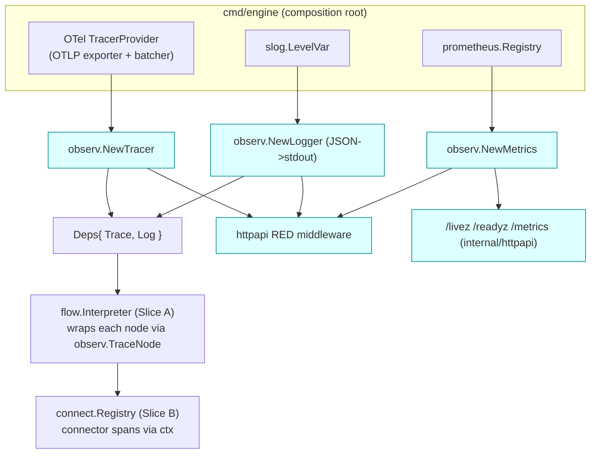

# LLD — Slice E: Observability, Logger node, Ops surface, Graceful lifecycle

Packages: `internal/observ`, `internal/httpapi` (ops endpoints), `cmd/engine` (lifecycle).

Status: **draft for build** · Designs against `docs/lld-contracts.md` (fixed seams) and the
approved HLD `docs/hld.md` (§3 Logger node + searchable fields, §6a debugging & observability,
§8 Ops surface, §10 AC-20..AC-24).

Grounded in the engineering-standards wiki: `[[low-level-design]]` (interfaces at boundaries,
DIP, high-cohesion/low-coupling), `[[observability-and-logging]]` (three pillars; structured,
contextual, leveled logs; no secrets), `[[distributed-tracing]]` (trace = tree of spans, one
`trace_id`, OpenTelemetry + W3C propagation, force-sample errors), `[[health-checks-liveness-readiness]]`
(liveness shallow / readiness deep; readiness gates traffic), `[[graceful-shutdown]]` (fail
readiness first, bounded drain, ordered teardown), `[[sli-slo-sla]]` (RED/golden signals),
`[[error-classification]]` (typed taxonomy across the seam).

> Content from the wiki was rephrased for compliance with licensing restrictions.

---

## 0. Scope, responsibilities, and the seam this slice owns

This slice is the **operability spine** of the engine. Because flows are *data, not code*
(HLD §6a), there is no compiler or native stack trace for a flow — execution traceability is
the **primary** way anyone understands what the engine did. That makes this slice a first-class
feature, not a cross-cutting afterthought (`[[observability-and-logging]]`: "if it isn't
observable, it isn't operable").

Owned here:

| Area | Package | Delivers | AC |
|---|---|---|---|
| Tracer/Span over OTel | `internal/observ` | `observ.Tracer`, `observ.Span` impls | AC-21 |
| Structured Logger over `slog` | `internal/observ` | `observ.Logger` impl, field set, redaction | AC-20, AC-21, AC-22 |
| Per-node auto-trace helper | `internal/observ` | `TraceNode` wrapper used by Slice A | AC-21, AC-2 |
| Logger/Debug node support | `internal/observ` | capture/redact/sample contract (handler in Slice A) | AC-22, AC-20 |
| Dry-run trace collector | `internal/observ` | `TraceCollector`, trace record shape | AC-14 (support), AC-2 |
| RED metrics | `internal/observ` | Prometheus collectors, names/labels | AC-21 (duration), SLO feed |
| Ops endpoints | `internal/httpapi` | `/livez`, `/readyz`, `/metrics` | AC-23 |
| Graceful lifecycle | `cmd/engine` | signal handling, drain, ordered teardown, flush | AC-24 |

**Not owned here** (consumed via the seam): the interpreter walk and the Logger node *handler*
(Slice A — but it calls this slice's `Logger`/`TraceNode`); the `Registry.HealthCheck` and
`Store` reachability that `/readyz` *gates on* (Slices B and D); secret resolution (Slice D) —
this slice only guarantees secret *values* never reach a log/trace sink.

Design rule applied throughout: **depend on the shared interfaces in `lld-contracts.md`, never
redefine them** (`[[low-level-design]]` DIP/ISP). Any required change to those seams is listed
in §11.

---

## 1. `internal/observ` — Tracer / Span / Logger over OpenTelemetry + `log/slog`

### 1.1 The canonical field set (HLD §3) — one definition, one home

Both the automatic per-node trace **and** the Logger node emit the same searchable field set so
logs and traces join on identical keys (`[[distributed-tracing]]`: "make the correlation id and
the trace id the same value"). This is the single source of truth for those keys:

```go
// internal/observ/fields.go
package observ

// Canonical attribute keys. Used verbatim as both slog field names and OTel
// span attribute keys so a log line and its span share the vocabulary (AC-21).
const (
    FldTraceID     = "trace_id"
    FldRequestID   = "request_id"
    FldFlowID      = "flow_id"
    FldFlowVersion = "flow_version"
    FldNodeID      = "node_id"
    FldNodeType    = "node_type"
    FldEnvironment = "environment"
    FldLabel       = "label"
    FldDurationMs  = "duration_ms"
    FldBranchTaken = "branch_taken"
    // outcome (not in §3 list but required by error-classification across the seam)
    FldErrorClass  = "error_class" // Timeout|NotFound|Validation|Upstream|Internal
    FldSpanStatus  = "status"      // ok|error
)

// RequestScope carries the request-stable identity extracted once at the edge
// (httpapi middleware) and threaded via context into every node/connector call.
type RequestScope struct {
    TraceID     string
    RequestID   string
    Env         string
    FlowID      string
    FlowVersion int
}
```

`RequestScope` is stored on the `context.Context` by the httpapi middleware (§2.1) and read by
both the Tracer and Logger so every emission is auto-stamped — the author of a node never has to
pass these by hand (`[[observability-and-logging]]`: "thread a context through calls and log
from it").

### 1.2 Tracer / Span — OpenTelemetry implementation

Implements the fixed seam:

```go
// contract (lld-contracts.md, unchanged):
// type Tracer interface { StartSpan(ctx, name, attrs) (context.Context, Span) }
// type Span   interface { End(err error); Set(attr string, v any) }
```

```go
// internal/observ/tracer.go
package observ

type otelTracer struct {
    tr  trace.Tracer   // go.opentelemetry.io/otel/trace
    log Logger         // for span-event mirroring at debug if desired
}

func NewTracer(tp trace.TracerProvider) Tracer {
    return &otelTracer{tr: tp.Tracer("nzr-rules-engine")}
}

func (t *otelTracer) StartSpan(ctx context.Context, name string, attrs map[string]any) (context.Context, Span) {
    ctx, s := t.tr.Start(ctx, name) // inherits parent span from ctx -> one trace
    sp := &otelSpan{s: s}
    // stamp request-scope + caller attrs; redaction already done by caller for ctx values
    if rs, ok := ScopeFrom(ctx); ok {
        sp.setScope(rs)
    }
    sp.setMap(attrs)
    return ctx, sp
}

type otelSpan struct{ s trace.Span }

func (sp *otelSpan) Set(attr string, v any) { sp.s.SetAttributes(toKV(attr, v)) }

func (sp *otelSpan) End(err error) {
    if err != nil {
        sp.s.SetStatus(codes.Error, err.Error())
        sp.s.SetAttributes(
            attribute.String(FldSpanStatus, "error"),
            attribute.String(FldErrorClass, string(ClassOf(err))), // §9
        )
    } else {
        sp.s.SetAttributes(attribute.String(FldSpanStatus, "ok"))
    }
    sp.s.End() // duration computed by OTel from start→End
}
```

Key design points:

- **One trace per request.** `StartSpan` always derives from the span already on `ctx`, so the
  root span created in the httpapi middleware (§2.1) is the ancestor of every node span and
  connector span → the whole request is one trace with one `trace_id` (`[[distributed-tracing]]`
  core model; AC-21).
- **`trace_id` extraction** uses the OTel `SpanContext` so the exact same value appears on logs
  (`Logger` reads it from the span context, §1.3) and is injected downstream (§2.3). Correlation
  id == trace id (`[[distributed-tracing]]`).
- **Attribute hygiene.** `toKV` keeps cardinality sane and refuses `nil`; callers must only pass
  already-redacted values. High-cardinality raw payloads are never set as attributes
  (`[[distributed-tracing]]`: "keep attribute cardinality sane").
- **Provider is injected** (`trace.TracerProvider`) so the backend (Jaeger/Tempo/OTLP collector)
  is swappable and tests use an in-memory exporter — DIP per `[[low-level-design]]`.

### 1.3 Logger — `log/slog` JSON implementation

Implements the fixed seam:

```go
// contract (lld-contracts.md, unchanged):
// type Logger interface { Emit(ctx, level, label string, fields map[string]any) }
```

```go
// internal/observ/logger.go
package observ

type slogLogger struct {
    base     *slog.Logger   // JSON handler -> stdout (12-factor: logs as event stream)
    levelVar *slog.LevelVar // dynamic level (config-toggle without redeploy)
    redactor Redactor       // §3.2 secret-path redaction
}

func NewLogger(w io.Writer, lv *slog.LevelVar) Logger {
    h := slog.NewJSONHandler(w, &slog.HandlerOptions{Level: lv})
    return &slogLogger{base: slog.New(h), levelVar: lv}
}

func (l *slogLogger) Emit(ctx context.Context, level, label string, fields map[string]any) {
    lvl := parseLevel(level)                 // debug|info|warn|error
    if !l.base.Enabled(ctx, lvl) {           // level gate -> debug cost ≈ 0 when off
        return
    }
    attrs := make([]slog.Attr, 0, len(fields)+8)
    // auto-stamp canonical scope fields from context (trace_id == span trace id)
    if rs, ok := ScopeFrom(ctx); ok {
        attrs = append(attrs,
            slog.String(FldTraceID, traceIDFrom(ctx)), // from active span context
            slog.String(FldRequestID, rs.RequestID),
            slog.String(FldFlowID, rs.FlowID),
            slog.Int(FldFlowVersion, rs.FlowVersion),
            slog.String(FldEnvironment, rs.Env),
        )
    }
    if label != "" {
        attrs = append(attrs, slog.String(FldLabel, label))
    }
    // caller fields (node_id/node_type/duration_ms/branch_taken, capture paths)
    for k, v := range l.redactor.Scrub(fields) { // §3.2 — redaction before emit
        attrs = append(attrs, slog.Any(k, v))
    }
    l.base.LogAttrs(ctx, lvl, "flow", attrs...)
}
```

Key design points:

- **Structured JSON key/value**, never string concatenation; every line carries identifying
  context auto-stamped from the context (`[[observability-and-logging]]` rules). Written to
  **stdout** as an event stream (12-factor XI).
- **Levels mean things** (`[[observability-and-logging]]`): debug = per-node trace / Logger-node
  debug points; info = request lifecycle; warn = degraded (breaker open, readiness flip); error =
  handled failure with `error_class`.
- **Dynamic level via `slog.LevelVar`.** `levelVar.Set(...)` is goroutine-safe and lets config
  flip a logger's effective level live (§3.3) — the hot path checks `Enabled` first, so debug
  logging that is off costs ~nothing.
- **Redaction is mandatory and centralized** in `Redactor.Scrub` (§3.2) so no caller can
  accidentally bypass it (AC-20). Secret values never reach the handler.
- **`trace_id` on every line** so a log line jumps to its trace (`[[distributed-tracing]]`
  correlation == trace).

### 1.4 Component wiring (how observ is assembled)



---

## 2. Per-node automatic tracing (AC-21)

### 2.1 Where the trace starts — httpapi middleware

The HTTP middleware (this slice, `internal/httpapi`) is the natural place to start the trace or
continue an inbound one (`[[distributed-tracing]]`: the edge starts/continues the trace):

```go
// internal/httpapi/middleware.go
func TraceAndScope(tr observ.Tracer, next http.Handler) http.Handler {
    return http.HandlerFunc(func(w http.ResponseWriter, r *http.Request) {
        // continue inbound W3C traceparent if present, else start a new root
        ctx := otel.GetTextMapPropagator().Extract(r.Context(), propagation.HeaderCarrier(r.Header))
        ctx, span := tr.StartSpan(ctx, "http.request", map[string]any{
            "http.method": r.Method, "http.route": routePattern(r),
        })
        defer span.End(nil)
        rs := observ.RequestScope{
            TraceID:   traceIDFrom(ctx),
            RequestID: orNewULID(r.Header.Get("X-Request-Id")),
        } // Env/FlowID/FlowVersion filled once the resolver picks the version
        ctx = observ.WithScope(ctx, rs)
        next.ServeHTTP(w, r.WithContext(ctx))
    })
}
```

`flow_id`/`flow_version`/`environment` are stamped onto the scope by Slice D's resolver the
moment the active version is pinned (HLD §6c R1), so from that point every span and log line
carries them.

### 2.2 Wrapping each node's `Exec` in a span — `observ.TraceNode`

Slice A's interpreter owns the `NodeHandler.Exec` call, but the *span-per-node* mechanics live
here so the field set and span conventions are defined once. The interpreter wraps every node
exec with this helper (manual spans only for domain-meaningful steps per
`[[distributed-tracing]]`):

```go
// internal/observ/tracenode.go
// TraceNode wraps a single node execution in a child span and emits the
// per-node debug trace line. Returned ctx carries the child span so any
// connector/ZEN call inside exec nests under this node's span (one trace).
func TraceNode(ctx context.Context, dep Deps, n flow.Node,
    exec func(ctx context.Context) (flow.Directive, error)) (flow.Directive, error) {

    ctx, span := dep.Trace.StartSpan(ctx, "node:"+string(n.Type), map[string]any{
        FldNodeID: n.ID, FldNodeType: string(n.Type),
    })
    start := time.Now()
    dir, err := exec(ctx)
    dur := time.Since(start)

    span.Set(FldDurationMs, dur.Milliseconds())
    if dir.Branch != "" {
        span.Set(FldBranchTaken, dir.Branch) // condition/switch selection (AC-2)
    }
    span.End(err) // sets status + error_class

    // automatic per-node debug trace line (searchable; same fields as the span)
    dep.Log.Emit(ctx, "debug", "node", map[string]any{
        FldNodeID: n.ID, FldNodeType: string(n.Type),
        FldDurationMs: dur.Milliseconds(), FldBranchTaken: dir.Branch,
    })
    // feed the dry-run collector if one is attached to this request (§4)
    if c, ok := CollectorFrom(ctx); ok {
        c.Record(TraceStep{NodeID: n.ID, NodeType: string(n.Type),
            Branch: dir.Branch, DurationMs: dur.Milliseconds(), Err: ClassOf(err)})
    }
    return dir, err
}
```

The span tree therefore is: `http.request` → `node:condition` → `zen.evaluate` (Slice C) /
`node:action` → `conn:<key>` (Slice B). One `trace_id`, reconstructable end to end (AC-21), and
the branch taken at each depth is observable on the span (AC-2).

### 2.3 Propagation into connector calls

Because `TraceNode` returns the child-span `ctx`, and `connect.Client.Execute(ctx, op)` takes
that `ctx` first (seam rule: context is always arg 0), the connector call is automatically a
child span under the node. Each connector (Slice B) opens its own span
(`conn:<key>` with `db.system`/`http.url` attributes) and — for HTTP/gRPC connectors — injects
the W3C `traceparent` into the outbound request headers:

```go
// convention Slice B follows (documented here, implemented there):
otel.GetTextMapPropagator().Inject(ctx, propagation.HeaderCarrier(req.Header))
```

So a slow Postgres query or REST call is attributable to the exact node and flow that invoked it
(HLD §6a correlation; `[[distributed-tracing]]` latency attribution). Valkey/pgx spans are
in-process children; outbound HTTP additionally propagates the header to the downstream service.

---

## 3. Logger / Debug node support (AC-22, HLD §3)

The Logger node is an optional, config-placed **debug point** that never changes the response
(HLD §3). Its *handler* lives in Slice A; this slice defines the **contract and machinery** it
depends on: the spec shape, capture extraction, redaction, sampling, and the live level toggle.

### 3.1 Node spec + the handler contract

```go
// internal/observ/loggernode.go  — spec parsed from flow.Node.Spec (json.RawMessage)
type LoggerSpec struct {
    Label      string   `json:"label"`                // -> FldLabel, searchable
    Level      string   `json:"level"`                // debug|info|warn|error
    Capture    []string `json:"capture"`              // dotted ctx paths to log
    SampleRate float64  `json:"sampleRate,omitempty"` // 0..1 (default 1.0)
    Enabled    *bool    `json:"enabled,omitempty"`    // config toggle (default true)
}

// LogPoint is the single call Slice A's logger-node handler makes. It encapsulates
// parse+sample+capture+redact+emit so the handler carries no observ policy.
func LogPoint(ctx context.Context, dep Deps, c *flow.Ctx, n flow.Node) error {
    var spec LoggerSpec
    if err := json.Unmarshal(n.Spec, &spec); err != nil {
        return Validation("logger node spec: %w", err)   // never 500 on bad config (AC-15)
    }
    if spec.Enabled != nil && !*spec.Enabled {
        return nil
    }
    if !sample(ctx, spec.SampleRate) { // deterministic per trace_id so a trace is whole
        return nil
    }
    fields := map[string]any{FldNodeID: n.ID, FldNodeType: "logger"}
    for _, p := range spec.Capture {              // capture ONLY selected paths (never whole ctx)
        if v, ok := c.GetPath(p); ok {
            fields[p] = v
        }
    }
    dep.Log.Emit(ctx, effectiveLevel(ctx, n.ID, spec.Level), spec.Label, fields)
    return nil
}
```

Contract the Slice A handler relies on (restated for the seam): it receives `Deps` (carrying
`observ.Logger`) and the `*flow.Ctx`, and delegates entirely to `observ.LogPoint`. The handler
does **no** redaction, sampling, or level logic itself — all of it is centralized here so it
can't be bypassed. The handler returns the node's `Directive{}` (linear, no branch) unchanged;
the node is a pure side-effect (HLD §3: "flows run identically with it removed").

### 3.2 Redaction of secret paths (AC-20)

`capture` selects parts of `ctx`; **never log the whole context** (PII/secret risk, HLD §3). On
top of path selection, a `Redactor` scrubs values at secret paths before anything reaches the
sink:

```go
type Redactor interface { Scrub(fields map[string]any) map[string]any }
```

- **Deny-list by key convention**: keys matching `secret`, `password`, `token`, `authorization`,
  `apikey`, `secretRef`-resolved values, and anything flagged by Slice D's secret resolver are
  replaced with `"***"`.
- **Value fingerprinting**: resolved secret values registered by the Registry (Slice B/D) are
  matched by value and masked even if they surface under an innocuous key.
- Redaction runs inside `Logger.Emit` (§1.3) **and** `Span` attribute setting, so it covers the
  automatic trace, the Logger node, and dry-run output alike. `[[observability-and-logging]]`:
  "never log secrets or full PII; log identifiers, not contents."

Only `secretRef` (an identifier) is ever stored/emitted — never a secret value (AC-20, HLD §6c).

### 3.3 Config-toggle of level without redeploy (AC-22)

Two layers of dynamic control, both config-driven (no redeploy, HLD §3):

1. **Global floor** — the process `slog.LevelVar` (§1.3). An env/config change can lower the
   global floor to `debug`.
2. **Per-node override** — `effectiveLevel(ctx, nodeID, specLevel)` consults an in-memory
   **debug overrides map** keyed by `flow_id:node_id`, refreshed from config on the same Valkey
   pub/sub invalidation channel Slice D already uses for config (HLD R5). Publishing a Logger
   node with `level:debug` (or an override entry) turns that one debug point on in prod within
   the bounded invalidation delay — no deploy.

Because `Emit` checks `base.Enabled(ctx, lvl)` first, a node left at `debug` while the floor is
`info` is effectively free until someone lowers the floor or sets an override.

---

## 4. Dry-run / trace mode plumbing (ties to Slice D's dry-run endpoint)

Slice D exposes `POST /admin/flows/dry-run` (HLD §6b) which runs a flow with **writes
suppressed** and returns the full node-by-node trace. This slice provides the **collector** that
accumulates that trace while the normal interpreter runs — the same `TraceNode` path (§2.2)
feeds it, so dry-run trace == live trace shape (no divergent code path).

```go
// internal/observ/collector.go
type TraceStep struct {
    NodeID     string         `json:"node_id"`
    NodeType   string         `json:"node_type"`
    Label      string         `json:"label,omitempty"`
    Branch     string         `json:"branch_taken,omitempty"` // condition/switch
    Inputs     map[string]any `json:"inputs,omitempty"`       // captured ctx paths (redacted)
    Decision   map[string]any `json:"decision,omitempty"`     // ZEN output (Slice C)
    Wrote      map[string]any `json:"wrote,omitempty"`        // Set targetPath=value (suppressed-but-shown)
    DurationMs int64          `json:"duration_ms"`
    Err        ErrorClass     `json:"error,omitempty"`
}

type TraceRecord struct {
    TraceID     string      `json:"trace_id"`
    FlowID      string      `json:"flow_id"`
    FlowVersion int         `json:"flow_version"`
    Env         string      `json:"environment"`
    DryRun      bool        `json:"dry_run"`
    Steps       []TraceStep `json:"steps"`      // in execution order
    DurationMs  int64       `json:"duration_ms"`
}

type TraceCollector interface {
    Record(step TraceStep)
    Result() TraceRecord
}
```

Plumbing:

- Slice D's dry-run handler creates a `TraceCollector`, attaches it to the request context via
  `observ.WithCollector(ctx, c)`, and sets the **dry-run flag** that Slice A/B honor to suppress
  writes. The interpreter's `TraceNode` wrapper (§2.2) calls `CollectorFrom(ctx)` and records a
  step per node automatically.
- `Inputs`/`Decision`/`Wrote` are populated by the respective node handlers (action/decision/set)
  through small `observ.CollectStep*` helpers, all passed through the `Redactor` (§3.2) so dry-run
  output cannot leak secrets either (AC-20).
- When no collector is attached (normal traffic), `CollectorFrom` returns `false` and the hot
  path pays only one map-less context lookup — dry-run adds no cost to live requests.
- The record shape is returned verbatim as the dry-run endpoint's JSON body — Slice D owns the
  HTTP envelope; this slice owns the record contract.

---

## 5. RED metrics (Prometheus)

Per `[[sli-slo-sla]]` the user-facing signals are latency/traffic/errors (+saturation); RED
(Rate, Errors, Duration) is the request-centric subset. Pull-based scrape via `/metrics`
(`[[observability-and-logging]]`: Prometheus pull model). All metrics are registered on an
injected `prometheus.Registry` (testable, DIP).

### 5.1 Metric set

| Metric | Type | Labels | Meaning |
|---|---|---|---|
| `nzr_flow_requests_total` | Counter | `flow_id`, `env`, `method`, `status` | **Rate** + **Errors** per flow (`status`=`ok\|error`) |
| `nzr_flow_request_duration_seconds` | Histogram | `flow_id`, `env`, `method` | **Duration** per flow (p50/p95/p99 feed SLOs) |
| `nzr_flow_errors_total` | Counter | `flow_id`, `env`, `error_class` | errors broken out by `[[error-classification]]` class |
| `nzr_connection_calls_total` | Counter | `conn_key`, `type`, `status` | **Rate**/**Errors** per connection |
| `nzr_connection_call_duration_seconds` | Histogram | `conn_key`, `type` | **Duration** per connection (downstream latency) |
| `nzr_breaker_state` | Gauge | `conn_key` | breaker state: `0`=closed, `1`=half-open, `2`=open |
| `nzr_inflight_requests` | Gauge | — | saturation signal; also read by graceful drain (§7) |
| `nzr_config_reload_total` | Counter | `env`, `result` | config hot-reload successes/failures (R5) |

### 5.2 How they're populated

- **Flow RED**: the httpapi RED middleware (`internal/httpapi`) observes `duration` and
  increments `requests_total`/`errors_total` on response, labeled with the `flow_id` the resolver
  pinned. Label cardinality is bounded by the number of configured flows (not by path params) —
  per `[[distributed-tracing]]`/`[[cost-awareness]]` cardinality discipline.
- **Connection RED + breaker gauge**: Slice B's `Client.Execute` wrapper calls
  `observ.Metrics.ObserveConn(...)` and the Registry sets `nzr_breaker_state` on every breaker
  state transition (so the gauge reflects reality even with no traffic). Metric *names/labels*
  are defined here; the call sites are in Slice B.
- Histograms use explicit latency buckets tuned to the SLO targets (e.g. 1ms…2s) so p99 is
  meaningful (`[[sli-slo-sla]]`: percentiles, not averages).

```go
// internal/observ/metrics.go (shape)
type Metrics struct { /* prometheus collectors */ }
func NewMetrics(reg prometheus.Registerer) *Metrics
func (m *Metrics) ObserveFlow(flowID, env, method, status string, d time.Duration)
func (m *Metrics) ObserveFlowError(flowID, env string, class ErrorClass)
func (m *Metrics) ObserveConn(key, typ, status string, d time.Duration)
func (m *Metrics) SetBreakerState(key string, state int) // 0/1/2
func (m *Metrics) IncInflight(); func (m *Metrics) DecInflight()
```

---

## 6. Ops endpoints (AC-23) — stdlib `net/http`

`/livez`, `/readyz`, `/metrics` on the standard-library `ServeMux` (HLD tech choice: no
third-party router). Liveness **shallow**, readiness **deep** — the single most important rule in
`[[health-checks-liveness-readiness]]`. Distinct endpoints so the orchestrator and the LB read
the right signal.

```go
// internal/httpapi/ops.go
type Readiness struct {
    reg   connect.Registry // Slice B — HealthCheck()
    store config.Store     // Slice D — reachability
    ready atomic.Bool      // flipped false during shutdown
    log   observ.Logger
}

func (o *Ops) Routes(mux *http.ServeMux, mreg *prometheus.Registry) {
    mux.HandleFunc("GET /livez", o.livez)   // shallow: process is up & not wedged
    mux.HandleFunc("GET /readyz", o.readyz) // deep: deps reachable AND not draining
    mux.Handle("GET /metrics", promhttp.HandlerFor(mreg, promhttp.HandlerOpts{}))
}

func (o *Ops) livez(w http.ResponseWriter, r *http.Request) {
    w.WriteHeader(http.StatusOK) // no dependency checks here (avoid restart storms)
    _, _ = w.Write([]byte("ok"))
}

func (o *Ops) readyz(w http.ResponseWriter, r *http.Request) {
    if !o.rd.ready.Load() { // shutting down -> fail readiness first (drain)
        http.Error(w, "draining", http.StatusServiceUnavailable)
        return
    }
    ctx, cancel := context.WithTimeout(r.Context(), 2*time.Second) // bound the check
    defer cancel()
    if err := o.rd.reg.HealthCheck(ctx); err != nil {        // pools reachable?
        o.writeNotReady(w, "registry", err); return
    }
    if err := o.rd.store.Ping(ctx); err != nil {             // config store reachable?
        o.writeNotReady(w, "config_store", err); return
    }
    w.WriteHeader(http.StatusOK); _, _ = w.Write([]byte("ready"))
}
```

How readiness flips:

- **Startup**: `ready` starts `false`; set to `true` only after the Registry has opened its pools
  and the first config load succeeds (`[[graceful-shutdown]]`: no half-initialized service).
- **Degraded**: if `Registry.HealthCheck` or `Store.Ping` fails, `/readyz` returns 503 and the LB
  stops routing — but the process is **not** restarted (liveness still 200), matching
  "readiness gates traffic, liveness gates lifecycle." It flips back to ready automatically when
  the dependency recovers (next probe passes).
- **Shutdown**: `ready.Store(false)` is the *first* action on SIGTERM (§7) so the LB drains before
  work stops.
- **Bounded + side-effect-free**: every dependency check has a tight timeout and only reads; a
  hanging probe is worse than a failing one (`[[health-checks-liveness-readiness]]`).

> `Store.Ping` is a seam addition — see §11. The HLD's readyz is "gated on `Registry.HealthCheck`
> + config Store reachability", but `config.Store` in `lld-contracts.md` has no reachability
> method; a `Ping(ctx)` is required.

Ops endpoints are served on a **separate listener/port** from flow traffic so probes and
`/metrics` stay answerable even when the main handler pool is saturated (saturation is exactly
when you most need the signal).

---

## 7. Graceful shutdown (AC-24) — `cmd/engine`

Follows `[[graceful-shutdown]]` exactly: fail readiness first → stop accepting new work → drain
in-flight within a bounded deadline → tear down in reverse dependency order → flush telemetry.
Single root context, cancelled once.

```go
// cmd/engine/main.go (lifecycle sketch)
func run() error {
    rootCtx, cancel := signal.NotifyContext(context.Background(), syscall.SIGINT, syscall.SIGTERM)
    defer cancel()

    // ---- startup: validate config, then build deps (fail fast, non-zero on error) ----
    lv := new(slog.LevelVar); lv.Set(cfgLevel)
    logger := observ.NewLogger(os.Stdout, lv)
    tp := observ.NewTracerProvider(cfg.OTLP)        // batch exporter
    tracer := observ.NewTracer(tp)
    metrics := observ.NewMetrics(promReg)
    reg, err := connect.NewRegistry(rootCtx, defs)  // opens pools
    if err != nil { return fmt.Errorf("registry init: %w", err) } // clean exit
    store, err := config.OpenStore(rootCtx, cfg.DSN)
    if err != nil { reg.Close(); return fmt.Errorf("store init: %w", err) }

    ops := httpapi.NewOps(reg, store, logger)
    appSrv := httpapi.NewServer(cfg.Addr, deps, metrics, tracer, logger) // read/write/idle timeouts set
    opsSrv := httpapi.NewOpsServer(cfg.OpsAddr, ops, promReg)

    ops.SetReady(true)   // only now: deps are healthy
    go appSrv.ListenAndServe()
    go opsSrv.ListenAndServe()

    <-rootCtx.Done()     // SIGINT/SIGTERM

    // ---- shutdown, ordered ----
    ops.SetReady(false)                               // 1. fail readiness FIRST -> LB drains
    sctx, scancel := context.WithTimeout(context.Background(), cfg.ShutdownTimeout) // bounded drain
    defer scancel()
    if err := appSrv.Shutdown(sctx); err != nil {     // 2. stop new conns, drain in-flight
        logger.Emit(sctx, "warn", "drain-timeout", map[string]any{"err": err.Error()})
    }
    _ = opsSrv.Shutdown(sctx)                          // 3. ops last (keep /metrics up while draining)
    reg.Close()                                        // 4. close pools (reverse of creation)
    _ = tp.Shutdown(sctx)                              // 5. flush traces (batch exporter)
    // slog is stdout — nothing buffered to flush
    return nil
}
```

Design points mapped to the standard:

- **Readiness flips first.** The `atomic.Bool` is set false before `Shutdown`, so the load
  balancer removes the instance *before* it stops accepting work — no request lands on a draining
  instance (`[[graceful-shutdown]]` / `[[health-checks-liveness-readiness]]`).
- **Bounded drain.** `http.Server.Shutdown(sctx)` waits for in-flight handlers up to
  `ShutdownTimeout`; if a stuck downstream blows the deadline it logs `drain-timeout` and proceeds
  rather than hanging the rollout. `nzr_inflight_requests` (§5) lets ops watch the drain to zero.
- **No dropped request.** New connections are refused once `Shutdown` starts; in-flight ones run
  to completion within the deadline (AC-24).
- **Ordered teardown.** App server → ops server → Registry pools → tracer flush — reverse of
  creation; the batch span exporter is flushed last so the final request's spans aren't lost
  (`[[distributed-tracing]]`).
- **Single root context** from `signal.NotifyContext`, cancelled once; propagated everywhere
  (`[[graceful-shutdown]]`: cancel once, everywhere). Also shuts down if a critical server
  goroutine dies on its own (the `ListenAndServe` error path cancels root).

---

## 8. Diagrams

### 8.1 Sequence — a traced request

```mermaid
sequenceDiagram
    autonumber
    participant C as Client
    participant MW as httpapi middleware (Slice E)
    participant I as Interpreter (Slice A)
    participant TN as observ.TraceNode (Slice E)
    participant Z as ZEN (Slice C)
    participant R as Registry/Client (Slice B)
    participant D as Downstream source

    C->>MW: HTTP request (maybe W3C traceparent)
    MW->>MW: Extract/Start root span -> trace_id; WithScope(ctx)
    MW->>I: ServeHTTP(ctx)  [root span on ctx]
    I->>TN: TraceNode(condition) wraps Exec
    TN->>TN: StartSpan node:condition (node_id,node_type)
    TN->>Z: Evaluate(ctx, jdm, input)  [span zen.evaluate]
    Z-->>TN: decision {branch=TRUE}
    TN->>TN: Set(branch_taken=TRUE); Emit debug line; Collector.Record (if dry-run)
    TN-->>I: Directive{Branch:"TRUE"}
    I->>TN: TraceNode(action) wraps Exec
    TN->>R: Client.Execute(ctx, op)  [span conn:pg; inject traceparent]
    R->>D: SQL / HTTP (traceparent header for HTTP)
    D-->>R: rows / response
    R-->>TN: result (observ.ObserveConn duration)
    TN->>TN: Set(duration_ms); span.End(nil); Emit debug line
    TN-->>I: Directive{}
    I-->>MW: finalResponse
    MW->>MW: span.End; RED middleware observes flow duration/status
    MW-->>C: HTTP response (one trace_id spans everything)
```

### 8.2 Component — observ wiring

```mermaid
flowchart LR
    subgraph E["internal/observ (Slice E)"]
        TR["Tracer (OTel)"]
        LG["Logger (slog JSON)"]
        RD["Redactor"]
        MT["Metrics (Prometheus)"]
        TC["TraceCollector"]
        TN["TraceNode / LogPoint helpers"]
    end
    LG --- RD
    TN --- TR
    TN --- LG
    TN --- TC
    subgraph H["internal/httpapi (Slice E/A)"]
        MW["Trace+Scope + RED middleware"]
        OPS["/livez /readyz /metrics"]
    end
    subgraph CM["cmd/engine"]
        LC["lifecycle: signals, drain, flush"]
    end
    MW --> TR
    MW --> MT
    OPS --> MT
    OPS -->|HealthCheck| B["connect.Registry (Slice B)"]
    OPS -->|Ping| D["config.Store (Slice D)"]
    LC --> TR
    LC --> B
    LC --> OPS
    TN --> B
    TN --> C["decision.Evaluator (Slice C)"]
    A["flow.Interpreter (Slice A)"] --> TN
    classDef own fill:#dff,stroke:#088; class TR,LG,RD,MT,TC,TN,MW,OPS,LC own;
```

---

## 9. Error classification across the seam

Per `[[error-classification]]` and the `lld-contracts.md` seam rule, errors cross slice
boundaries as **wrapped, typed** errors in the taxonomy `Timeout | NotFound | Validation |
Upstream | Internal`. This slice does not *invent* classes; it **reads** the class off an error
and surfaces it on spans, logs, and metrics so a failure is attributable without string-matching.

```go
// internal/observ/errors.go
type ErrorClass string
const (
    ClassTimeout    ErrorClass = "Timeout"
    ClassNotFound   ErrorClass = "NotFound"
    ClassValidation ErrorClass = "Validation"
    ClassUpstream   ErrorClass = "Upstream"
    ClassInternal   ErrorClass = "Internal"
)
// ClassOf inspects a wrapped error via errors.As on the shared typed errors
// (defined once at the module root per the Go idiom), never by message text.
func ClassOf(err error) ErrorClass
```

- **Span**: `End(err)` sets `status=error` + `error_class` (§1.2).
- **Log**: errors emit at `error` level with `error_class` + identifying ids (never a bare
  "failed", per `[[observability-and-logging]]`).
- **Metric**: `nzr_flow_errors_total{error_class=...}` and the per-connection error counter break
  errors out by class so dashboards distinguish a `Timeout` storm from a `Validation` spike.
- **Mapping to HTTP** (httpapi middleware): `Validation`→400, `NotFound`→404, `Timeout`→504,
  `Upstream`→502, `Internal`→500. A malformed-config error classifies as `Validation` and never
  becomes a 500 (AC-15).
- Secrets never appear in an error message that reaches a sink — the `Redactor` also scrubs the
  rendered error string before it is logged (AC-20).

The concrete typed/sentinel error values are defined at the module root (shared by all slices);
Go `errors.Is/As/%w` idioms belong to the Go language page, not here (`[[error-classification]]`).

---

## 10. Test plan (maps to AC-20..AC-24)

Tests use an **in-memory OTel span exporter**, an **in-memory `prometheus.Registry`**, and a
`bytes.Buffer`-backed slog handler so assertions are deterministic and need no backend
(`[[low-level-design]]`: validate the design with tests; `[[observability-and-logging]]` feeds
these).

| AC | What it proves | Test |
|---|---|---|
| **AC-20** | No secrets in logs/traces/dry-run | Register a known secret value with the Redactor; run a flow whose ctx and a Logger node `capture` include that value; scan the slog buffer, exported span attributes, and dry-run `TraceRecord` JSON — assert the value is absent and `***`/`secretRef` appear instead. Table-driven over key-based and value-based matches. |
| **AC-21** | One `trace_id` spans flow walk + each ZEN eval + each connector call | Run a nested flow against fake ZEN + fake connector; collect exported spans; assert a single `trace_id`, a `http.request` root, a `node:*` span per executed node with `node_id`/`node_type`/`duration_ms`, `zen.evaluate` and `conn:*` as children, and that the outbound HTTP connector carried a `traceparent` header. |
| **AC-21 (branch)** also AC-2 | Branch taken observable | Assert `branch_taken` attribute on each condition span matches the executed path. |
| **AC-22** | Logger node emits documented fields; level toggles via config without redeploy | (a) Run a Logger node; assert the emitted record has `label`, `level`, `trace_id`, `flow_id`, `node_id`, `node_type` and only the `capture` paths. (b) With global floor at `info`, assert a `debug` Logger node emits nothing; push a config override setting its level/floor to `debug` (via the overrides map / `LevelVar.Set`), re-run, assert it now emits — no restart. |
| **AC-22 (sample)** | Sampling is deterministic per trace | Same `trace_id` + `sampleRate<1` either always or never logs within one trace (no half-sampled trace). |
| **AC-23** | `/livez` liveness; `/readyz` deep + flips | (a) `/livez` returns 200 even with deps down. (b) With a stub Registry/Store returning errors, `/readyz` is 503; make them healthy, assert 200; break the Store again, assert it flips back to 503 without the process restarting. (c) Assert readyz check honors its timeout (stub that blocks → 503 within bound). |
| **AC-24** | Graceful drain, pools closed, traces flushed, no dropped request | Start the server; open a slow in-flight request; send SIGTERM; assert (1) `/readyz` is 503 immediately, (2) the in-flight request still completes 200, (3) new connections after SIGTERM are refused, (4) `Registry.Close` was called, (5) the span exporter was flushed (in-flight request's spans present), all within `ShutdownTimeout`. A second test sets a tiny deadline with a stuck handler and asserts a `drain-timeout` warn is logged and shutdown still returns. |
| RED metrics | names/labels + breaker gauge | Scrape the in-memory registry after a run; assert `nzr_flow_request_duration_seconds` observed, `nzr_flow_errors_total{error_class=...}` incremented on an injected error, and `nzr_breaker_state` reflects an injected breaker transition. |
| Dry-run | trace record shape | Attach a `TraceCollector`, run with dry-run flag; assert `TraceRecord.Steps` lists every node in order with branch/duration and that `Wrote` is shown but no write side-effect occurred (coordinates with Slice D AC-14). |
| Error seam | classification mapping | Table-driven: each `ErrorClass` → expected span status, log level, HTTP status, metric label. |

Integration-level AC-21/AC-23/AC-24 run in the CGO-aware CI alongside ephemeral PG/Valkey
(AC-25); unit-level trace/log/metric assertions run with fakes and no external deps.

---

## 11. Seam changes requested

These require edits to `docs/lld-contracts.md` and affect other slices; flagged per the seam
rules (not applied here).

1. **`config.Store` needs a reachability method for `/readyz`.** The HLD gates readiness on
   "config Store reachability" (AC-23) but the `Store` interface has no cheap, side-effect-free
   check. **Request:** add
   ```go
   Ping(ctx context.Context) error // cheap reachability check for readiness; no state change
   ```
   to `config.Store` (Slice D). Readiness must not reuse a heavy query.

2. **A dry-run trace-collector handle must reach the node handlers.** `TraceNode` and the node
   handlers (action/decision/set) need to find the active `TraceCollector` for dry-run. Two
   non-conflicting options — prefer (a):
   - **(a) context-carried (preferred).** Collector is attached via `observ.WithCollector(ctx, c)`
     and read via `observ.CollectorFrom(ctx)`. **No change to `Deps`** — purely additive helpers
     in `internal/observ`. This keeps `Deps` stable and matches "context is arg 0" seam rule.
   - **(b) explicit field.** If the stitch step prefers an explicit dependency over context,
     add `Trace observ.Tracer` (already present) plus `Collector observ.TraceCollector // nil on live traffic`
     to `Deps`. Listed only as a fallback; (a) is recommended.
   **Decision needed from the stitch step: (a) or (b).**

3. **`RequestScope` enrichment point.** The resolver (Slice D) must stamp `flow_id`,
   `flow_version`, `environment` onto the context scope once the active version is pinned.
   **Request:** document that Slice D calls `observ.EnrichScope(ctx, flowID, version, env)` after
   version resolution. Additive helper in `internal/observ`; no interface signature change.

No changes requested to `observ.Tracer`, `observ.Span`, or `observ.Logger` signatures — the fixed
observability seam is sufficient as written.
