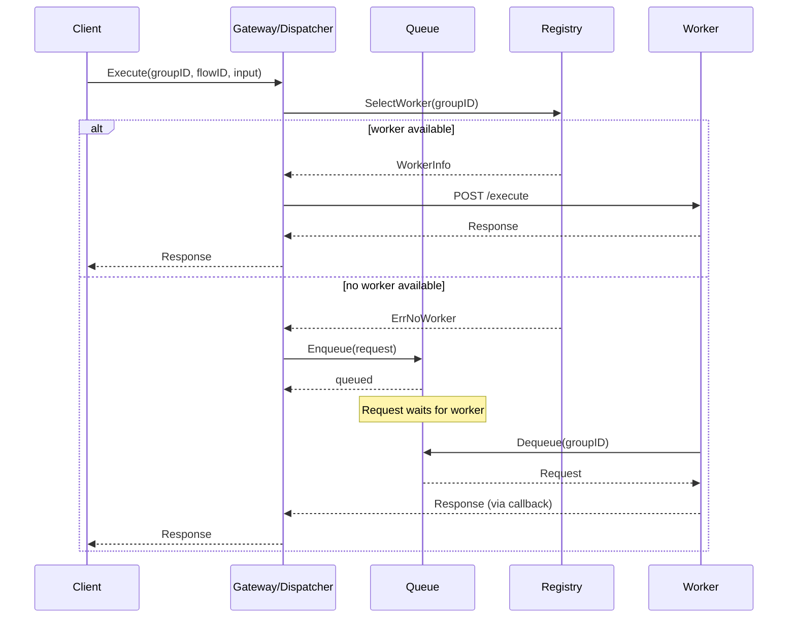

# LLD — Slice I: Gateway (request dispatcher with auto-scaling)

Package: `internal/gateway` · Module: `nzr-rules-engine` · Go 1.22+
Status: **implemented** · Last updated: 2026-10-07

The gateway package implements the API gateway pattern: dispatching requests to group-isolated
workers, managing worker registration, auto-scaling, and request queuing.

---

## 1. Package responsibilities

`internal/gateway` is the home for:

- **Dispatcher** — routes requests to appropriate worker instances.
- **Scaler** — auto-scales worker instances based on load.
- **Queue** — buffers requests when workers are at capacity.
- **Registry** — tracks registered workers and their health.
- **Manifests** — generates Kubernetes manifests for worker deployments.
- **Metrics/Tracing** — gateway-specific observability.

### Explicit non-responsibilities

- Worker execution logic → Slice G (`internal/worker`)
- Flow interpretation → Slice A (`internal/flow`)
- Underlying HTTP serving → stdlib `net/http`

---

## 2. Core types

### 2.1 Dispatcher (`dispatcher.go`)

```go
// Dispatcher routes requests to workers based on group affinity.
type Dispatcher struct {
    registry *Registry
    queue    *Queue
    scaler   *Scaler
    // ...
}

// Dispatch sends a request to an appropriate worker.
// Returns the response or queues the request if no worker is available.
func (d *Dispatcher) Dispatch(ctx context.Context, req *Request) (*Response, error)

// Request represents an incoming flow execution request.
type Request struct {
    GroupID   string
    FlowID    string
    Input     map[string]any
    TraceID   string
    Deadline  time.Time
}

// Response wraps the worker's execution result.
type Response struct {
    Status  int
    Body    map[string]any
    Headers map[string]string
}
```

### 2.2 Scaler (`scaler.go`)

```go
// Scaler manages worker instance scaling decisions.
type Scaler struct {
    cfg      ScalerConfig
    registry *Registry
    // ...
}

// ScalerConfig defines scaling behavior.
type ScalerConfig struct {
    MinReplicas       int
    MaxReplicas       int
    TargetConcurrency int           // target requests per worker
    ScaleUpCooldown   time.Duration
    ScaleDownCooldown time.Duration
}

// Evaluate checks current load and returns scaling decision.
func (s *Scaler) Evaluate(ctx context.Context, groupID string) ScaleDecision

type ScaleDecision struct {
    Action   ScaleAction // ScaleUp, ScaleDown, NoOp
    Replicas int         // target replica count
    Reason   string
}
```

### 2.3 Queue (`queue.go`)

```go
// Queue buffers requests when workers are at capacity.
type Queue struct {
    cfg      QueueConfig
    pending  map[string][]*Request // groupID -> pending requests
    // ...
}

// QueueConfig defines queue behavior.
type QueueConfig struct {
    MaxSize        int           // max pending requests per group
    MaxWait        time.Duration // max time a request waits in queue
    DrainOnShutdown bool
}

// Enqueue adds a request to the queue.
// Returns error if queue is full.
func (q *Queue) Enqueue(ctx context.Context, req *Request) error

// Dequeue retrieves the next request for a worker.
func (q *Queue) Dequeue(ctx context.Context, groupID string) (*Request, error)
```

### 2.4 Registry (`registry.go`)

```go
// Registry tracks registered workers and their state.
type Registry struct {
    workers map[string]map[string]*WorkerInfo // groupID -> workerID -> info
    // ...
}

// WorkerInfo describes a registered worker instance.
type WorkerInfo struct {
    ID           string
    GroupID      string
    Address      string // worker HTTP endpoint
    Concurrency  int    // current in-flight requests
    MaxConcurrency int
    Ready        bool
    LastHealthCheck time.Time
}

// Register adds or updates a worker in the registry.
func (r *Registry) Register(ctx context.Context, info WorkerInfo) error

// Deregister removes a worker from the registry.
func (r *Registry) Deregister(ctx context.Context, workerID string) error

// SelectWorker picks an available worker for a group (load-balancing).
func (r *Registry) SelectWorker(ctx context.Context, groupID string) (*WorkerInfo, error)
```

### 2.5 Manifests (`manifests.go`)

```go
// GenerateDeployment creates a Kubernetes Deployment manifest for a worker group.
func GenerateDeployment(group GroupConfig) *appsv1.Deployment

// GenerateService creates a Kubernetes Service manifest for a worker group.
func GenerateService(group GroupConfig) *corev1.Service

// GroupConfig defines a worker group's deployment configuration.
type GroupConfig struct {
    GroupID     string
    Image       string
    Replicas    int
    Resources   ResourceRequirements
    Environment map[string]string
}
```

---

## 3. Metrics (`metrics.go`)

```go
// Gateway metrics (Prometheus)
var (
    requestsTotal    = prometheus.NewCounterVec(...)   // gateway_requests_total{group,status}
    requestDuration  = prometheus.NewHistogramVec(...) // gateway_request_duration_seconds
    queueDepth       = prometheus.NewGaugeVec(...)     // gateway_queue_depth{group}
    workersActive    = prometheus.NewGaugeVec(...)     // gateway_workers_active{group}
    scalingEvents    = prometheus.NewCounterVec(...)   // gateway_scaling_events{group,action}
)
```

---

## 4. Tracing (`tracing.go`)

```go
// Gateway spans integrate with OpenTelemetry.
// - gateway.dispatch: full dispatch lifecycle
// - gateway.queue: time spent waiting in queue
// - gateway.forward: time forwarding to worker
```

---

## 5. File structure

```
internal/gateway/
  dispatcher.go   // Dispatcher, Request, Response
  scaler.go       // Scaler, ScalerConfig, ScaleDecision
  queue.go        // Queue, QueueConfig
  registry.go     // Registry, WorkerInfo
  manifests.go    // Kubernetes manifest generation
  metrics.go      // Prometheus metrics
  tracing.go      // OpenTelemetry integration
```

---

## 6. Request flow



---

## 7. Acceptance criteria

| AC | Description |
|----|-------------|
| AC-36 | Gateway dispatches requests to workers with auto-scaling |
| | - Requests route to correct worker group |
| | - Queue handles burst traffic gracefully |
| | - Scaler increases replicas under load |
| | - Scaler decreases replicas during idle periods |
| | - Worker failure triggers re-routing |

---

## 8. Verification (2026-10-07)

```bash
ls engine/internal/gateway/
# Output: dispatcher.go manifests.go metrics.go queue.go registry.go scaler.go tracing.go

grep -n "type Dispatcher struct\|type Scaler struct" engine/internal/gateway/*.go
# Confirms: core types exist
```
