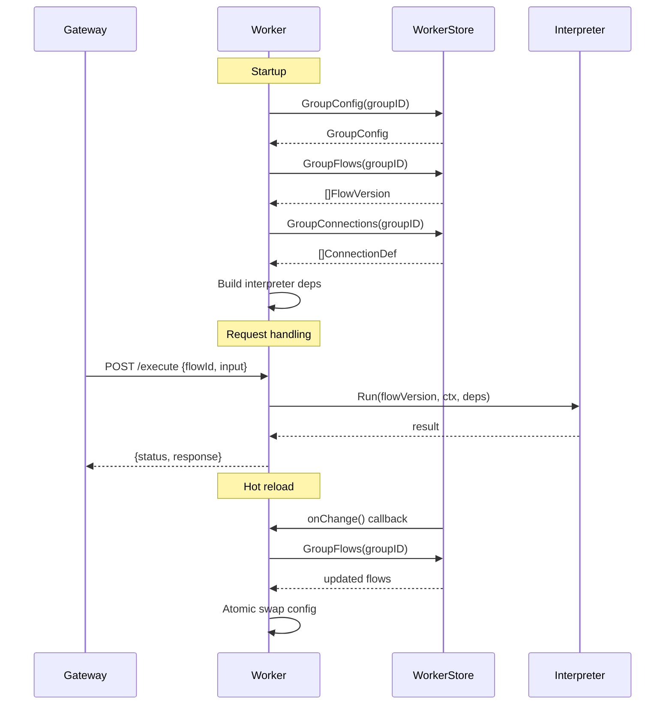

# LLD — Slice J: Worker (group-isolated runtime)

Packages: `internal/worker` + `cmd/worker` · Module: `nzr-rules-engine` · Go 1.22+
Status: **implemented** · Last updated: 2026-10-07

The worker package provides a group-isolated runtime for multi-tenant deployments, where each
worker instance loads configuration for a specific group and executes flows in isolation.

---

## 1. Package responsibilities

`internal/worker` is the home for:

- **Worker** — loads group configuration and executes flows.
- **LoadGroup** — fetches and caches group-specific config (flows, connections, JDMs).
- **Hot-reload** — detects config changes and reloads without restart.
- **Handler** — HTTP endpoints for execution and health checks.
- **WorkerStore** — interface for group config persistence.

`cmd/worker` provides:

- **Main entrypoint** — wires dependencies, starts the worker HTTP server.

### Explicit non-responsibilities

- Flow interpretation → Slice A (`internal/flow`)
- Connection management → Slice B (`internal/connect`)
- Request routing/dispatch → Slice I (`internal/gateway`)

---

## 2. Core types

### 2.1 Worker (`worker.go`)

```go
// Worker manages flow execution for a specific group.
type Worker struct {
    groupID    string
    store      WorkerStore
    interp     *flow.Interpreter
    registry   connect.Registry
    evaluator  decision.Evaluator
    // ...
}

// Config holds worker configuration.
type Config struct {
    GroupID       string
    PollInterval  time.Duration // config reload check interval
    ShutdownGrace time.Duration
}

// LoadGroup loads or reloads configuration for the worker's group.
func (w *Worker) LoadGroup(ctx context.Context) error

// Execute runs a flow with the given input.
func (w *Worker) Execute(ctx context.Context, flowID string, input map[string]any) (*flow.Ctx, error)

// Ready returns true if the worker is ready to accept requests.
func (w *Worker) Ready() bool

// Close gracefully shuts down the worker.
func (w *Worker) Close(ctx context.Context) error
```

### 2.2 WorkerStore (`types.go`)

```go
// WorkerStore provides group-specific configuration.
type WorkerStore interface {
    // GroupConfig returns the configuration for a group.
    GroupConfig(ctx context.Context, groupID string) (*GroupConfig, error)
    
    // GroupFlows returns all flows assigned to a group.
    GroupFlows(ctx context.Context, groupID string) ([]config.FlowVersion, error)
    
    // GroupConnections returns connections available to a group.
    GroupConnections(ctx context.Context, groupID string) ([]connect.ConnectionDef, error)
    
    // GroupJDMs returns JDMs used by the group's flows.
    GroupJDMs(ctx context.Context, groupID string) ([]decision.JDM, error)
    
    // WatchGroup notifies on configuration changes.
    WatchGroup(ctx context.Context, groupID string, onChange func()) (stop func(), err error)
}

// GroupConfig describes a worker group.
type GroupConfig struct {
    ID          string
    Name        string
    Environment string
    Settings    map[string]any
}
```

### 2.3 Handler (`handler.go`)

```go
// Handler provides HTTP endpoints for the worker.
type Handler struct {
    worker *Worker
}

// Routes returns the worker's HTTP routes.
func (h *Handler) Routes() http.Handler

// Endpoints:
// POST /execute         - execute a flow
// GET  /healthz         - liveness probe
// GET  /readyz          - readiness probe (true when config loaded)
// GET  /debug/config    - dump current config (debug only)
```

### 2.4 Execute request/response

```go
// ExecuteRequest is the payload for POST /execute.
type ExecuteRequest struct {
    FlowID  string         `json:"flowId"`
    Input   map[string]any `json:"input"`
    TraceID string         `json:"traceId,omitempty"`
    DryRun  bool           `json:"dryRun,omitempty"`
}

// ExecuteResponse wraps the flow execution result.
type ExecuteResponse struct {
    Status   int            `json:"status"`
    Response map[string]any `json:"response"`
    Trace    []TraceEntry   `json:"trace,omitempty"` // only on dryRun
}
```

---

## 3. Hot-reload (`reload.go`)

```go
// reloader watches for config changes and triggers reload.
type reloader struct {
    worker *Worker
    store  WorkerStore
    // ...
}

// Start begins watching for config changes.
func (r *reloader) Start(ctx context.Context)

// Reload flow:
// 1. Detect change (WatchGroup callback or poll)
// 2. Load new config (flows, connections, JDMs)
// 3. Build new interpreter deps
// 4. Atomic swap (requests in flight complete on old config)
// 5. Close old resources
```

---

## 4. cmd/worker entrypoint

```go
// cmd/worker/main.go
func main() {
    // Required environment variables:
    // - GROUP_ID: the worker group to load
    // - WORKER_PORT: HTTP listen port
    // - CONFIG_STORE_DSN: config store connection
    // - VALKEY_ADDR: cache connection
    
    cfg := loadConfig()
    store := config.NewPgStore(cfg.ConfigStoreDSN)
    worker := worker.New(cfg.GroupID, store, ...)
    
    if err := worker.LoadGroup(ctx); err != nil {
        log.Fatal("failed to load group config", "err", err)
    }
    
    handler := worker.NewHandler(worker)
    server := &http.Server{
        Addr:    ":" + cfg.WorkerPort,
        Handler: handler.Routes(),
    }
    
    // Graceful shutdown on SIGTERM
    go gracefulShutdown(ctx, server, worker)
    
    log.Info("worker ready", "group", cfg.GroupID, "port", cfg.WorkerPort)
    server.ListenAndServe()
}
```

---

## 5. File structure

```
internal/worker/
  worker.go       // Worker struct, LoadGroup, Execute, Ready, Close
  handler.go      // HTTP handler, /execute, /healthz, /readyz
  reload.go       // hot-reload watcher
  types.go        // WorkerStore interface, GroupConfig, request/response types
  worker_test.go  // unit tests

cmd/worker/
  main.go         // entrypoint, config loading, server setup
```

---

## 6. Sequence diagram



---

## 7. Acceptance criteria

| AC | Description |
|----|-------------|
| AC-35 | Worker loads group config and executes flows in isolation |
| | - Worker starts with GROUP_ID env var |
| | - Only flows assigned to the group are available |
| | - Config changes reload without restart |
| | - /readyz returns not-ready until config loaded |
| | - Multiple workers for same group load-balance requests |

---

## 8. Verification (2026-10-07)

```bash
ls engine/internal/worker/
# Output: handler.go reload.go types.go worker.go worker_test.go

ls engine/cmd/worker/
# Output: main.go

grep -n "type Worker struct\|func.*LoadGroup\|func.*Execute" engine/internal/worker/worker.go
# Confirms: Worker with LoadGroup and Execute methods
```
