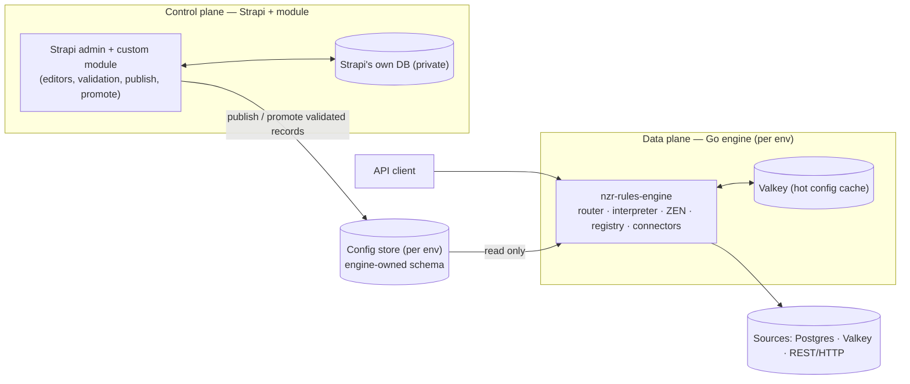

# High-Level Design — nzr-rules-engine

Config-driven API platform: a standalone Go engine that serves dynamic API endpoints defined
entirely as configuration, with a Strapi-based CMS as the control plane. Adding an API = adding
config, no code deploy.

Status: **approved for build (v1 engine)** · Last updated: 2026-10-02
Follows the HLD process in `[[high-level-design]]`.

---

## 1. Requirements

### Functional
- Serve dynamic REST endpoints whose routing, logic, and response shaping are defined as config.
- Read/write **multiple heterogeneous sources** (Postgres, Valkey, REST/HTTP in v1; MySQL,
  Mongo, gRPC, Kafka later) via reusable, named **connections** referenced by key.
- Execute **nested conditional logic** (if/else trees to arbitrary depth), with branch tests
  evaluated by a rule engine (GoRules ZEN).
- **CRUD**, including writes that may fan out to **multiple sources** in one flow.
- Add response fields **conditionally** (field present only when a branch runs).
- Enforce **AuthN** (JWT/JWKS) and **AuthZ** (policy as a ZEN decision).
- Author/manage all config through a **CMS** (Strapi + custom module), no admin UI built in-house.

### Non-functional
- **Production-grade**: resilience, observability, health/lifecycle, security, tested, CI.
- **Horizontally scalable**, stateless engine instances (`[[high-level-design]]` scale-out).
- **Per-environment isolation** (dev/staging/prod) — a dev config cannot reach prod.
- **Config changes without redeploy** (hot-reload via cache).
- Engine stays available if the CMS is down (reads config from its own store + cache).

---

## 2. Architecture overview

Two independently deployable services sharing only a config-store contract (control plane /
data plane split).

- **Control plane** — **Strapi (Node.js) + a custom module**. Authors and manages config:
  content types (Connection, Flow, Jdm, Environment), React custom-field editors
  (`@gorules/jdm-editor` for decisions, React Flow canvas for flows), write/publish validation,
  draft/publish, and promotion across environments. Has its **own private database** for Strapi
  internals.
- **Data plane** — the **standalone Go engine (`nzr-rules-engine`)**. Reads published config
  from the config store (cached in Valkey) and executes flows. No runtime dependency on Strapi.
- **Config store** — a clean, **engine-owned** Postgres schema, **one per environment**. Written
  by the control plane on publish; read by the engine. This schema is the contract between planes.

Full component and sequence diagrams live in `../architecture.md` (working design notes).

---

## 3. Core components (data plane)

| Component | Responsibility |
| --- | --- |
| **HTTP router** (stdlib `net/http` `ServeMux`, Go 1.22+) | Match path+method to a flow; entrypoint. Method + path-pattern routing (`GET /orders/{id}`) from the standard library — no third-party router. |
| **AuthN middleware** | Validate JWT against JWKS. |
| **Flow resolver** | Load the flow tree for the route (Valkey → config store on miss). |
| **Tree-walking interpreter** | Recurse the flow tree, thread a context accumulator, call ZEN at conditions, stitch via `targetPath`. |
| **ZEN (embedded)** | Pure decision evaluation — condition tests, AuthZ, computed values. No I/O. |
| **Connection Registry** | Build & own live pooled clients keyed by connection name; hot-reload; per-connection resilience. |
| **Connectors** | Per-type adapters (postgres, valkey, rest/http) behind one `Connector` interface. |
| **Config store client** | Read engine-owned config schema; cache in Valkey with invalidation. |
| **Ops surface** | `/livez`, `/readyz`, metrics, graceful shutdown, structured logs, tracing. |

### Node taxonomy (flow tree)
Trigger · Action (I/O) · Control (Condition/Switch/Sequence/Parallel/ForEach — owns children) ·
Decision (ZEN) · Set/Transform (`targetPath`) · **Logger/Debug** · Response.

### Logger / Debug node (optional, config-placed)
A **Logger node** is an optional node dropped anywhere in the tree to emit a structured log
entry at that point — a **debug point** the flow author places where they want visibility.
It never changes the response; flows run identically with it removed.

- **Config**: `{ label, level (debug|info|warn|error), capture: [contextPaths], sampleRate? }`.
  `capture` selects which parts of `ctx` to log (never log whole context blindly — PII/secret
  risk); values at secret paths are redacted (per [[config-and-secrets]]).
- **Searchable fields**: every entry (Logger node *and* the engine's automatic per-node trace)
  carries `trace_id`, `request_id`, `flow_id`, `flow_version`, `node_id`, `node_type`,
  `environment`, `label`, `duration_ms`, and `branch_taken` (for conditions). So logs are
  queryable: "every run of flow X where node `cond.amount` took TRUE", or a full request path
  by `trace_id`.
- **Toggle without redeploy**: a Logger node's `level`/enabled state is config — turn debug
  logging on for one flow in prod by publishing a config change, no deploy.

### Connection types (pluggable by `type`)
`postgres`, `valkey`, `rest`/`http` in **v1**; `mysql`, `mongodb`, `grpc`, `kafka` are
**next-phase**, added as new `Connector` implementations with **no engine change**.

---

## 4. Data flow

1. Client request → router → JWT validated (AuthN).
2. Flow resolver loads the flow tree (Valkey cache → config store on miss).
3. Interpreter walks the tree: at each **Condition** it calls `zen.Evaluate(jdm, ctx)` to pick a
   branch, descends, runs that branch's action nodes (read/write via connectors), threading `ctx`.
4. **AuthZ** is a ZEN decision over `{user, roles, resource, action}`, evaluated early.
5. **Set/Transform** nodes patch fields into `ctx.finalResponse` via `targetPath` (cumulative,
   multi-depth, no clobber). Fields appear only if their branch ran.
6. Response node returns the stitched JSON.

Config contract: `decision = zen.Evaluate(jdm_id, ctx)` — JSON in, JSON out. Orchestration owns
all I/O and sequencing; ZEN stays pure.

---

## 5. Technology choices

| Concern | Choice | Why |
| --- | --- | --- |
| Engine language | **Go** | Stateless, high-concurrency interpreter; strong std lib; easy horizontal scale. |
| Rule engine | **GoRules ZEN** (embedded, CGO) | Battle-tested decision engine; portable JDM; microsecond eval; don't hand-build a rule language. |
| Rule authoring | **`@gorules/jdm-editor`** (React) | Drop-in visual JDM editor; mounts in Strapi as a custom field. |
| CMS / control plane | **Strapi + custom module** | React admin, roles, draft/publish for free; custom-field plugins host the visual editors. |
| HTTP router | **stdlib `net/http`** (Go 1.22+ `ServeMux`) | Enhanced `ServeMux` does method + path-pattern routing; no third-party router dependency. |
| Postgres driver | `pgx` / `pgxpool` | Performant, pooled. |
| Cache | **Valkey** | Hot config + read models, sub-ms. |
| Circuit breaker | `sony/gobreaker` (or equiv.) | Per-connection independent breakers. |
| Observability | `log/slog`, Prometheus, OpenTelemetry | Per `[[observability-and-logging]]`, `[[distributed-tracing]]`. |

---

## 6. Architecture Decision Records (ADRs)

Each decision is recorded context → decision → consequences, per `[[decisions]]`.

### ADR-001 — Split into a rule engine (ZEN) and an orchestration engine (Go)
- **Context**: requirements mix pure logic (conditions, authz, validation) with I/O
  orchestration (fetch/stitch across sources, CRUD). The original blueprint built one homegrown
  recursive interpreter for both.
- **Decision**: use **GoRules ZEN** for all pure decisions; build the **Go orchestration engine**
  for routing, I/O, and the control-flow tree. ZEN decides *which way*; the engine *does the I/O*.
- **Consequences**: no hand-built rule language; portable JDM; one authoring model. Adds a
  (CGO) dependency. Clean separation holds at every nesting depth.

### ADR-002 — Config is a recursive control-flow tree, not a flat DAG
- **Context**: logic needs nested conditionals (`if c1 → DB; else → REST; nested conditions
  inside`).
- **Decision**: model config as a **tree**; control nodes own child branches; the engine is a
  **recursive tree-walking interpreter**.
- **Consequences**: arbitrary nesting supported; interpreter is recursive (bound depth to avoid
  abuse). More complex visual editor (nested containers) — deferred (Path B).

### ADR-003 — Embed ZEN in-process (accept CGO)
- **Context**: ZEN is Rust with Go bindings (CGO) or could run as a sidecar.
- **Decision**: **embed `zen-go`** in-process.
- **Consequences**: simplest runtime, lowest latency, no extra deployable. Build/CI must enable
  CGO + a C toolchain; cross-compile and fully-static linking are constrained. Revisit as a
  sidecar only if the build constraint becomes painful.

### ADR-004 — Control plane / data plane split; Strapi is the CMS
- **Context**: need a CMS to author config without building an admin UI; engine must stay
  available independent of the CMS.
- **Decision**: **Strapi + a custom module** is the control plane (authoring, validation,
  publish, promotion). The **Go engine** is a standalone data plane that only reads config.
- **Consequences**: free admin/roles/versioning; second (Node) runtime + plugin development for
  the visual editors. Engine has no runtime dependency on Strapi.

### ADR-005 — Separate databases: Strapi's internal DB vs. the engine config store
- **Context**: tempting to have the engine read Strapi's tables directly.
- **Decision**: Strapi keeps its **own private DB**; **publish writes a clean, engine-owned
  record** to a **separate config store** that the engine reads.
- **Consequences**: no coupling to Strapi's private, version-dependent schema; the config-store
  schema is an explicit, versioned contract. One extra write step on publish.

### ADR-006 — Per-environment config stores; one Strapi orchestrates promotion
- **Context**: a dev config must never reach prod; need promotion across environments.
- **Decision**: **separate config store DB + Valkey per environment** (dev/staging/prod). **One
  Strapi** manages all and promotes config between stores. Connection keys are stable; values and
  secrets resolve per-env (`secretRef`).
- **Consequences**: strict isolation (physical DB boundary); same engine image everywhere
  (12-factor). One Strapi is a shared control point (and a single admin blast radius — mitigate
  with Strapi roles).

### ADR-007 — Connections are reusable, typed, referenced by key; resilience per connection
- **Context**: avoid re-entering connection details per node; need independent failure isolation.
- **Decision**: define a **Connection** once (typed: postgres/valkey/rest/…); nodes reference it
  by **key**; the **Connection Registry** owns pooled clients; **resilience (timeout/retry/
  breaker) lives on the connection**, with optional per-node override.
- **Consequences**: change credentials once; shared pools; a tripped breaker isolates one source.
  New source types are new connectors behind one interface — no engine change.

### ADR-008 — Synchronous v1; async (Kafka) and gateway deferred
- **Context**: the original blueprint routed all writes through Kafka and fronted with KrakenD.
- **Decision**: **synchronous** reads and writes for v1; **defer** Kafka and the API gateway.
- **Consequences**: ordinary CRUD semantics (read-after-write), simpler ops. Revisit async for
  high-throughput ingest; add a gateway when edge concerns (global rate limiting) demand it.

---

## 6a. Debugging & observability (first-class, not a checkbox)

Because flows are **data, not code**, there is no compiler, stack trace, or `go vet` for a
flow. Execution traceability is therefore the **primary** way anyone understands what the
system did — a core feature of the engine, not an add-on (per [[observability-and-logging]],
[[distributed-tracing]]).

- **Automatic per-node execution trace**: the interpreter emits a span per node (type, id,
  inputs selected, branch taken, duration, error), stitched under one `trace_id` per request
  (OpenTelemetry). A request's full path through the tree is reconstructable end to end.
- **Logger/Debug nodes**: optional, config-placed debug points (see §3) for ad-hoc visibility
  into chosen `ctx` paths, toggled by config without redeploy.
- **Searchable structured logs**: `log/slog` JSON with the fields listed in §3 so logs are
  queryable by flow, node, branch, request, environment.
- **Dry-run / trace mode**: a request header or admin call runs a flow and returns the full
  node-by-node trace (what each node read, decided, wrote) **without committing writes** — the
  "debugger" for a data-defined system. (v1: trace returned; write-suppression is a flag.)
- **Metrics (RED)**: rate/errors/duration per flow and per connection; breaker state gauges.
- **Correlation**: `trace_id` propagates to every connector call (downstream SQL/HTTP) so a
  slow source is attributable to the exact node and flow that invoked it.

## 6c. Config versioning (immutable versions, pointer-based activation)

All config is **versioned** — a first-class property, not an afterthought (per
[[versioning-and-compatibility]], and the audit-truthfulness in [[confirm-scope-before-acting]]).

- **Immutable, numbered versions.** Every Flow, JDM, and Connection has versions. An edit
  **creates a new version**; existing versions are never mutated or deleted. A version is the
  unit of test, promotion, and rollback.
- **Pointer-based activation (per environment).** An `active_version` pointer per object per
  environment selects what runs (e.g. `flow:orders → v7` in prod, `v9` in staging). **Publish =
  advance the pointer** to a validated new version. **Rollback = move the pointer back** to a
  prior version — instant, no rebuild, no redeploy.
- **Requests pin at resolve time (R1).** The interpreter snapshots the active version when a
  request starts and walks that version to completion, so a mid-flight publish/rollback never
  tears an in-progress execution.
- **Fixtures travel with the version.** The test fixtures (§6b) are part of the version, so
  "the thing you tested is the thing you promote," and every version is independently replayable.
- **Promotion carries a specific version.** dev `v9` → staging → prod moves that exact version
  (and its fixtures) into the next environment's config store; environments can sit on different
  versions deliberately.
- **Audit trail.** Who created/published/rolled back which version, when, and why — the stored
  record is the source of truth ([[config-and-secrets]] for who-can; [[data-and-migrations]] for
  the store).
- **Connections are versioned, secrets are not.** A connection version captures host/port/pool/
  resilience and a `secretRef` — never a secret value. Rotating a secret is **not** a config
  version bump; the registry refreshes the resolved secret without a new version.
- **Compatibility.** The engine is **forward-compatible on load** — a config version carrying a
  field or node type an older engine doesn't understand must fail validation cleanly (rejected,
  logged), never crash (R11, [[versioning-and-compatibility]]).

## 6b. Flow testing (test-before-save — a first-class gate)

Because flows are data, an author **must be able to test a flow against sample data before
saving/publishing it** — this is the primary safety net against shipping broken config
(mitigates R2 and the "flows are untestable" risk). It is a required feature, not optional.

- **Flow test fixtures**: an author defines, per flow, one or more cases:
  `{ name, input (sample request), mocks (per-connection/per-node canned responses), expect:
  { output?, branchPath?, errors? } }`. Mocks mean a test runs with **no real I/O**, so it is
  deterministic and safe.
- **Run-before-save gate (CMS)**: on save/publish, the control plane calls the engine's
  **validate/test endpoint** (`POST /admin/flows/validate` — stateless, no writes) which (a)
  structurally validates the tree + JDM refs and (b) runs the flow's fixtures. **Publish is
  blocked if validation or any fixture fails.** A bad flow can never reach a live config store.
- **Dry-run / trace mode**: run the flow with **writes suppressed** (optionally against real
  read sources) and return the full node-by-node trace (what each node read, which branch each
  Condition took, what each Set wrote). This is the author's "preview" of exactly what the
  config does — the debugger for a data-defined system.
- **Where fixtures live**: stored with the flow in the config store (versioned alongside it),
  so they travel through promotion and act as regression tests on every future edit.
- **Engine endpoints** (control-plane facing, separate from runtime traffic):
  `POST /admin/flows/validate` (structure + fixtures), `POST /admin/flows/dry-run` (trace,
  writes suppressed). Both are stateless and side-effect-free.

This makes a flow **complete** only when it has: a valid tree, resolvable connection refs,
valid JDM refs, and at least passing fixtures — enforced at save time.

## 7. Scalability & bottlenecks

- **Scale-out**: engine instances are **stateless and identical**; scale horizontally behind a
  load balancer on aggregate CPU/mem (`[[high-level-design]]`).
- **Config reads**: served from **Valkey** sub-ms; config store hit only on cache miss /
  invalidation.
- **Likely bottlenecks** (`[[high-level-design]]` checklist): downstream **source latency**
  (mitigated by per-connection timeouts + breakers), **DB connection pools** (bounded, shared via
  registry), **ZEN eval** (CPU — microsecond-scale, cache compiled JDMs), **auth** (JWKS cached).

---

## 8. Failure modes & mitigations

| Failure | Mitigation |
| --- | --- |
| A downstream source is slow/down | Per-connection timeout + **circuit breaker**; fail fast; other connections unaffected (`[[distributed-systems-patterns]]`). |
| Malformed/invalid flow published | **Validation at publish** (control plane) **and** defensive validation on load (engine never 500s on bad config) (`[[error-classification]]`). |
| Strapi (control plane) down | Engine keeps serving from config store + Valkey; only authoring is blocked. |
| Config store down | Serve from Valkey cache; readiness probe degrades; no new flows loaded. |
| Partial multi-source write fails | Classify op (best-effort vs required, `[[best-effort-vs-required]]`); retry only idempotent ops (`[[idempotency-and-dedup]]`); surface error; (sagas/outbox are next-phase if needed). |
| Secret rotation | Secrets by `secretRef`; registry hot-reloads connection clients (`[[config-and-secrets]]`). |
| Deep/abusive nesting | Bound recursion depth; validate tree size at publish. |

---

## 8a. Risks & when NOT to use this engine

The architecture is internally coherent, but it rests on a **premise** that must hold for the
engine to be worth its complexity. These are recorded honestly so the bet is explicit and
future readers do not over-apply the engine.

### The core premise (the biggest risk)
A config-driven interpreter is **a programming language expressed as data** — you inherit the
hard problems of language design (no compiler, no type checker, no native stack traces;
testing and debugging move from code to data). It only pays off when **config changes are
frequent and made by people who cannot/should not deploy code**.

- **If APIs change rarely, or only engineers change them**, plain Go handlers + a normal CI/CD
  pipeline are simpler, safer, and cheaper. Do not build the interpreter for that case.
- **"No deploy" is scoped, not absolute**: there is no deploy for flows expressible with
  *existing* primitives. A new source type, node kind, or auth scheme is an engine code change
  and a deploy. Config changes still need validation, review, staging, and rollback — a release
  process relocated into Strapi, not eliminated.

### When NOT to use it
- Few endpoints, or a stable API surface that changes a few times a year.
- Only engineers author APIs (then code + CI is the better "config").
- Logic that needs expressiveness beyond ZEN's JDM/expression model (see R7).
- Hard cross-source transactional guarantees are required (see R3).

### Risk register

| # | Risk | Mitigation / decision | v1? |
| --- | --- | --- | --- |
| R0 | **Premise doesn't hold** — change rate too low to justify an interpreter | Validate change-rate assumption with stakeholders before full build; keep the engine small enough to abandon | decision gate |
| R1 | **Flow version torn mid-execution** — a republish changes a flow a request is already walking | **Pin each request to the flow version resolved at request start** (snapshot at resolve) | **v1** |
| R2 | **Flows are untestable as data** — no regression safety for N flows | Build a **flow test-fixture harness**: input + mocked source responses → assert output and branch path | **v1** |
| R3 | **Multi-source writes are not atomic** — DB commit then REST write fails ⇒ inconsistency | v1 constraint: **writes are not atomic across sources**; classify best-effort vs required ([[best-effort-vs-required]]); sagas/compensation are next-phase | documented constraint |
| R4 | **Retried writes duplicate** | Idempotency key derived from request + dedup table/TTL ([[idempotency-and-dedup]]) — design the mechanism | v1 for required-writes; else phase 2 |
| R5 | **Cache invalidation across N instances** — one Strapi writes, many engines cache | Explicit invalidation channel (Valkey pub/sub on publish) + bounded TTL fallback; never rely on TTL alone ([[caching-strategy]]) | **v1** |
| R6 | **No rate limiting** — a fan-out endpoint is a DoS amplifier | Per-flow and per-connection rate limits at the engine edge ([[high-level-design]], [[retry-and-backoff]]) | phase 2 (document gap) |
| R7 | **ZEN expressiveness ceiling** — a real condition JDM can't express, with no code escape hatch | **De-risking spike**: evaluate the hardest real condition in ZEN before full build (validates ADR-001) | **spike first** |
| R8 | **Loop/ForEach unbounded** over config-driven data | Max-iteration bound + per-request time/work budget; validated at publish | **v1** |
| R9 | **CGO tax** — loses Go's static-binary/cross-compile ease; harder crash debugging (ADR-003) | **De-risking spike**: prove CGO build in CI + target image before full build; sidecar remains the fallback | **spike first** |
| R10 | **Per-instance breakers** — breaker state is per-engine-instance, not global (ADR-007) | Accept per-instance breaking for v1; shared-state (Valkey) breaking only if a global trip is required (adds hot-path latency) | documented constraint |
| R11 | **Config-store ⇄ Strapi schema drift** — two codebases, one contract + a publish transform | Config-store schema is a **versioned contract**; engine is forward-compatible on load; contract tests on both sides ([[versioning-and-compatibility]]) | **v1** (contract tests) |
| R12 | **Secret resolution path undesigned** — `secretRef` names a value but not the backend/refresh | Choose a backend (Vault/SSM/env); registry resolves at open + refreshes on rotation ([[config-and-secrets]]) | v1 (pick backend) |
| R13 | **Operational surface too large for v1** — many datastores/services before first real request | Narrow v1 (see §9); defer Strapi, multi-env, OTel to prove the core bet with ~30% of the surface | scope decision |
| R14 | **Observability undercounted** — flows-as-data make tracing the *only* way to understand behavior | Per-node trace + Logger nodes + dry-run/trace mode are first-class (see §6a), not a checkbox | **v1** |

### Recommended de-risking spike (before the full engine)
On a throwaway branch, prove the two riskiest ADRs cheaply: **(a)** embed `zen-go` via CGO and
build it in your real CI/target image (R9/ADR-003); **(b)** evaluate your **hardest actual
condition** as a ZEN JDM and run **one nested flow** end to end against Postgres + REST, seeded
from JSON, synchronously (R7/ADR-001). If either fails, the HLD changes materially before any
production build begins.

## 9. v1 scope (engine only) & phasing

**Phase 0 — de-risking spike (before the full build, throwaway branch).** Validate the two
riskiest ADRs: (a) embed `zen-go` via CGO and build in the real CI/target image (R9/ADR-003);
(b) model the **hardest actual condition** as a ZEN JDM and run **one nested flow** end to end
against Postgres + REST, seeded from JSON, synchronously (R7/ADR-001). Gate: if either fails,
revise the HLD before building. (Scope decision R0/R13 is revisited after the spike.)

**v1 (this build)** — Go engine `nzr-rules-engine`, to the production bar. Core:
1. Flow-tree schema + structural validation (Trigger/Action/Control/Decision/Set/**Logger**/Response).
2. Recursive tree-walking interpreter; context accumulator; `targetPath` stitching.
3. **Flow version pinning** — a request is pinned to the flow version resolved at its start (R1).
4. **Loop/ForEach bounds** — max-iteration + per-request time/work budget, enforced at run and
   validated at publish (R8).
5. Connection Registry — pooled clients keyed by name, hot-reload, per-connection resilience
   (timeout/retry/breaker, per-instance — R10) with per-node override.
6. Connectors: postgres (`pgx`), valkey, rest/http — read + write.
7. Embedded ZEN (CGO) — load JDM by id, `Evaluate(jdm, ctx)`.
8. Engine-owned config store + migrations; **config versioning** — immutable numbered versions
   of Flow/JDM/Connection, per-environment `active_version` pointer, publish = advance pointer,
   **rollback = move pointer back**, audit trail (§6c); Valkey hot cache with **explicit
   invalidation (pub/sub on publish) + bounded TTL** (R5); defensive validation on load (never
   500 on bad config).
9. **Flow testing (test-before-save)** — fixture format, `POST /admin/flows/validate` (structure
   + fixtures, publish-blocking) and `POST /admin/flows/dry-run` (trace, writes suppressed) (R2, §6b).
10. **Debugging & observability** — per-node execution trace, Logger/Debug nodes, dry-run/trace
    mode, searchable structured logs, RED metrics, OTel (R14, §6a).
11. AuthN (JWT/JWKS) + AuthZ (ZEN decision).
12. **Secrets** — pick a backend (env for v1, pluggable to Vault/SSM); registry resolves at open,
    refreshes on rotation (R12).
13. Ops surface — `/livez`, `/readyz`, graceful shutdown.
14. **Config-store contract tests** (engine side) guarding the Strapi⇄engine schema contract (R11).
15. Tests + CI (unit, integration against ephemeral PG/Valkey, flow-fixture tests); CGO-aware CI.
16. One end-to-end example flow (nested orders), seeded via SQL/JSON, running without the CMS.

**Documented v1 constraints** (not built, stated honestly): writes are **not atomic across
sources** (R3); **no rate limiting** yet (R6); breakers are **per-instance** (R10).

**Next phase** — Strapi control-plane module (content types, React custom-field editors incl.
the fixture/dry-run UI, validation, publish/promote); additional connectors (mysql, mongodb,
grpc); idempotency for required writes if not in v1 (R4); rate limiting (R6); cross-source
saga/compensation (R3); async write path (Kafka); API gateway (KrakenD) if edge needs arise.

Build isolation: an **isolated git worktree/branch**. The Strapi module is a **separate build**.

## 10. Acceptance criteria

Each criterion is **verifiable** (a test, a command, or an observable behavior). The build is
done only when all v1 criteria pass; the spike proceeds to v1 only if the Phase 0 gate passes.

### Phase 0 — spike gate (go / no-go)
- **AC-S1** `zen-go` is embedded and builds in the real CI with CGO enabled, producing a
  runnable binary in the target image. *(Verify: CI job green; `docker run` the image.)*
- **AC-S2** The hardest real-world condition is expressed as a ZEN JDM and evaluates correctly
  for a table of representative inputs. *(Verify: a test asserting expected branch per input.)*
- **AC-S3** One nested flow (≥2 condition depth) runs end to end against a real Postgres **and**
  a real REST source, seeded from JSON, synchronously, returning the correct stitched response.
  *(Verify: integration test asserting the response body.)*
- **Gate**: if any of AC-S1..S3 fails, the HLD is revised before the v1 build starts.

### v1 — acceptance criteria (engine)
Routing & execution
- **AC-1** A request to a configured route resolves the matching flow and returns its stitched
  response; an unmatched route returns 404. *(integration test)*
- **AC-2** A nested conditional flow takes the correct branch at each depth for given inputs;
  the executed branch path is observable in the trace. *(integration test + trace assertion)*
- **AC-3** A `Set` node adds a response field **only** when its branch runs; absent otherwise.
  Fields from different depths/siblings coexist without clobbering. *(integration test)*

Decisions (ZEN)
- **AC-4** Every Condition test and computed value is evaluated by ZEN; given fixed context, the
  decision output is deterministic and matches the JDM. *(unit test)*

Connections & resilience
- **AC-5** A connection defined once is reused by multiple nodes/flows via its key; the registry
  opens exactly one pooled client per connection. *(test inspecting pool/registry)*
- **AC-6** When a downstream source exceeds its timeout or error threshold, that connection's
  breaker opens, fails fast, and **other** connections remain healthy. *(fault-injection test)*
- **AC-7** A per-node resilience override takes precedence over the connection default. *(test)*
- **AC-8** New source types (`postgres`/`valkey`/`rest`) are added via the `Connector` interface
  with no change to the interpreter or schema. *(compile-time: interface satisfied; design review)*

Config versioning & rollback (§6c)
- **AC-9** Editing a flow creates a new immutable version; prior versions are unchanged and
  retrievable. *(test)*
- **AC-10** Publish advances the active-version pointer; **rollback** moves it to a prior version
  and takes effect without redeploy. *(integration test)*
- **AC-11** A request pins to the version active at its start; republishing mid-request does not
  change that request's result. *(concurrency test)*
- **AC-12** Promotion moves a specific version (with its fixtures) to the next environment's
  store; environments can hold different active versions. *(test)*

Flow testing & validation (§6b)
- **AC-13** `POST /admin/flows/validate` structurally validates a flow and runs its fixtures;
  **publish is blocked** when validation or any fixture fails. *(integration test — publish rejected)*
- **AC-14** `POST /admin/flows/dry-run` returns the full node-by-node trace with **writes
  suppressed** (no rows created, no external POST sent). *(integration test asserting no side effects)*
- **AC-15** A malformed/invalid published config is rejected on load and never returns a 500 at
  runtime. *(test with a deliberately broken config row)*

Caching
- **AC-16** On publish, the config cache is invalidated across instances (pub/sub) within a
  bounded delay; stale config is not served past that bound. *(multi-instance test)*

Safety bounds
- **AC-17** A `ForEach`/loop exceeding its max-iteration or time/work budget is terminated with a
  clear error, not a hang. *(test)*

Security
- **AC-18** A request without a valid JWT (bad signature / expired / wrong issuer) is rejected
  401; JWKS key rotation is handled without restart. *(test)*
- **AC-19** AuthZ denies a request when the ZEN policy says the role may not perform the action
  on the resource; allows when it may. *(test)*
- **AC-20** Secret values never appear in logs, traces, or config versions; only `secretRef` is
  stored/emitted. *(test scanning log/trace output + config rows)*

Observability (§6a)
- **AC-21** Every request produces a single `trace_id` spanning the flow walk, each node, each
  ZEN eval, and each connector call; a request's full path is reconstructable. *(trace assertion)*
- **AC-22** A Logger node emits a structured entry with the documented fields; toggling its level
  via config takes effect without redeploy. *(test)*

Operations
- **AC-23** `/livez` reflects process liveness; `/readyz` is not-ready until the registry and
  config store are reachable, and flips to ready once they are. *(test)*
- **AC-24** Graceful shutdown drains in-flight requests and closes pools within the shutdown
  deadline; no request is dropped mid-flight. *(test)*

Delivery
- **AC-25** CI runs unit + integration (ephemeral Postgres/Valkey) + flow-fixture tests and is
  green; the build is CGO-aware and reproducible. *(CI pipeline)*
- **AC-26** The end-to-end example flow (nested orders) runs from a seeded config **without the
  CMS present**, proving the engine is independent of the control plane. *(integration test)*

### Documented-constraint checks (negative acceptance)
These confirm the honest v1 limits are real and labeled, not silent:
- **AC-27** Cross-source writes are **not** atomic: a flow whose second write fails leaves the
  first committed — and this is documented behavior, surfaced as a classified error, not a hidden
  inconsistency (R3). *(test)*
- **AC-28** No global rate limiting in v1 (R6) and per-instance (not global) breakers (R10) are
  documented in the README/limits doc. *(doc check)*
